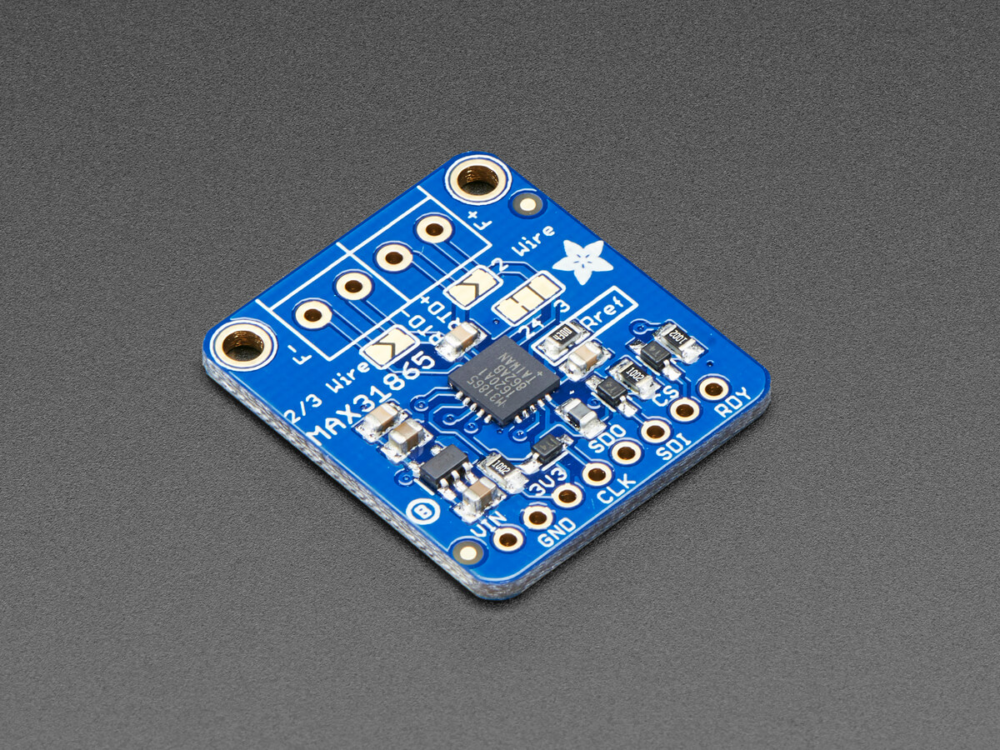

MAX31865 Platinum RTD Temperature Sensor
========================================

.. seo::
    :description: Instructions for setting up MAX31865 platinum RTD temperature sensors.
    :image: max31865.jpg

The ``max31865`` temperature sensor allows you to use your max31865 RTD
temperature sensor (`datasheet <https://datasheets.maximintegrated.com/en/ds/MAX31865.pdf>`__) with ESPHome

    MAX31865 Sensor. Image by `Adafruit`_

.. _Adafruit: https://www.adafruit.com/product/3328

As the communication with the MAX31865 is done using SPI, you need
to have an :ref:`spi bus <spi>` in your configuration with both **miso_pin** and **mosi_pin** set.

- ``VIN`` connects to 5V (``3V3`` will output 3.3V), or directly connect ``3V3`` to 3.3V
- ``3Vo`` is not used by ESPHome
- ``GND`` connects to ground
- ``CLK`` connects to the SPI **clk_pin**
- ``SDO`` connects to the SPI **miso_pin**
- ``SDI`` connects to the SPI **mosi_pin**
- ``CS`` connects to a free GPIO pin
- ``RDY`` is not used by ESPHome

.. code:: yaml

    # Example configuration entry
    spi:
      miso_pin: D0
      mosi_pin: D1
      clk_pin: D2

    sensor:
      - platform: max31865
        name: "Living Room Temperature"
        cs_pin: D3
        reference_resistance: 430 Ω
        rtd_nominal_resistance: 100 Ω

Configuration variables:
------------------------

- **name** (**Required**, string): The name for the temperature sensor.
- **cs_pin** (**Required**, :ref:`Pin Schema <config-pin_schema>`): The Chip Select pin of the SPI interface.
- **update_interval** (*Optional*, :ref:`config-time`): The interval to check the sensor. Defaults to ``60s``.
- **reference_resistance** (**Required**, float): Reference resistor on the PCB. Adafruit's PT100 (#3328) uses 430 Ω, their PT1000 (#3648) uses 4300 Ω.
- **rtd_nominal_resistance** (**Required**, float): Nominal resistance of the RTD at 0°C. PT100 is 100 Ω, PT1000 is 1000 Ω.
- **mains_filter** (*Optional*, string): The mains power frequency to reject (``50 Hz`` or ``60 Hz``). Defaults to ``60 Hz``.
- **rtd_wires** (*Optional*, int): The number of RTD wires. Be sure to solder board jumpers to match! Defaults to ``4``.
- **spi_id** (*Optional*, :ref:`config-id`): Manually specify the ID of the :ref:`SPI Component <spi>` if you want to use multiple SPI buses.
- **id** (*Optional*, :ref:`config-id`): Manually specify the ID used for code generation.
- All other options from :ref:`Sensor <config-sensor>`.

See Also
--------

- :ref:`sensor-filters`
- :doc:`dallas`
- :doc:`dht`
- :doc:`adc`
- :doc:`max6675`
- :doc:`max31855`
- :doc:`max31856`
- `MAX31865 Library <https://github.com/adafruit/Adafruit_MAX31865>`__ by `Adafruit <https://www.adafruit.com/>`__
- :apiref:`max31865/max31865.h`
- :ghedit:`Edit`
