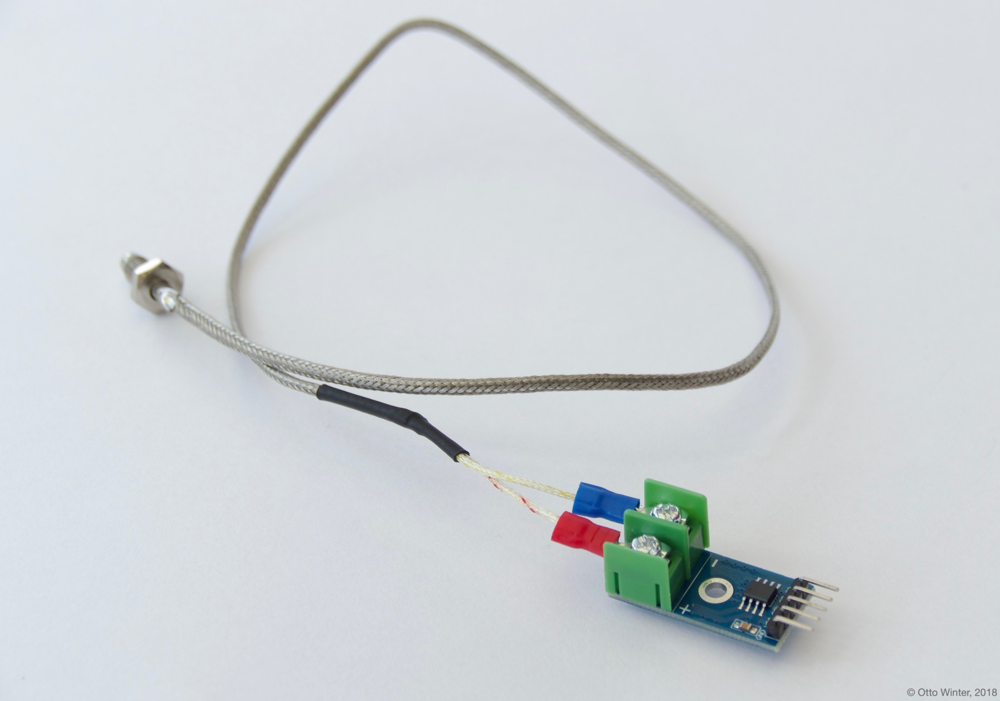

MAX6675 K-Type Thermocouple Temperature Sensor
==============================================

.. seo::
    :description: Instructions for setting up MAX6675 Thermocouple temperature sensors.
    :image: max6675.jpg

The ``max6675`` temperature sensor allows you to use your MAX6675 thermocouple
temperature sensor (`datasheet <https://datasheets.maximintegrated.com/en/ds/MAX6675.pdf>`__, `SainSmart`_) with ESPHome

    MAX6675 K-Type Thermocouple Temperature Sensor.

.. _SainSmart: https://www.sainsmart.com/products/max6675-module-k-type-thermocouple-thermocouple-sensor-temperature-0-1024-for-arduino

As the communication with the MAX6675 is done using SPI, you need
to have an :ref:`SPI bus <spi>` in your configuration with the **miso_pin** set (MOSI is not required).

Connect ``GND`` to ``GND``, ``VCC`` to ``3.3V`` and the other three ``MISO`` (or ``SO`` for short),
``CS`` and ``CLOCK`` (or ``CLK``) to free GPIO pins.

.. figure:: images/temperature.png
    :align: center
    :width: 80.0%

.. code-block:: yaml

    # Example configuration entry
    spi:
      miso_pin: D0
      clk_pin: D1

    sensor:
      - platform: max6675
        name: "Living Room Temperature"
        cs_pin: D2
        update_interval: 60s

Configuration variables:
------------------------

- **name** (**Required**, string): The name for the temperature sensor.
- **cs_pin** (**Required**, :ref:`Pin Schema <config-pin_schema>`): The Chip Select pin of the SPI interface.
- **update_interval** (*Optional*, :ref:`config-time`): The interval to check the sensor. Defaults to ``60s``.

- **spi_id** (*Optional*, :ref:`config-id`): Manually specify the ID of the :ref:`SPI Component <spi>` if you want
  to use multiple SPI buses.
- **id** (*Optional*, :ref:`config-id`): Manually specify the ID used for code generation.
- All other options from :ref:`Sensor <config-sensor>`.

See Also
--------

- :ref:`sensor-filters`
- :doc:`dallas`
- :doc:`dht`
- :doc:`adc`
- :doc:`sht3xd`
- `MAX6675 Library <https://github.com/adafruit/MAX6675-library>`__ by `Adafruit <https://www.adafruit.com/>`__
- :apiref:`max6675/max6675.h`
- :ghedit:`Edit`
