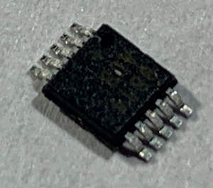

MAX9611/9612 High Side Current+Voltage+Temperature Sensor
=========================================================

.. seo::
    :description: Instructions for setting up MAX9611 MAX9612 High-Side Current-Sense Amplifier
    :image: max9611.jpg
    :keywords: MAX9611 MAX9612

The ``MAX9611`` sensor platform allows you to use your MAX9611/MAX9612
(`datasheet <https://datasheets.maximintegrated.com/en/ds/MAX9611-MAX9612.pdf>`__)
High-side current, voltage and temperature sensors with ESPHome.

This sensor supports up to +60V DC common mode voltage, has a 1.8V to 3.3V logic range,
a 12-Bit integrated ADC with :ref:`I²C <i2c>`, and is meant to act as a high-side current sense amplifier.

The :ref:`I²C <i2c>` is
required to be set up in your configuration for this sensor to work.

    MAX9611 High-Side Current-Sense Amplifier

.. code-block:: yaml

    # Example configuration entry
    sensor:
      - platform: max9611
        shunt_resistance: 0.2 ohm
        gain: '1X'
        voltage:
          name: Max9611 Voltage
        current:
          name: Max9611 Current
        power:
          name: Max9611 Watts
        temperature:
          name: Max9611 Temperature
        address: 0x70
        update_interval: 60s

Configuration variables:
------------------------

- **shunt_resistance** (**Required**, ohms): The value of the High Side Shunt Resistor.

- **voltage** (*Optional*): The information for the voltage sensor

  - **name** (**Required**, string): The name for the voltage sensor.
  - All other options from :ref:`Sensor <config-sensor>`.

- **current** (*Optional*): The information for the current sensor, scaled by the gain factor and multiplied by voltage

  - **name** (**Required**, string): The name for the current sensor.
  - All other options from :ref:`Sensor <config-sensor>`.

- **power** (*Optional*): The information for the power sensor

  - **name** (**Required**, string): The name for the power sensor.
  - All other options from :ref:`Sensor <config-sensor>`.

- **temperature** (*Optional*): The information for the temperature sensor

  - **name** (**Required**, string): The name for the temperature sensor.
  - All other options from :ref:`Sensor <config-sensor>`.

- **address** (*Optional*, int): Manually specify the I²C address of
  the sensor. Defaults to ``0x70``.
- **update_interval** (*Optional*, :ref:`config-time`): The interval to check the
  sensor. Defaults to ``60s``.

See Also
--------

- :ref:`sensor-filters`
- :ghedit:`Edit`
