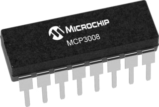

MCP3008 8-Channel 10-Bit A/D Converter
======================================

.. seo::
    :description: Instructions for setting up MCP3008 10 Bit Analog to Digital Converter in ESPHome.
    :keywords: MCP3008
    :image: mcp3008.jpg

The Microchip Technology Inc. MCP3008
devices are successive approximation 10-bit Analog-to-Digital (A/D) converters with on-board sample and
hold circuitry.

.. _mcp3008-component:

Component/Hub
-------------

The MCP3008 component allows you to use MCP3008 8-Channel 10-Bit A/D Converter
(`datasheet <http://ww1.microchip.com/downloads/en/DeviceDoc/21295d.pdf>`__,
`Adafruit <https://www.adafruit.com/product/856>`__) in ESPHome.
It uses the :ref:`SPI Bus <spi>` for communication.

Once configured, you can use any of the 8 pins as
sensors for your projects.

Each pin will respond with a voltage calculated off of the ``reference_voltage`` (default is 3.3V).
It calculates the voltage by multiplying the ``reference_voltage`` by the value on the pin (basically the percentage of VREF).

Most configurations will establish the reference voltage by assigning it the value of VREF, which is located at pin 13 on the chip.

If you want just the scaled value you can use the read_data function:
  ``float MCP3008::read_data(uint8_t pin)``

.. code-block:: yaml

    # Example configuration entry
    mcp3008:
      cs_pin: D8
      id: my_mcp

    # Example config of sensors.
    # This is a NTCB3950 10K thermocoupler attached to pin 0
    # of the MCP3008 with a 10K resistor as a voltage divider.
    # See `resistance` and `ntc` platorms for other options
    sensor:
      - platform: mcp3008             # Attached to pin 0 of the MCP3008.
        reference_voltage: 3.19
        update_interval: 1s
        mcp3008_id: my_mcp
        id: freezer_temp_source
        number: 0                     # MCP3008 pin number
      - platform: resistance
        id: freezer_resistance_sensor
        sensor: freezer_temp_source
        configuration: DOWNSTREAM
        resistor: 10kOhm
      - platform: ntc
        id: freezer_temp
        sensor: freezer_resistance_sensor
        calibration:
          b_constant: 3950
          reference_temperature: 25°C
          reference_resistance: 10kOhm
        name: Freezer Temperature

Configuration variables:

- **id** (**Required**, :ref:`config-id`): The id to use for this MCP3008 component.
- **cs_pin** (**Required**, int): The SPI cable select pin to use.

Sensor
------

The ``mcp3008`` sensor allows you to use your MCP3008 10-Bit A/D Converter sensors with ESPHome.
First, setup a :ref:`MCP3008 Hub <mcp3008-component>` for your MCP3008 sensor and then use this
sensor platform to create individual sensors that will report the voltage to Home Assistant.

Configuration variables:

- **mcp3008_id** (**Required**, :ref:`config-id`): The id of the parent MCP3008 component.
- **number** (**Required**, int): The pin number of the MCP3008.
- **reference_voltage** (*Optional*, float): The reference voltage. Defaults to ``3.3V``.
- **update_interval** (*Optional*, :ref:`config-time`): The interval to check the sensor. Defaults to ``1s``.

See Also
--------

- :ref:`spi`
- :apiref:`mcp3008/mcp3008.h`
- :ghedit:`Edit`
