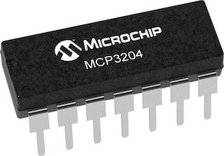

MCP3204 4-Channel 12-Bit A/D Converter
======================================

.. seo::
    :description: Instructions for setting up MCP3204 12-Bit Analog to Digital Converter in ESPHome.
    :keywords: MCP3204
    :image: mcp3204.jpg

The Microchip Technology Inc. MCP3204
devices are successive approximation 12-bit Analog-to-Digital (A/D) converters with on-board sample and
hold circuitry.

.. _mcp3204-component:

Component/Hub
-------------

The MCP3204 component allows you to use MCP3204 4-Channel 12-Bit A/D Converter
(`datasheet <https://ww1.microchip.com/downloads/en/DeviceDoc/21298e.pdf>`__) in ESPHome.
It uses the :ref:`SPI Bus <spi>` for communication.

Once configured, you can use any of the 4 pins as
sensors for your projects.

Each pin will respond with a voltage calculated off of the reference_voltage (default is 3.3v).
It calculates the voltage by multiplying the reference_voltage * value on the pin (basically the percentage of VREF)

Most configurations will set the reference_voltage = VREF (pin 13 on the chip)

If you want just the scaled value you can use the read_data function
  ``float MCP3204::read_data(uint8_t pin)``

.. code-block:: yaml

    # Example configuration entry
    mcp3204:
      cs_pin: D8

    # Example config of sensors.
    # This is a small 1.5v solar panel power rail attached to pin 0
    # of the MCP3204
    sensor:
      - platform: mcp3204             # Attached to pin 0 of the MCP3204.
        reference_voltage: 3.306
        update_interval: 1s
        id: solar_voltage
        number: 0                     # MCP3204 pin number

Configuration variables:
------------------------

- **id** (**Required**, :ref:`config-id`): The id to use for this MCP3204 component.
- **cs_pin** (**Required**, int): The SPI cable select pin to use

Sensor
------

The ``mcp3204`` sensor allows you to use your MCP3204 12-Bit A/D Converter sensors with ESPHome.
First, setup a :ref:`MCP3204 Hub <mcp3204-component>` for your MCP3204 sensor and then use this
sensor platform to create individual sensors that will report the voltage to Home Assistant.

Configuration variables:

- **id** (**Required**, :ref:`config-id`): The id of the parent MCP3204 component.
- **number** (**Required**, int): The pin number of the MCP3204
- **reference_voltage** (*Optional*, float): The reference voltage. Defaults to ``3.3V``.
- **update_interval** (*Optional*, :ref:`config-time`): The interval to check the sensor. Defaults to ``1s``.

See Also
--------

- :ref:`spi`
- :apiref:`mcp3204/mcp3204.h`
- :ghedit:`Edit`
