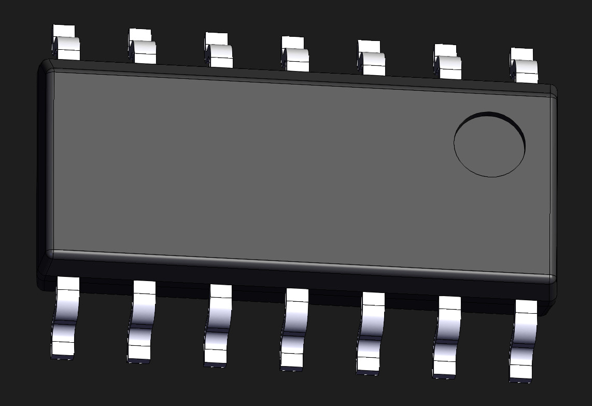
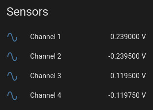

MCP3426/7/8 Multi-Channel 16-Bit A/D Converter
==============================================

.. seo::
    :description: Instructions for setting up MCP3426/7/8 multiplexed analog voltage sensors.
    :image: mcp3428.jpg
    :keywords: MCP3426 MCP3427 MCP3428

.. _mcp3428-component:

Component/Hub
-------------

The ``mcp3428`` domain creates a global hub so that you can later create
individual sensors using the :ref:`MCP3426/7/8 Sensor Platform <mcp3428-sensor>`.
To use this hub, first setup the :ref:`I²C Bus <i2c>` and connect the sensor to the pins specified there.

    MCP3428 4 channel 16-Bit ADC.

.. _Microchip_MCP3428: https://ww1.microchip.com/downloads/en/DeviceDoc/22226a.pdf

Configuration example:

.. code-block:: yaml

    mcp3428:
      - address: 0x68

Configuration variables:
************************

- **address** (**Required**, int): The i²c address of the sensor.
  See :ref:`I²C Addresses <mcp3428_i2c_addresses>` for more information.
- **continuous_mode** (**Optional**, boolean): Set if the MCP3426/7/8 should continuously measure voltages or
  only measure them when an update is called. Defaults to ``false``.
- **id** (**Optional**, :ref:`config-id`): Manually specify the ID for this MCP3428 Hub. Use this if you
  want to use multiple MCP3428 hubs at once.

.. _mcp3428_i2c_addresses:

I²C Addresses
-------------

To prevent address conflicts with chips with the same  address on the same I2C bus the MCP3427 and MCP3428 have 2 pins that configure the address. 
They can either be tied to GND, Vcc, or Vcc/2 (equivalent to floating). The possible address range is 0x68 to 0x6F.
With both pins tied to GND the address is 0x68. The address of the MCP3426 is configured by the factory, so you need to know the address from the vendor or find it with an address scan.

.. _mcp3428-sensor:

Sensor
------

The ``mcp3428`` sensor allows you to use your MCP3426/7/8 sigma-delta ADC
sensors (`datasheet <https://ww1.microchip.com/downloads/en/DeviceDoc/22226a.pdf>`__) with ESPHome.
First, setup an :ref:`MCP3426/7/8 Hub <mcp3428-component>` for your chip and then use this
sensor platform to create individual sensors that will report the voltage to Home Assistant.

Be aware that the internal reference voltage is 2.048V which limits the voltage range of the sensor.

Minimal example:

.. code-block:: yaml

    mcp3428:
      address: 0b1101000
    sensor:
      - platform: mcp3428
        multiplexer: 1

More detailed example configuration with Home Assistant discoverability:

.. code-block:: yaml

    mcp3428:
      address: 0b1101000

    sensor:
      - platform: mcp3428
        name: "Channel 1"
        multiplexer: 1
        resolution: 12
        gain: 8
        id: mcp3428_sensor1
      - platform: mcp3428
        name: "Channel 2"
        multiplexer: 2
        resolution: 14
        id: mcp3428_sensor2
      - platform: mcp3428
        name: "Channel 3"
        multiplexer: 3
        resolution: 16
        gain: 8
        id: mcp3428_sensor3
        update_interval: 10s
      - platform: mcp3428
        name: "Channel 4"
        multiplexer: 4
        resolution: 14
        id: mcp3428_sensor4

Example output of the above configuration in HA:

Configuration variables:
************************

-  **multiplexer** (**Required**, int): The channel to be measured. MCP3428 can be configured from 1 to 4. MCP3426/7 only have Channel 1 and 2 available.
-  **gain** (**Optional**, int): The gain of this sensor. Possible values 1, 2, 4, and 8. Defaults to 1x.
-  **resolution** (**Optional**, int): Resolution of the sensor in bits. Possible values are 12, 14, and 16. Defaults to 16 bit.
-  **name** (**Required**, string): The name for this sensor.
-  **mcp3428_id** (*Optional*, :ref:`config-id`): Manually specify the ID of the
   :ref:`MCP3426/7/8 Hub <mcp3428-component>` you want to use this sensor on.
-  **update_interval** (*Optional*, :ref:`config-time`): The interval
   to check the sensor. Defaults to ``60s``.
-  **id** (*Optional*, :ref:`config-id`): Manually specify the ID used for code generation.

See Also
--------

- :ref:`sensor-filters`
- :doc:`adc`
- :apiref:`mcp3428/mcp3428.h`
- `i2cdevlib <https://github.com/jrowberg/i2cdevlib>`__ by `Jeff Rowberg <https://github.com/jrowberg>`__
- :ghedit:`Edit`
