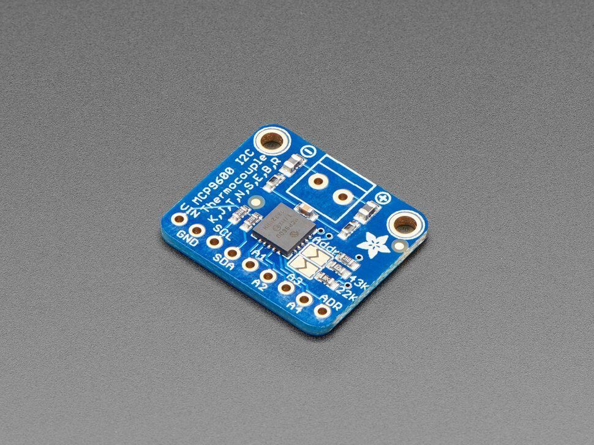

MCP9600 Thermocouple Amplifier
===========================================

.. seo::
    :description: Instructions for setting up the MCP9600 thermocouple amplifier
    :image: mcp9600.jpg
    :keywords: MCP9600

The ``mcp9600`` sensor platform allows you to use your MCP9600 and MCP9601
(`datasheet <https://cdn-learn.adafruit.com/assets/assets/000/105/040/original/MCP960X-Data-Sheet-20005426%281%29.pdf>`__,
`Adafruit`_) to measure the temperature of a connected thermocouple while also measuring the ambient temperature around the sensor with ESPHome. :ref:`I²C <i2c>` is
required to be set up in your configuration for this sensor to work.

.. note::

    The :ref:`I²C <i2c>` bus must be set to a minimum of ``10khz`` due to the limitations of the MCP9600 and MCP9601.

    MCP9600 Thermocouple Amplifier

.. _Adafruit: https://www.adafruit.com/product/4101

.. code-block:: yaml

    # Example configuration entry
    sensor:
      - platform: mcp9600
        hot_junction:
          name: "Thermocouple Temperature"
        cold_junction:
          name: "Ambient Temperature"
        thermocouple_type: K
        address: 0x67
        update_interval: 60s

Configuration variables:
------------------------

- **hot_junction** (*Optional*): The information for the Hot Junction temperature sensor.

  - **name** (**Required**, string): The name for the temperature
    sensor.
  - **id** (*Optional*, :ref:`config-id`): Set the ID of this sensor for use in lambdas.
  - All other options from :ref:`Sensor <config-sensor>`.

- **cold_junction** (*Optional*): The information for the Cold Junction temperature sensor.

  - **name** (**Required**, string): The name for the temperature sensor.
  - **id** (*Optional*, :ref:`config-id`): Set the ID of this sensor for use in lambdas.
  - All other options from :ref:`Sensor <config-sensor>`.

- **thermocouple_type** (*Optional*): Set the thermocouple type. Options are:
  K, J, T, N, S, E, B and R type thermocouple. Defaults to ``K``.
- **address** (*Optional*, int): Manually specify the I²C address of
  the sensor. Defaults to ``0x67``.
- **update_interval** (*Optional*, :ref:`config-time`): The interval to check the
  sensor. Defaults to ``60s``.

See Also
--------

- :ref:`sensor-filters`
- :apiref:`mcp9600/mcp9600.h`
- `Adafruit MCP9600 Library <https://github.com/adafruit/Adafruit_MCP9600>`__ by `Adafruit <https://www.adafruit.com/>`__
- `SparkFun MCP9600 Library <https://github.com/sparkfun/SparkFun_MCP9600_Arduino_Library>`__ by `SparkFun <https://www.sparkfun.com/>`__
- :ghedit:`Edit`
