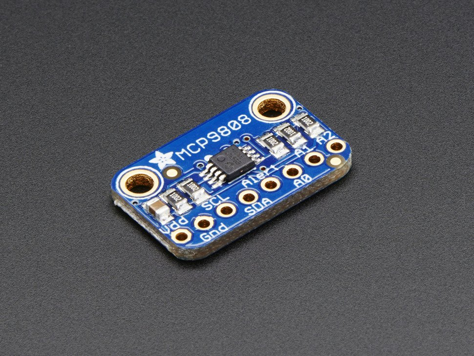

MCP9808 Temperature Sensor
==========================

.. seo::
    :description: Instructions for setting up MCP9808 temperature sensor.
    :image: mcp9808.jpg
    :keywords: MCP9808

The MCP9808 Temperature sensor allows you to use your MCP9808
(`datasheet <http://ww1.microchip.com/downloads/en/DeviceDoc/25095A.pdf>`__,
`Adafruit <https://www.adafruit.com/product/1782>`__) sensors with
ESPHome. The :ref:`I²C Bus <i2c>` is
required to be set up in your configuration for this sensor to work.

    MCP9808 Temperature Sensor. Image by `Adafruit`_.

.. _Adafruit: https://www.adafruit.com/product/1782

.. code-block:: yaml

    # Example configuration entry
    sensor:
      - platform: mcp9808
        name: "Living Room Temperature"
        update_interval: 60s

Configuration variables:
------------------------

- **name** (**Required**, string): The name for the temperature sensor.
- **id** (*Optional*, :ref:`config-id`): Set the ID of this sensor for use in lambdas.
- **address** (*Optional*, int): Manually specify the I²C address of the sensor. Defaults to ``0x18``.
- **update_interval** (*Optional*, :ref:`config-time`): The interval to check the sensor. Defaults to ``60s``.
- All other options from :ref:`Sensor <config-sensor>`.

See Also
--------

- :ref:`sensor-filters`
- :doc:`dht`
- :doc:`dht12`
- :doc:`htu21d`
- :doc:`sht3xd`
- :doc:`hdc1080`
- :apiref:`mcp9808/mcp9808.h`
- `MCP9808 Library <https://github.com/adafruit/Adafruit_MCP9808_Library>`__ by `AdaFruit <https://www.adafruit.com/>`__
- :ghedit:`Edit`
