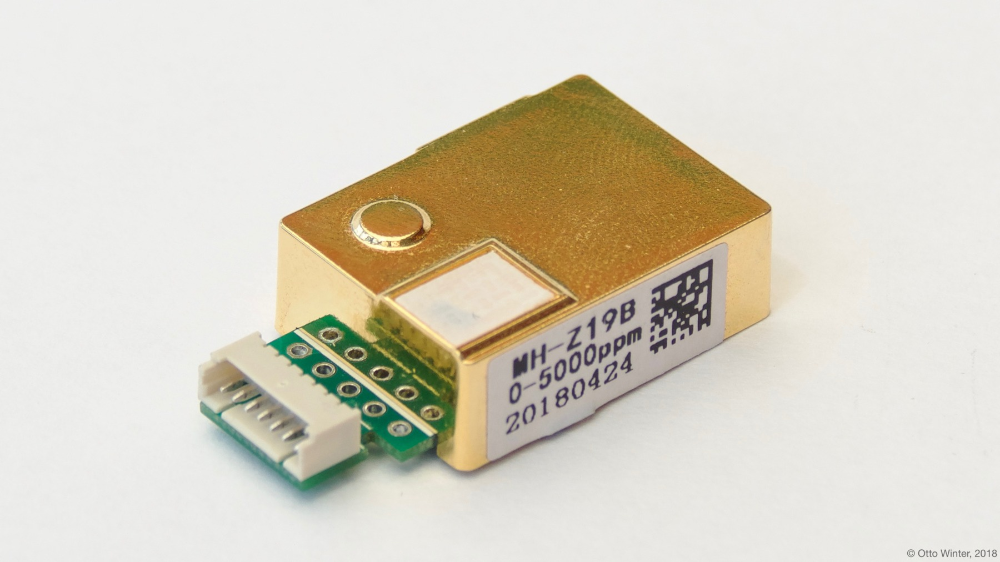
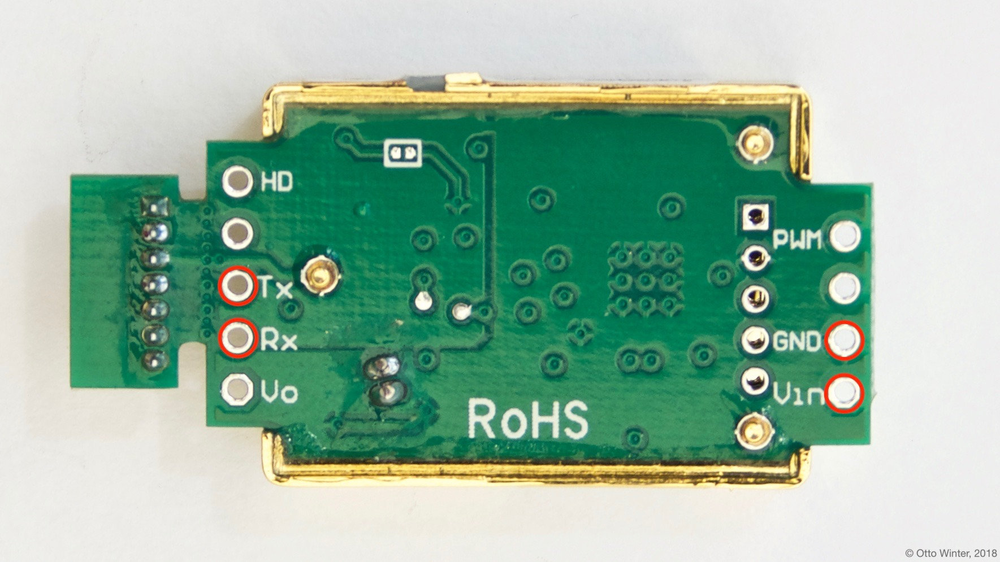

MH-Z19 CO_2 and Temperature Sensor
==================================

.. seo::
    :description: Instructions for setting up MH-Z19 CO2 and temperature sensors
    :image: mhz19.jpg
    :keywords: mh-z19

The ``mhz19`` sensor platform allows you to use MH-Z19 CO_2 and temperature sensors
(`Revspace`_) with ESPHome.
The CO_2 measurement also works with the MH-Z16 and MH-Z14 sensors.

    MH-Z19 CO_2 and Temperature Sensor.

.. _Revspace: https://revspace.nl/MHZ19

As the communication with the MH-Z19 is done using UART, you need
to have an :ref:`UART bus <uart>` in your configuration with the ``rx_pin`` connected to the TX pin of the
MH-Z19 and the ``tx_pin`` connected to the RX Pin of the MH-Z19 (it's switched because the
TX/RX labels are from the perspective of the MH-Z19). Additionally, you need to set the baud rate to 9600.

.. code-block:: yaml

    # Example configuration entry
    sensor:
      - platform: mhz19
        co2:
          name: MH-Z19 CO2 Value
        temperature:
          name: MH-Z19 Temperature

Configuration variables:
------------------------

- **co2** (**Required**): The CO_2 data from the sensor in parts per million (ppm).
  All options from :ref:`Sensor <config-sensor>`.

- **temperature** (**Required**): The information for the temperature sensor. Please note that this is
  not officially documented in the datasheet and seems to be quite inaccurate.
  All options from :ref:`Sensor <config-sensor>`.

- **update_interval** (*Optional*, :ref:`config-time`): The interval to check the
  sensor. Defaults to ``60s``.

- **uart_id** (*Optional*, :ref:`config-id`): Manually specify the ID of the :ref:`UART Component <uart>` if you want
  to use multiple UART buses.

- **id** (*Optional*, :ref:`config-id`): Manually specify the ID used for actions.

- **automatic_baseline_calibration** (*Optional*, boolean): MH-Z19 has automatic calibration procedure.
  The automatic calibration cycle is every 24 hours after powered on.
  Set this value to ``false`` to disable ABC on boot (it's better if you use sensor indoor).
  Set this value to ``true`` to enable ABC on boot.
  Doesn't send calibration command if not set (default sensor logic will be used).

- **warmup_time** (*Optional*, Time): The sensor has a warmup time and before that, it returns bougus readings (eg: 500ppm, 505ppm...). This setting discards readings until the warmup time happened (``NAN`` is returned). The datasheet says preheating takes 1min, but empirical tests have shown it often takes more, so the 75s default should be enough to accomodate for that.

    Pins on the MH-Z19. Only the ones marked with a red circle need to be connected.

.. _mhz19-calibrate_zero_action:

``mhz19.calibrate_zero`` Action
-------------------------------

This :ref:`action <config-action>` executes zero point calibration command on the sensor with the given ID.

If you want to execute zero point calibration, the MH-Z19 sensor must work in stable gas environment (400ppm)
for over 20 minutes and you execute this function.

.. code-block:: yaml

    on_...:
      then:
        - mhz19.calibrate_zero: my_mhz19_id

You can provide :ref:`service <api-services>` to call it from Home Assistant

.. code-block:: yaml

    api:
      services:
        - service: mhz19_calibrate_zero
          then:
            - mhz19.calibrate_zero: my_mhz19_id

.. _mhz19-abc_enable_action:

``mhz19.abc_enable`` Action
---------------------------

This :ref:`action <config-action>` enables automatic baseline calibration on the sensor with the given ID.

.. code-block:: yaml

    on_...:
      then:
        - mhz19.abc_enable: my_mhz19_id

.. _mhz19-abc_disable_action:

``mhz19.abc_disable`` Action
----------------------------

This :ref:`action <config-action>` disables automatic baseline calibration on the sensor with the given ID.

.. code-block:: yaml

    on_...:
      then:
        - mhz19.abc_disable: my_mhz19_id

You can provide switch and control ABC from Home Assistant

.. code-block:: yaml

    switch:
      - platform: template
        name: "MH-Z19 ABC"
        optimistic: true
        on_turn_on:
          mhz19.abc_enable: my_mhz19_id
        on_turn_off:
          mhz19.abc_disable: my_mhz19_id

See Also
--------

- :ref:`sensor-filters`
- `MH-Z19 library <https://github.com/nara256/mhz19_uart>`__ by `@nara356 <https://github.com/nara256>`__
- :apiref:`mhz19/mhz19.h`
- :ghedit:`Edit`
