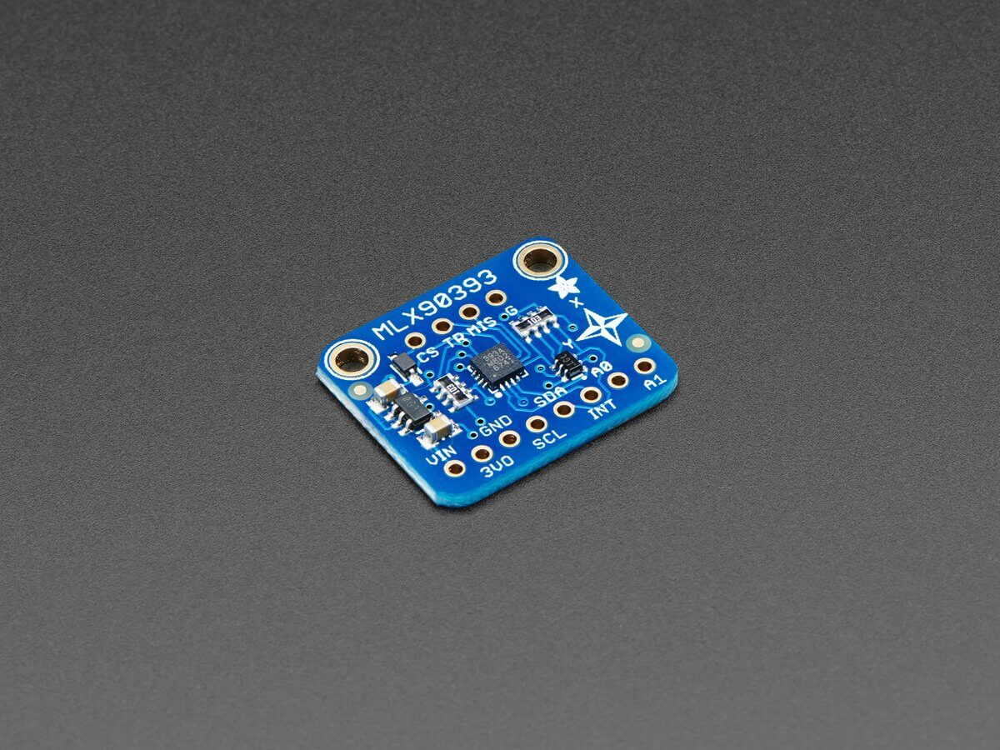

MLX90393 Triple-axis Magnetometer
=================================

.. seo::
    :description: Instructions for setting up MLX90393 Triple-Axis magnetometer sensor.
    :image: mlx90393.jpg
    :keywords: MLX90393

The ``mlx90393`` sensor platform allows you to use your MLX90393
(`datasheet <https://media.melexis.com/-/media/files/documents/datasheets/mlx90393-datasheet-melexis.pdf>`__,
`Adafruit`_) three axis magnetometer with ESPHome. The :ref:`I²C <i2c>` is required to be set up in
your configuration for this sensor to work.

    MLX90393 Triple-axis Magnetometer

.. _Adafruit: https://www.adafruit.com/product/4022

.. code-block:: yaml

    # Example configuration entry
    sensor:
      - platform: mlx90393
        id: mlx
        x_axis:
          name: "x"
        y_axis:
          name: "y"
        z_axis:
          name: "z"

Configuration variables:
------------------------

- **x_axis** (*Optional*): The information for the x-axis.

  - **name** (**Required**, string): The name for the x-axis sensor.
  - **id** (*Optional*, :ref:`config-id`): Set the ID of this sensor for use in lambdas.
  - **resolution** (*Optional*, int): Set resolution. Defaults to ``19BIT``. Must be one of:

    - ``16BIT``
    - ``17BIT``
    - ``18BIT``
    - ``19BIT``

  - All other options from :ref:`Sensor <config-sensor>`.

- **y_axis** (*Optional*): The information for the y-axis.

  - **name** (**Required**, string): The name for the y-axis sensor.
  - **id** (*Optional*, :ref:`config-id`): Set the ID of this sensor for use in lambdas.
  - **resolution** (*Optional*, int): Set resolution. Defaults to ``19BIT``. Must be one of:

    - ``16BIT``
    - ``17BIT``
    - ``18BIT``
    - ``19BIT``

  - All other options from :ref:`Sensor <config-sensor>`.

- **z_axis** (*Optional*): The information for the z-axis.

  - **name** (**Required**, string): The name for the z-axis sensor.
  - **id** (*Optional*, :ref:`config-id`): Set the ID of this sensor for use in lambdas.
  - **resolution** (*Optional*, int): Set resolution. Defaults to ``16BIT``. Must be one of:

    - ``16BIT``
    - ``17BIT``
    - ``18BIT``
    - ``19BIT``

  - All other options from :ref:`Sensor <config-sensor>`.

- **temperature** (*Optional*): Built-in temperature sensor.

  - **name** (**Required**, string): The name for the temperature sensor.
  - **id** (*Optional*, :ref:`config-id`): Set the ID of this sensor for use in lambdas.
  - **oversampling** (*Optional*, int): On-chip oversampling for the temperature sensor. Defaults to ``0``. Must be between ``0`` and ``3``.
  - All other options from :ref:`Sensor <config-sensor>`.

- **drdy_pin** (*Optional*, :ref:`Pin Schema <config-pin_schema>`): Data-ready pin. Often labelled ``INT``. Using this pin might lead to slightly quicker read times.

- **gain** (*Optional*, int): Specify the gain. Defaults to ``2_5X``. Must be one of

  - ``1X``
  - ``1_33X``
  - ``1_67X``
  - ``2X``
  - ``2_5X``
  - ``3X``
  - ``4X``
  - ``5X``

- **oversampling** (*Optional*, int): On-chip oversampling. Defaults to ``2``. Must be between ``0`` and ``3``.

- **filter** (*Optional*, int): On-chip digital filter. Defaults to ``6``. Must be between ``0`` and ``7``.

- **update_interval** (*Optional*, :ref:`config-time`): The interval to check the
  sensor. Defaults to ``60s``.

- **address** (*Optional*, int): Manually specify the I²C address of
  the sensor. Defaults to ``0x0C``.

- **i2c_id** (*Optional*, :ref:`config-id`): Manually specify the ID of the :ref:`I²C Component <i2c>` if you want
  to use multiple I²C buses.

See Also
--------

- :ref:`sensor-filters`
- `arduino-MLX90393 <https://github.com/functionpointer/arduino-MLX90393>`__
- :ghedit:`Edit`
