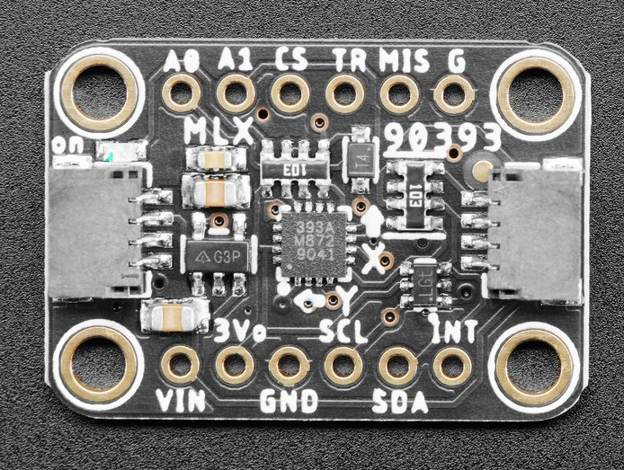

MLX90393 Triple-axis Magnetometer
=================================

.. seo::
    :description: Instructions for setting up MLX90393 Triple-Axis magnetometer sensor.
    :image: mlx90393.jpg
    :keywords: MLX90393

The ``mlx90393`` sensor platform allows you to use your MLX90393
(`datasheet <https://media.melexis.com/-/media/files/documents/datasheets/mlx90393-datasheet-melexis.pdf>`__,
`Adafruit`_) three axis magnetometer with ESPHome. The :ref:`I²C <i2c>` is required to be set up in
your configuration for this sensor to work.

    MLX90393 Triple-axis Magnetometer

.. _Adafruit: https://www.adafruit.com/product/4022

.. code-block:: yaml

    # Example configuration entry
    sensor:
      - platform: mlx90393
        id: mlx
        x_axis:
          name: "x"
        y_axis:
          name: "y"
        z_axis:
          name: "z"

Configuration variables:
------------------------

- **x_axis** (*Optional*): The information for the x-axis.

  - **resolution** (*Optional*, int): Specify which part of the full 19-bit value to read. Defaults to ``DIV_4``. Must be one of:

    - ``DIV_8``
    - ``DIV_4``
    - ``DIV_2``
    - ``DIV_1``

  - All other options from :ref:`Sensor <config-sensor>`.

- **y_axis** (*Optional*): The information for the y-axis.

  - **resolution** (*Optional*, int): Specify which part of the full 19-bit value to read. Defaults to ``DIV_4``. Must be one of:

    - ``DIV_8``
    - ``DIV_4``
    - ``DIV_2``
    - ``DIV_1``

  - All other options from :ref:`Sensor <config-sensor>`.

- **z_axis** (*Optional*): The information for the z-axis.

  - **resolution** (*Optional*, int): Specify which part of the full 19-bit value to read. Defaults to ``DIV_4``. Must be one of:

    - ``DIV_8``
    - ``DIV_4``
    - ``DIV_2``
    - ``DIV_1``

  - All other options from :ref:`Sensor <config-sensor>`.

- **temperature** (*Optional*): Built-in temperature sensor.

  - **oversampling** (*Optional*, int): On-chip oversampling for the temperature sensor. Defaults to ``0``. Must be between ``0`` and ``3``.
  - All other options from :ref:`Sensor <config-sensor>`.

- **drdy_pin** (*Optional*, :ref:`Pin Schema <config-pin_schema>`): Data-ready pin. Often labelled ``INT``. Using this pin might lead to slightly quicker read times.

- **gain** (*Optional*, int): Sets the analog gain. Defaults to ``1X``. Must be one of

  - ``1X``
  - ``1_25X``
  - ``1_67X``
  - ``2X``
  - ``2_5X``
  - ``3X``
  - ``3_75X``
  - ``5X``

- **oversampling** (*Optional*, int): On-chip oversampling. Defaults to ``2``. Must be between ``0`` and ``3``.

- **filter** (*Optional*, int): On-chip digital filter. Defaults to ``6``. Must be between ``0`` and ``7``.

- **temperature_compensation** (*Optional*, bool): On-chip temperature compensation. Defaults to ``false``. When enabled, the resolution options ``DIV_8`` and ``DIV_4`` cannot be used.

- **hallconf** (*Optional*, int): Modifies the hall plate spinning (2-phase vs 4-phase). Defaults to ``0xC``. Must be ``0xC`` or ``0x0``.

- **update_interval** (*Optional*, :ref:`config-time`): The interval to check the
  sensor. Defaults to ``60s``.

- **address** (*Optional*, int): Manually specify the I²C address of
  the sensor. Defaults to ``0x0C``.

- **i2c_id** (*Optional*, :ref:`config-id`): Manually specify the ID of the :ref:`I²C Component <i2c>` if you want
  to use multiple I²C buses.

Gain, resolution and full scale readings
----------------------------------------

By default, the sensor is configured for the lowest sensitivity.
This enables reading magnetic fields of 50,000 µT. However, sensitivity is limited to 3 µT.
This can be improved significantly using the **gain** and **resolution** options, at the cost of reducing the maximum magnetic field that can be measured.

The sensor internally generates an analog signal which is sent to an amplifier.
The **gain** option controls this   amplifier. Too much amplification will cause saturation of the values, but no integer overflow.

After amplification, the analog signal is digitized using a 19-bit ADC.
Only 16 bits are sent to ESPHome. The **resolution** option chooses which bits are sent.

    Resolution options and which bits they report to ESPHome. ``DIV_8`` sends the most significant 16 bits, while ``DIV_1`` sends the least significant bits.

Note that the ADC doesn't actually fill all its 19 bits. This causes ``DIV_4`` to have the same maximum field as ``DIV_8``, while giving better sensitivity.
Only ``DIV_2`` and ``DIV_1`` actually use all values, giving them the best dynamic range. However, both will cause integer overflows when the maximum field strength is exceeded.

After receiving the 16-bit value, ESPHome converts it to floating point values in µT.
Therefore, neither **gain** nor **resolution** affects the magnitude of the values in ESPHome directly.

The following table shows the sensitivity and maximum field strength for every combination.
Note that the Z axis has worse sensitivity due to hardware constraints.

+-------+------------+-------------------------+-------------------+------------------------+------------------+
| gain  | resolution | sensitivity XY (µT/LSB) | max field XY (µT) | sensitivity Z (µT/LSB) | max field Z (µT) |
+=======+============+=========================+===================+========================+==================+
| 1X    | DIV_8      |                   6.009 |            66,098 |                  9.680 |          106,480 |
+-------+------------+-------------------------+-------------------+------------------------+------------------+
| 1X    | DIV_4      |                   3.004 |            66,098 |                  4.840 |          106,480 |
+-------+------------+-------------------------+-------------------+------------------------+------------------+
| 1X    | DIV_2      |                   1.502 |            49,225 |                  2.420 |           79,299 |
+-------+------------+-------------------------+-------------------+------------------------+------------------+
| 1X    | DIV_1      |                   0.751 |            24,612 |                  1.210 |           39,649 |
+-------+------------+-------------------------+-------------------+------------------------+------------------+
| 1_25X | DIV_8      |                   4.807 |            52,878 |                  7.744 |           85,184 |
+-------+------------+-------------------------+-------------------+------------------------+------------------+
| 1_25X | DIV_4      |                   2.404 |            52,878 |                  3.872 |           85,184 |
+-------+------------+-------------------------+-------------------+------------------------+------------------+
| 1_25X | DIV_2      |                   1.202 |            39,380 |                  1.936 |           63,439 |
+-------+------------+-------------------------+-------------------+------------------------+------------------+
| 1_25X | DIV_1      |                   0.601 |            19,690 |                  0.968 |           31,719 |
+-------+------------+-------------------------+-------------------+------------------------+------------------+
| 1_67X | DIV_8      |                   3.605 |            39,659 |                  5.808 |           63,888 |
+-------+------------+-------------------------+-------------------+------------------------+------------------+
| 1_67X | DIV_4      |                   1.803 |            39,659 |                  2.904 |           63,888 |
+-------+------------+-------------------------+-------------------+------------------------+------------------+
| 1_67X | DIV_2      |                   0.901 |            29,535 |                  1.452 |           47,579 |
+-------+------------+-------------------------+-------------------+------------------------+------------------+
| 1_67X | DIV_1      |                   0.451 |            14,767 |                  0.726 |           23,790 |
+-------+------------+-------------------------+-------------------+------------------------+------------------+
| 2X    | DIV_8      |                   3.004 |            33,049 |                  4.840 |           53,240 |
+-------+------------+-------------------------+-------------------+------------------------+------------------+
| 2X    | DIV_4      |                   1.502 |            33,049 |                  2.420 |           53,240 |
+-------+------------+-------------------------+-------------------+------------------------+------------------+
| 2X    | DIV_2      |                   0.751 |            24,612 |                  1.210 |           39,649 |
+-------+------------+-------------------------+-------------------+------------------------+------------------+
| 2X    | DIV_1      |                   0.376 |            12,306 |                  0.605 |           19,825 |
+-------+------------+-------------------------+-------------------+------------------------+------------------+
| 2_5X  | DIV_8      |                   2.404 |            26,439 |                  3.872 |           42,592 |
+-------+------------+-------------------------+-------------------+------------------------+------------------+
| 2_5X  | DIV_4      |                   1.202 |            26,439 |                  1.936 |           42,592 |
+-------+------------+-------------------------+-------------------+------------------------+------------------+
| 2_5X  | DIV_2      |                   0.601 |            19,690 |                  0.968 |           31,719 |
+-------+------------+-------------------------+-------------------+------------------------+------------------+
| 2_5X  | DIV_1      |                   0.300 |             9,845 |                  0.484 |           15,860 |
+-------+------------+-------------------------+-------------------+------------------------+------------------+
| 3X    | DIV_8      |                   2.003 |            22,033 |                  3.227 |           35,493 |
+-------+------------+-------------------------+-------------------+------------------------+------------------+
| 3X    | DIV_4      |                   1.001 |            22,033 |                  1.613 |           35,493 |
+-------+------------+-------------------------+-------------------+------------------------+------------------+
| 3X    | DIV_2      |                   0.501 |            16,408 |                  0.807 |           26,433 |
+-------+------------+-------------------------+-------------------+------------------------+------------------+
| 3X    | DIV_1      |                   0.250 |             8,204 |                  0.403 |           13,216 |
+-------+------------+-------------------------+-------------------+------------------------+------------------+
| 3_75X | DIV_8      |                   1.602 |            17,626 |                  2.581 |           28,395 |
+-------+------------+-------------------------+-------------------+------------------------+------------------+
| 3_75X | DIV_4      |                   0.801 |            17,626 |                  1.291 |           28,395 |
+-------+------------+-------------------------+-------------------+------------------------+------------------+
| 3_75X | DIV_2      |                   0.401 |            13,127 |                  0.645 |           21,146 |
+-------+------------+-------------------------+-------------------+------------------------+------------------+
| 3_75X | DIV_1      |                   0.200 |             6,563 |                  0.323 |           10,573 |
+-------+------------+-------------------------+-------------------+------------------------+------------------+
| 5X    | DIV_8      |                   1.202 |            13,220 |                  1.936 |           21,296 |
+-------+------------+-------------------------+-------------------+------------------------+------------------+
| 5X    | DIV_4      |                   0.601 |            13,220 |                  0.968 |           21,296 |
+-------+------------+-------------------------+-------------------+------------------------+------------------+
| 5X    | DIV_2      |                   0.300 |             9,845 |                  0.484 |           15,860 |
+-------+------------+-------------------------+-------------------+------------------------+------------------+
| 5X    | DIV_1      |                   0.150 |             4,922 |                  0.242 |            7,930 |
+-------+------------+-------------------------+-------------------+------------------------+------------------+

For **hallconf** = 0x0, the sensitivity scales with a factor 98/75. For example 0.150μT/LSB with HALLCONF 0xC
becomes 0.196μT/LSB with HALLCONF 0x0. The maximum field strength changes accordingly.

See Also
--------

- :ref:`sensor-filters`
- `arduino-MLX90393 <https://github.com/functionpointer/arduino-MLX90393>`__
- :ghedit:`Edit`
