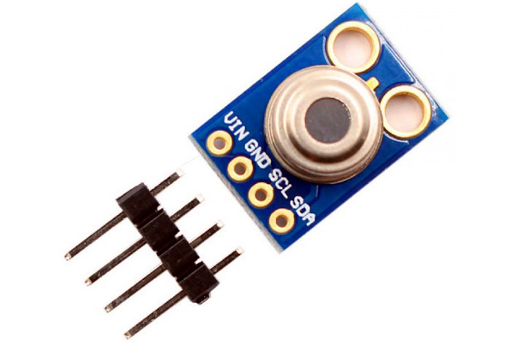

MLX90614  non-contact thermometer
=================================

.. seo::
    :description: Instructions for setting up Melexis MLX90614 non-contact thermometer.
    :image: mlx90614.jpg
    :keywords: MLX90614

The ``mlx90614`` sensor platform allows you to use your Melexis MLX90614 non-contact infrared thermometer
(`Datasheet <https://www.melexis.com/en/documents/documentation/datasheets/datasheet-mlx90614>`__,
`Product Page`_) with ESPHome. Sensor measures both ambient and object temperature that can be enabled independently.

The :ref:`I²C Bus <i2c>` is required to be set up in your configuration for this sensor to work.

    MLX90614  non-contact thermometer

.. _Product Page: https://www.melexis.com/en/product/MLX90614/Digital-Plug-Play-Infrared-Thermometer-TO-Can

.. code-block:: yaml

    # Example configuration entry
    sensor:
      - platform: mlx90614
        ambient:
          name: Ambient
        object:
          name: Object

Configuration variables
-----------------------
- **ambient** (*Optional*): Enables sensor entity for ambient temperature reading.

  - All options from :ref:`Sensor <config-sensor>`.

- **object** (*Optional*): Enables sensor entity for object temperature reading.

  - **emissivity** (*Optional*): Emissivity coefficient is the measure of an object's ability to emit infrared energy 
    compared to a theoretical perfect black body emitter. See `Emissivity Application note <https://media.melexis.com/-/media/files/documents/application-notes/mlx90614-changing-emissivity-unlocking-key-application-note-melexis.pdf?la=en>`__
    for details on determining custom emissivity. Default is 1.0 which is 100% and corresponds to the ideal black body.

  - All options from :ref:`Sensor <config-sensor>`.

- All other options for I²C devices described at :ref:`I²C Bus <i2c>`.

See Also
--------

- :ref:`sensor-filters`
- :apiref:`mlx90614/mlx90614.h`
- :ghedit:`Edit`
