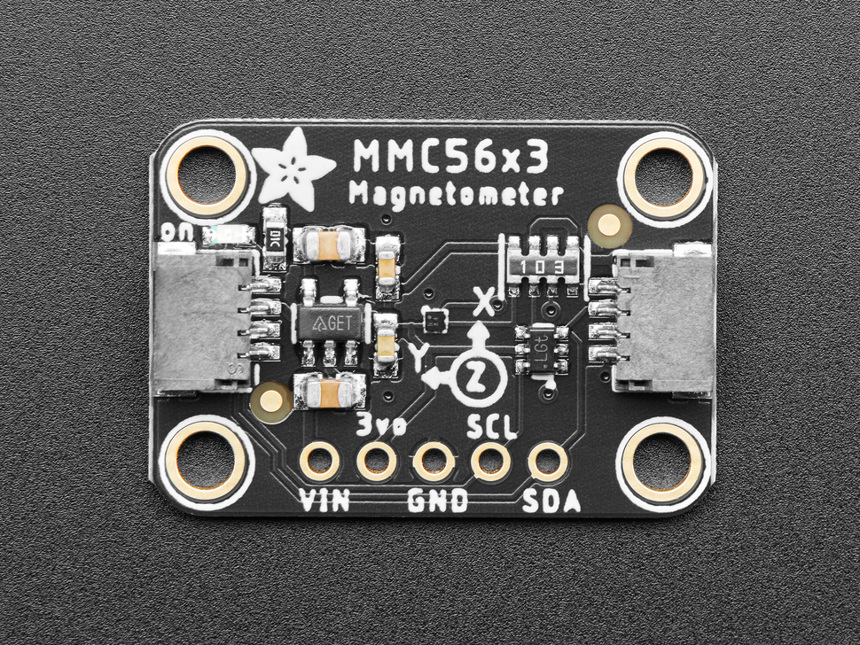

.. _mmc5603:

MMC5603 Magnetometer
=====================

.. seo::
    :description: Instructions for setting up MMC5693 IMU compass sensors.
    :image: mmc5603.jpg
    :keywords: MMC5603

The ``mmc5603`` allows you to use your MMC5603 triple-axis magnetometers
(`datasheet <https://cdn-learn.adafruit.com/assets/assets/000/113/957/original/MMC5603NJ_RevB_7-12-18.pdf?1659554945>`__,
`Adafruit`_) with ESPHome. The :ref:`I²C Bus <i2c>` is required to be set up in your configuration
for this sensor to work.

    MMC5603 Magnetometer.

.. _Adafruit: https://www.adafruit.com/product/5579

.. code-block:: yaml

    # Example configuration entry
    sensor:
      - platform: mmc5603 
        address: 0x30
        field_strength_x:
          name: "MMC5603 Field Strength X"
        field_strength_y:
          name: "MMC5603 Field Strength Y"
        field_strength_z:
          name: "MMC5603 Field Strength Z"
        heading:
          name: "MMC5603 Heading"
        update_interval: 60s

Configuration variables:
------------------------

- **address** (*Optional*, int): Manually specify the I²C address of the sensor. Defaults to ``0x1E``.
- **field_strength_x** (*Optional*): The field strength in microtesla along the X-Axis. All options from
  :ref:`Sensor <config-sensor>`.
- **field_strength_y** (*Optional*): The field strength in microtesla along the Y-Axis. All options from
  :ref:`Sensor <config-sensor>`.
- **field_strength_z** (*Optional*): The field strength in microtesla along the Z-Axis. All options from
  :ref:`Sensor <config-sensor>`.
- **heading** (*Optional*): The heading of the sensor in degrees. All options from
  :ref:`Sensor <config-sensor>`.
- **update_interval** (*Optional*, :ref:`config-time`): The interval to check the sensor. Defaults to ``60s``.

- **id** (*Optional*, :ref:`config-id`): Manually specify the ID used for code generation.

See Also
--------

- :ref:`sensor-filters`
- :doc:`template`
- :apiref:`mmc5603/mmc5603.h`
- :ghedit:`Edit`
