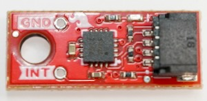

.. _mmc5983:

MMC5983 Magnetometer
====================

.. seo::
    :description: Instructions for setting up MMC5983 magnetometer.
    :image: mmc5983.jpg
    :keywords: MMC5983

The ``mmc5983`` component allows you to use your MMC5983 triple-axis magnetometer (`datasheet`_, `SparkFun`_) with ESPHome.

The :ref:`I²C Bus <i2c>` is required to be set up for this sensor to work. The device supports 400kHz
operation, so you may specify up to ``frequency: 400kHz`` in your ``i2c`` configuration.

    MMC5983 Magnetometer.

.. _datasheet: https://www.memsic.com/Public/Uploads/uploadfile/files/20220119/MMC5983MADatasheetRevA.pdf
.. _SparkFun: https://www.sparkfun.com/products/19921

.. code-block:: yaml

    # Example configuration entry
    sensor:
      - platform: mmc5983
        field_strength_x:
          name: "Field X"
        field_strength_y:
          id: "field_y"
          internal: true
        field_strength_z:
          name: "Field Z"
          filters:
            - throttle: 120s
        update_interval: 60s

Configuration variables:
------------------------

- **field_strength_x** (*Optional*): The information for the X-axis field sensor. All options from
  :ref:`Sensor <config-sensor>`.
- **field_strength_y** (*Optional*): The information for the Y-axis field sensor. All options from
  :ref:`Sensor <config-sensor>`.
- **field_strength_z** (*Optional*): The information for the Z-axis field sensor. All options from
  :ref:`Sensor <config-sensor>`.
- **update_interval** (*Optional*, :ref:`config-time`): The interval to check the sensor. Defaults to ``60s``.

See Also
--------

- :ref:`sensor-filters`
- :doc:`mmc5603`
- :apiref:`mmc5983/mmc5983.h`
- `SparkFun MMC5983MA Magnetometer Arduino Library <https://github.com/sparkfun/SparkFun_MMC5983MA_Magnetometer_Arduino_Library>`__
- :ghedit:`Edit`
