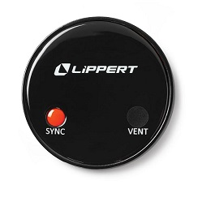

Mopeka Pro Check BLE Sensor
===========================

.. seo::
    :description: Instructions for setting up Mopeka Pro Check or Lippert Propane Tank bluetooth-based sensors in ESPHome.
    :image: mopeka_pro_check.jpg
    :keywords: Mopeka, Mopeka Pro Check, Mopeka Pro Plus, Mopeka Pro Universal, Lippert, Lippert Propane, Lippert Propane Sensor, Lippert Propane Tank Sensor, BLE, Bluetooth

The ``mopeka_pro_check`` sensor platform lets you track the output of Mopeka Pro
Check LP, Mopeka Pro Plus, Mopeka Pro Universal or Lippert Propane Tank Sensors,   Bluetooth Low
Energy devices using the :doc:`/components/esp32_ble_tracker`. This component
will track the tank level, distance, temperature, and battery percentage of a 
device every time the sensor sends out a BLE broadcast.

.. warning::

    This sensor component only supports the following sensors:
      + Mopeka Pro Check devices
      + Mopeka Pro Plus devices
      + Mopeka Pro Check Universal Sensor
      + Lippert Propane Tank Sensor, part number 2021130655

    Sensors are calibrated for propane only.
      
    See :doc:`/components/sensor/mopeka_std_check` for original Mopeka Check sensors support.

.. figure:: images/mopeka_pro_check.jpg
    :align: center

    Mopeka Pro Check LP over BLE.

    Lippert™ Propane Tank Sensor 

The original Mopeka Check sensors are not supported.

Mopeka Pro Check LP over BLE:
-----------------------------

.. code-block:: yaml

    esp32_ble_tracker:

    sensor:
      # Example using 20lb vertical propane tank.
      - platform: mopeka_pro_check
        mac_address: D3:75:F2:DC:16:91
        tank_type: 20LB_V
        temperature:
            name: "Propane test temp"
        level:
            name: "Propane test level"
        distance:
            name: "Propane test distance"
        battery_level:
            name: "Propane test battery level"

      # Custom example - user defined empty / full points
      - platform: mopeka_pro_check
        mac_address: D3:75:F2:DC:16:91
        tank_type: CUSTOM
        custom_distance_full: 40cm
        custom_distance_empty: 10mm
        temperature:
            name: "Propane c test temp"
        level:
            name: "Propane c test level"
        distance:
            name: "Propane c test distance"
        battery_level:
            name: "Propane c test battery level"

Configuration variables:
------------------------

- **mac_address** (**Required**, MAC Address): The MAC address of the Mopeka/Lippert
  device.

- **tank_type** (**Required**): The tank type the sensor is measuring. See below.

- **custom_distance_full** (*Optional*): distance sensor will read when it should be
  considered full (100%).  This is only used when tank_type = CUSTOM

- **custom_distance_empty** (*Optional*): distance sensor will read when it should be
  considered empty (0%).  This is only used when tank_type = CUSTOM

- **level** (*Optional*): The percentage of full for the tank sensor

  - All options from :ref:`Sensor <config-sensor>`.

- **distance** (*Optional*): The raw distance/depth of the liquid for the sensor in mm.

  - All options from :ref:`Sensor <config-sensor>`.

- **temperature** (*Optional*): The information for the temperature sensor.
  This temperature is on the sensor and is not calibrated to ambient temperature.

  - All options from :ref:`Sensor <config-sensor>`.

- **battery_level** (*Optional*): The information for the battery percentage
  sensor.  Sensor uses a standard CR2032 battery.

  - All options from :ref:`Sensor <config-sensor>`.

Tank Types
----------

Currently supported Tank types are:

- ``20LB_V`` - 20 LB vertical tank
- ``30LB_V`` - 30 LB vertical tank
- ``40LB_V`` - 40 LB vertical tank
- ``EUROPE_6KG`` - 6kg vertical tank
- ``EUROPE_11KG`` - 11kg vertical tank
- ``EUROPE_14KG`` - 14kg vertical tank
- ``CUSTOM`` - Allows you to define your own full and empty points

Setting Up Devices
------------------

To set up the sensor devices you first need to find the MAC Address so that
ESPHome can identify it. First, create a simple configuration with the ``esp32_ble_tracker``
and the ``mopeka_ble`` component like so:

.. code-block:: yaml

    esp32_ble_tracker:

    mopeka_ble:

After uploading, the ESP32 will immediately try to scan for BLE devices.  Press and hold the sync button for it to be identified.
Or alternativly set the configuration flag ``show_sensors_without_sync: true`` to see all devices.
For all sensors found the ``mopeka_ble`` component will print a message like this one:

.. code::

    [20:43:26][I][mopeka_ble:074]: MOPEKA PRO (NRF52) SENSOR FOUND: D3:75:F2:DC:16:91

Then just copy the address (``D3:75:F2:DC:16:91``) into a new
``sensor.mopeka_pro_check`` platform entry like in the configuration example at the top.

.. note::

    The ESPHome Mopeka Pro Check BLE component listens passively to packets the Mopeka/Lippert device sends by itself.
    ESPHome therefore has no impact on the battery life of the device.

See Also
--------

- :doc:`/components/esp32_ble_tracker`
- :doc:`/components/sensor/index`
- :apiref:`mopeka_pro_check/mopeka_pro_check.h`
- `Mopeka  <https://www.mopekaiot.com/shop>`
- `Lippert <https://store.lci1.com/lippert-propane-tank-sensor-2021130655>`__
- :ghedit:`Edit`
