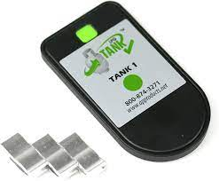

Mopeka Standard Check BLE Sensor
================================

.. seo::
    :description: Instructions for setting up Mopeka Standard Check bluetooth-based sensors in ESPHome.
    :image: mopeka_std_check.jpg
    :keywords: Mopeka, Mopeka Standard Check, Mopeka Std Check, BLE, Bluetooth

The ``mopeka_std_check`` sensor platform lets you track the output of Mopeka
Standard Check LP Bluetooth Low Energy devices using the 
:doc:`/components/esp32_ble_tracker`. This component will track the tank level, 
distance, temperature, and battery percentage of a Mopeka Standard Check LP BLE 
device every time the sensor sends out a BLE broadcast.

.. warning::

    This sensor component only supports the Mopeka Standard Check devices.
    See :doc:`/components/sensor/mopeka_pro_check` for Mopeka Pro Check sensors support.

    Mopeka Std Check LP over BLE.

.. code-block:: yaml

    esp32_ble_tracker:

    sensor:
      # Example using 11kg 100% propane tank.
      - platform: mopeka_std_check
        mac_address: D3:75:F2:DC:16:91
        tank_type: Europe_11kg
        temperature:
            name: "Propane test temp"
        level:
            name: "Propane test level"
        distance:
            name: "Propane test distance"
        battery_level:
            name: "Propane test battery level"

      # Custom example - user defined empty / full points and 80% butane and 20% propane.
      - platform: mopeka_std_check
        mac_address: D3:75:F2:DC:16:91
        tank_type: CUSTOM
        custom_distance_full: 40cm
        custom_distance_empty: 32mm
        propane_butane_mix: 20%
        temperature:
            name: "Propane c test temp"
        level:
            name: "Propane c test level"
        distance:
            name: "Propane c test distance"
        battery_level:
            name: "Propane c test battery level"

Configuration variables:
------------------------

- **mac_address** (**Required**, MAC Address): The MAC address of the Mopeka
  device.

- **tank_type** (**Required**): The tank type the sensor is measuring. See below.

- **custom_distance_full** (*Optional*): distance sensor will read when it should be
  considered full (100%).  This is only used when tank_type = CUSTOM

- **custom_distance_empty** (*Optional*): distance sensor will read when it should be
  considered empty (0%).  This is only used when tank_type = CUSTOM

- **propane_butane_mix** (*Optional*): Mixture of propane and butane.

  - 100% - (*default*) 100% Propane

  - 80% - 80% Propane and 20% Butane

  - 20% - 20% Propane and 80% Butane

  - 0% - 100% Butane

- **level** (*Optional*): The percentage of full for the tank sensor

  - All options from :ref:`Sensor <config-sensor>`.

- **distance** (*Optional*): The raw distance/depth of the liquid for the sensor in mm.

  - All options from :ref:`Sensor <config-sensor>`.

- **temperature** (*Optional*): The information for the temperature sensor.
  This temperature is on the sensor and is not calibrated to ambient temperature.

  - All options from :ref:`Sensor <config-sensor>`.

- **battery_level** (*Optional*): The information for the battery percentage
  sensor.  Sensor uses a standard CR2032 battery.

  - All options from :ref:`Sensor <config-sensor>`.

Tank Types
----------

Currently supported Tank types are:

- ``NORTH_AMERICA_20LB_VERTICAL`` - 20 LB vertical tank
- ``NORTH_AMERICA_30LB_VERTICAL`` - 30 LB vertical tank
- ``NORTH_AMERICA_40LB_VERTICAL`` - 40 LB vertical tank
- ``EUROPE_6KG`` - 6kg vertical tank
- ``EUROPE_11KG`` - 11kg vertical tank
- ``EUROPE_14KG`` - 14kg vertical tank
- ``CUSTOM`` - Allows you to define your own full and empty points

Setting Up Devices
------------------

To set up Mopeka Standard Check devices you first need to find their MAC Address so that
ESPHome can identify them. So first, create a simple configuration with the ``esp32_ble_tracker``
and the ``mopeka_ble`` component like so:

.. code-block:: yaml

    esp32_ble_tracker:

    mopeka_ble:

After uploading, the ESP32 will immediately try to scan for BLE devices. For Mopeka Standard devices you must press and hold the green sync button for it to be identified. 
Or alternativly set the configuration flag ``show_sensors_without_sync: true`` to see all devices.
For all sensors found the ``mopeka_ble`` component will print a message like this one:

.. code::

    [20:43:26][I][mopeka_ble:056]: MOPEKA STD (CC2540) SENSOR FOUND: D3:75:F2:DC:16:91

Then just copy the address (``D3:75:F2:DC:16:91``) into a new
``sensor.mopeka_std_check`` platform entry like in the configuration example at the top.

.. note::

    The ESPHome Mopeka Standard Check BLE component listens passively to packets the Mopeka device sends by itself.
    ESPHome therefore has no impact on the battery life of the device.

See Also
--------

- :doc:`/components/esp32_ble_tracker`
- :doc:`/components/sensor/index`
- :apiref:`mopeka_std_check/mopeka_std_check.h`
- :ghedit:`Edit`
