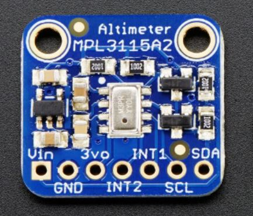

MPL3115A2 Barometric Pressure/Altitude/Temperature Sensor
=========================================================

.. seo::
    :description: Instructions for setting up MPL3115A2 atmospheric pressure sensors.
    :image: mpl3115a2.jpg
    :keywords: MPL3115A2

The ``mpl3115a2`` sensor platform allows you to use your MPL3115A2 atmospheric pressure sensors
(`datasheet <https://www.nxp.com/docs/en/data-sheet/MPL3115A2.pdf>`__,
`Adafruit`_)  temperature and pressure sensors with ESPHome. The :ref:`I²C <i2c>` is
required to be set up in your configuration for this sensor to work.

    MPL3115A2 Barometric Pressure/Altitude/Temperature Sensor

.. _Adafruit: https://www.adafruit.com/product/1893

.. code-block:: yaml

    # Example configuration entry
    sensor:
    - platform: mpl3115a2
      temperature:
        name: "MPL3115A2 Temperature"
      pressure:
        name: "MPL3115A2 Pressure"
      update_interval: 10s

Configuration variables:
------------------------
The MPL3115A2 can be configured to output either pressure or altitude depending on which
sensor is configured.

- **pressure** (*Optional*): The information for the pressure sensor.

  - **name** (**Required**, string): The name for the pressure sensor.
  - **id** (*Optional*, :ref:`config-id`): Set the ID of this sensor for use in lambdas.
  - All other options from :ref:`Sensor <config-sensor>`.

- **altitude** (*Optional*): The information for the altitude sensor.

  - **name** (**Required**, string): The name for the altitude sensor.
  - **id** (*Optional*, :ref:`config-id`): Set the ID of this sensor for use in lambdas.
  - All other options from :ref:`Sensor <config-sensor>`.

- **temperature** (*Optional*): The information for the temperature sensor.

  - **name** (**Required**, string): The name for the temperature sensor.
  - **id** (*Optional*, :ref:`config-id`): Set the ID of this sensor for use in lambdas.
  - All other options from :ref:`Sensor <config-sensor>`.

- **address** (*Optional*, int): Manually specify the I²C address of
  the sensor. Defaults to ``0x60``.
- **update_interval** (*Optional*, :ref:`config-time`): The interval to check the
  sensor. Defaults to ``60s``.

See Also
--------

- :ref:`sensor-filters`
- :doc:`bmp280`
- :doc:`bme280`
- :doc:`bmp085`
- :doc:`ms5611`
- :apiref:`mpl3115a2/mpl3115a2.h`
- :ghedit:`Edit`
