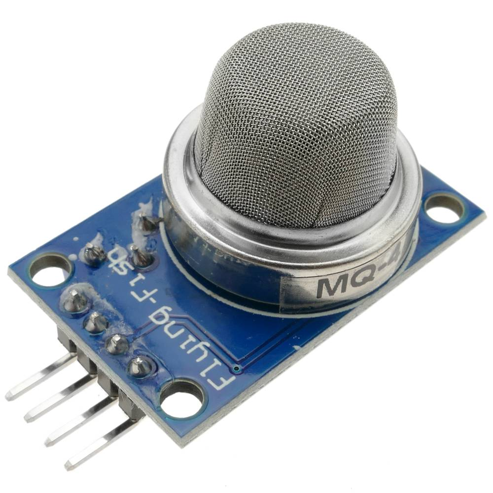

MQ Gas Sensor Series
====================

.. seo::
    :description: Instructions for setting up MQ gas sensor
    :image: mq.jpg
    :keywords: mq

The ``mq`` sensor platform allows you to use one of the MQ sensor series
(`website`_) with ESPHome. More details about the MQ gas sensor could be found
in the `article`_.

.. _website: https://www.sparkfun.com/categories/tags/mq-sensor
.. _article: https://jayconsystems.com/blog/understanding-a-gas-sensor

    MQ Gas Sensor

The communication with the MQ sensor is done using it's analog output, so you need
to connect ESP using an analog pin. 
Most of the MQ sensors need 12 - 24 hours of preheating time (:ref:`Datasheets <mq-datasheets>`).
Connect the power supply and leave for the required time until it gets ready.
The sensor needs to be calibrated.

.. _mq-calibration:

MQ sensor calibration
---------------------

Before using the module you have to calibrate it. 
This sensor measures the gas concentration based on resistance ratio. 
This ratio includes R0 (sensor resistance in certain ppm concentration of a specific gas) 
and Rs (internal resistance of the sensor which changes by gas concentration). 
In clean air, after preheating run a sensor configuration without ``r0`` variable.
Then the R0 will be automatically calculated and the value will be provided in the log output 
(the :ref:`log level <logger-log_levels>` must be set to at least ``DEBUG``!).

.. code-block:: yaml

    # Example configuration entry
    sensor:
    - platform: mq
      model: MQ9
      pin: A0
      rl: 10
      r0: 0.95
      update_interval: 30s
      sensor_lpg:
        name: Sensor LPG
      sensor_ch4:
        name: Sensor CH4
      sensor_co:
        name: Sensor CO

Configuration variables:
------------------------

- **model** (**Required**, string): Set a MQ model. |br| 
  Supported models: ``MQ2, MQ3, MQ4, MQ5, MQ6, MQ7, MQ8, MQ9, MQ135``.

- **pin** (**Required**, :ref:`config-pin`): The analog pin of the board.
  Usually, this is ``A0`` (e.g. ESP32 can be ``GPIO36``).

- **rl** (**Optional**, float): MQ board RL value in kilo-ohms.
  Defaults to ``10.0``.
  Data of board that is used should have it specified or can be measured (`Details <https://images.squarespace-cdn.com/content/v1/5af4ad515cfd79b209ac7864/1548673278154-1EA0LU2OFKIKQQG67MB4/Circuit3.JPG?format=750w>`__).

- **r0** (**Optional**, float, :ref:`Calibration <mq-calibration>`): MQ board R0 value in kilo-ohms.
  If not provided then it will be set via calibration. The best is to set it once the calibrated value is known (can be found in the log output).

- **sensor_x** (**Optional**): The gas data from the sensor in parts per million (ppm) (``x`` specifies the gas type that is allowed to use with the given MQ model). |br|
  Allowed sensors for given model: |br|
    
    * MQ2: ``sensor_h2, sensor_lpg, sensor_co, sensor_alcohol, sensor_propane``
    * MQ3: ``sensor_lpg, sensor_ch4, sensor_co, sensor_alcohol, sensor_benzene, sensor_hexane``
    * MQ4: ``sensor_lpg, sensor_ch4, sensor_co, sensor_alcohol, sensor_smoke``
    * MQ5: ``sensor_h2, sensor_lpg, sensor_ch4, sensor_co, sensor_alcohol``
    * MQ6: ``sensor_h2, sensor_lpg, sensor_ch4, sensor_co, sensor_alcohol``
    * MQ7: ``sensor_h2, sensor_lpg, sensor_ch4, sensor_co, sensor_alcohol``
    * MQ8: ``sensor_h2, sensor_lpg, sensor_ch4, sensor_co, sensor_alcohol``
    * MQ9: ``sensor_lpg, sensor_ch4, sensor_co``
    * MQ135: ``sensor_co, sensor_alcohol, sensor_co2, sensor_tolueno, sensor_nh4, sensor_acetona``

  - **name** (**Required**, string): The name for the CO sensor.
  - **id** (*Optional*, :ref:`config-id`): Set the ID of this sensor for use in lambdas. 
    All other options from :ref:`Sensor <config-sensor>`.

- **update_interval** (*Optional*, :ref:`config-time`): The interval to check the
  sensor. Defaults to ``10s``.

- **id** (*Optional*, :ref:`config-id`): Manually specify the ID used for actions.

MQ sensor connection
--------------------

    Example of the connection diagram how to connect ESP32/ESP8266 to MQ sensor
    
.. note::

    Note that sensor requires 5 V. Also to read the data the sensor needs to be connected to analog pin of the ESP device

.. note::

    **MQ-7** needs two different voltages for heater, they can be supplied by PWM and DC Signal 
    controlled by your controller, another option is to use two different power sources, you should 
    use the best option for you.

    .. figure:: images/mq7-pins.png
        :align: center
        :width: 80.0%

        Example of the connection diagram to MQ-7 sensor

.. _mq-datasheets:

Sensor manufacturers datasheets
-------------------------------

.. csv-table::  
    :header: "Sensor", "Manufacture", "URL Datasheet"
    :widths: auto

    "MQ-2", "Pololulu", `Datasheet <https://www.pololu.com/file/0J309/MQ2.pdf>`__
    "MQ-3", "Sparkfun", `Datasheet <https://www.sparkfun.com/datasheets/Sensors/MQ-3.pdf>`__
    "MQ-4", "Sparkfun", `Datasheet <https://www.sparkfun.com/datasheets/Sensors/Biometric/MQ-4.pdf>`__
    "MQ-5", "parallax", `Datasheet <https://www.parallax.com/sites/default/files/downloads/605-00009-MQ-5-Datasheet.pdf>`__
    "MQ-6", "Sparkfun", `Datasheet <https://www.sparkfun.com/datasheets/Sensors/Biometric/MQ-6.pdf>`__
    "MQ-7", "Sparkfun", `Datasheet <https://www.sparkfun.com/datasheets/Sensors/Biometric/MQ-7.pdf>`__
    "MQ-8", "Sparkfun", `Datasheet <https://dlnmh9ip6v2uc.cloudfront.net/datasheets/Sensors/Biometric/MQ-8.pdf>`__
    "MQ-9", "Haoyuelectronics", `Datasheet <http://www.haoyuelectronics.com/Attachment/MQ-9/MQ9.pdf>`__
    "MQ-135", "HANWEI Electronic", `Datasheet <https://www.electronicoscaldas.com/datasheet/MQ-135_Hanwei.pdf>`__

See Also
--------

- :ref:`sensor-filters`
- :apiref:`mq/mq.h`
- `MQSensorsLib <https://github.com/miguel5612/MQSensorsLib>`__
- :ghedit:`Edit`

.. |br| raw:: html

       
