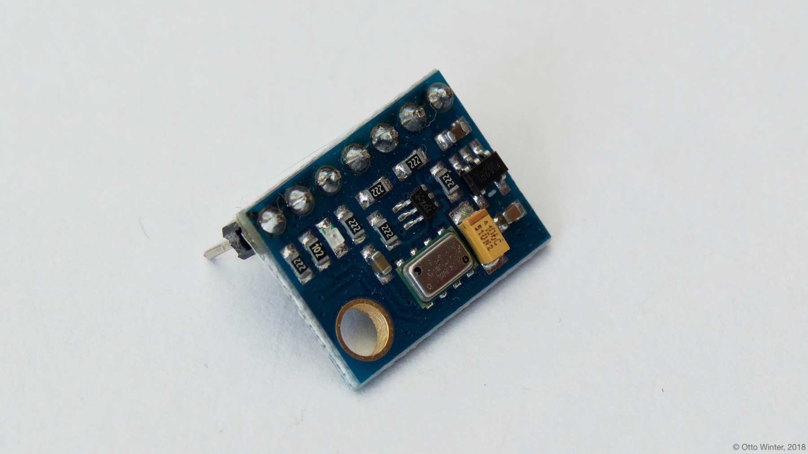

MS5611 Atmospheric Pressure Sensor
==================================

.. seo::
    :description: Instructions for setting up MS5611 atmospheric pressure sensors.
    :image: ms5611.jpg
    :keywords: MS5611

The ``ms5611`` sensor platform allows you to use your MS5611 atmospheric pressure sensors
(`hobbytronics`_) temperature and pressure sensors with ESPHome. The :ref:`I²C <i2c>` is
required to be set up in your configuration for this sensor to work.

    MS5611 Atmospheric Pressure Sensor

.. _hobbytronics: http://www.hobbytronics.co.uk/ms5611-altitude-sensor

.. figure:: images/ms5611-ui.png
    :align: center
    :width: 80.0%

.. code-block:: yaml

    # Example configuration entry
    sensor:
      - platform: ms5611
        temperature:
          name: "Outside Temperature"
        pressure:
          name: "Outside Pressure"
        address: 0x77
        update_interval: 60s

Configuration variables:
------------------------

- **pressure** (**Required**): The information for the pressure sensor.

  - **name** (**Required**, string): The name for the pressure sensor.
  - **id** (*Optional*, :ref:`config-id`): Set the ID of this sensor for use in lambdas.
  - All other options from :ref:`Sensor <config-sensor>`.

- **temperature** (**Required**): The information for the temperature.
  sensor

  - **name** (**Required**, string): The name for the temperature
    sensor.
  - **id** (*Optional*, :ref:`config-id`): Set the ID of this sensor for use in lambdas.
  - All other options from :ref:`Sensor <config-sensor>`.

- **address** (*Optional*, int): Manually specify the I²C address of
  the sensor. Defaults to ``0x77``.
- **update_interval** (*Optional*, :ref:`config-time`): The interval to check the
  sensor. Defaults to ``60s``.

See Also
--------

- :ref:`sensor-filters`
- :doc:`bmp280`
- :doc:`bme280`
- :doc:`bmp085`
- `Arduino MS5611 Library <https://github.com/jarzebski/Arduino-MS5611>`__ by `Korneliusz Jarzębski <https://github.com/jarzebski>`__
- :apiref:`ms5611/ms5611.h`
- :ghedit:`Edit`
