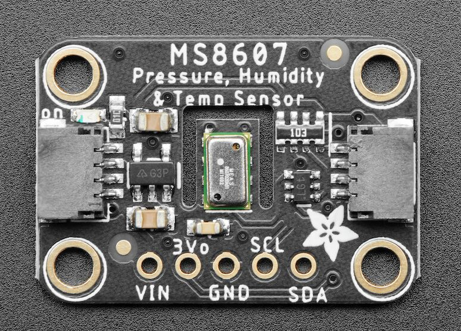

MS8607 Temperature+Pressure+Humidity Sensor
===========================================

.. seo::
    :description: Instructions for setting up MS8607 temperature, humidity, and pressure sensors.
    :image: ms8607.jpg
    :keywords: MS8607

The ``ms8607`` sensor platform allows you to use your MS8607 (`datasheet`_, `Adafruit`_) temperature,
pressure and humidity sensors with ESPHome. An :ref:`I²C Bus <i2c>` is required to be set up in
your configuration for this sensor to work.

    MS8607 Temperature, Pressure & Humidity Sensor. Image by `Adafruit`_

.. _datasheet: https://www.te.com/commerce/DocumentDelivery/DDEController?Action=srchrtrv&DocNm=MS8607-02BA01&DocType=DS&DocLang=English
.. _Adafruit: https://www.adafruit.com/product/4716

.. code-block:: yaml

    # Example configuration entry
    sensor:
      - platform: ms8607
        temperature:
          name: Temperature
        humidity:
          name: Humidity
        pressure:
          name: Pressure

Configuration variables:
------------------------

- **temperature** (**Required**): The information for the temperature sensor.
  All options from :ref:`Sensor <config-sensor>`.

- **pressure** (**Required**): The information for the pressure sensor.
  All options from :ref:`Sensor <config-sensor>`.

- **humidity** (**Required**): The information for the humidity sensor.
  
  - **address** (*Optional*, int): Manually specify the I²C address of
    the humidity sensor. Defaults to ``0x40``.
  - **i2c_id** (*Optional*, :ref:`config-id`): Manually specify the ID of the :ref:`I²C Component <i2c>` if your
    configuration uses multiple I²C buses. This should match the ``i2c_id`` documented below.
  - All other options from :ref:`Sensor <config-sensor>`.

- **address** (*Optional*, int): Manually specify the I²C address of
  the temperature & pressure sensor. Defaults to ``0x76``.
- **i2c_id** (*Optional*, :ref:`config-id`): Manually specify the ID of the :ref:`I²C Component <i2c>` if your
  configuration uses multiple I²C buses. This should match the ``i2c_id`` inside of ``humidity``, documented above.
- **update_interval** (*Optional*, :ref:`config-time`): The interval to check the
  sensor. Defaults to ``60s``.

I²C Addresses
-------------
The MS8607 digital sensor has two I²C addresses: one for temperature & pressure (``0x76``), and the other for
humidity readings (``0x40``). They are attached to the same ``SCL``/``SDA`` pins on the package, so if you need to
customize the ``i2c_id``, you need to specify it at the top-level for temperature & humidity, and use the same value
inside the humidity configuration block.

See Also
--------

- :ref:`sensor-filters`
- :apiref:`ms8607/ms8607.h`
- `MS8607 Generic C Driver <https://github.com/TEConnectivity/MS8607_Generic_C_Driver>`__ by `TE Connectivity <http://www.te.com/>`__
- `Manufacturer's product page <https://www.te.com/usa-en/product-CAT-BLPS0018.html>`__
- :ghedit:`Edit`
