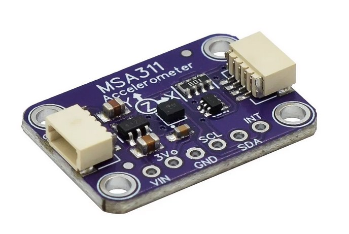
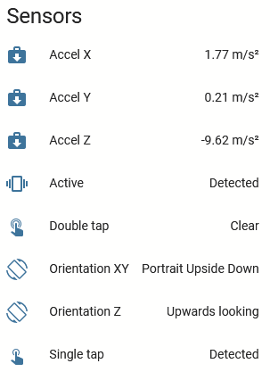

MSA301 and MSA311 Sensors
=========================

.. seo::
    :description: Instructions for setting up MSA301 and MSA311 digital tri-axial accelerometers.
    :image: msa311.jpg

.. _msa3xx-component:

Component/Hub
-------------

The ``msa3xx`` sensor platform allows you to use your MSA301 and MSA311 tri-axial, 
low-g accelerometers (`datasheet <https://cdn-shop.adafruit.com/product-files/5309/MSA311-V1.1-ENG.pdf>`__) 
with ESPHome. The :ref:`I²C <i2c>` is required to be set up in your configuration for this sensor to work.

This component provides acceleration data in m/s², orientation information, and tap detection. XYZ axes can be
calibrated and transformed to match the physical orientation of the sensor.

    Module breakout board with MSA311 sensor.

    Example of MSA3xx sensor represenration in ESPHome dashboard.

.. code-block:: yaml

    # Example configuration entry
    msa3xx:
      model: msa311
      range: 4G
      resolution: 12
      update_interval: 10s
      calibration:
        offset_x: 0.000
        offset_y: 0.000
        offset_z: 0.000
      transform:
        mirror_x: false
        mirror_y: false
        mirror_z: false
        swap_xy: false

    sensor:
      - platform: msa3xx
        acceleration_x: Accel X
        acceleration_y: Accel Y
        acceleration_z: Accel Z

    text_sensor:
      - platform: msa3xx
        orientation_xy: Orientation XY
        orientation_z: Orientation Z

    binary_sensor:
      - platform: msa3xx
        tap: Single tap   # shorthand notation for the sensor
        double_tap:       # regular notation for the sensor
          name: Double tap
        active: 
          name: Active
          filters: 
            - delayed_off: 5000ms

Configuration variables:
************************

The configuration is made up of three parts: The central component, acceleration sensors,
text sensors with orientation information, and binary sensors for taps and movement detection.

Base Configuration:

- **model** (**Required**, string): The model of the sensor. One of ``msa301`` or ``msa311``.
- **update_interval** (*Optional*, :ref:`config-time`): The interval for updating acceleration sensors.
  Defaults to ``10s``.
- **range** (*Optional*, string): The range of the sensor. One of ``2G``, ``4G``, ``8G``, ``16G``. Defaults to ``2G`` 
  which means it picks up accelerations between -2g and 2g.
- **resolution** (*Optional*, int): The ADC resolution of the sensor in bits. ``msa311`` only supports 12-bits resolution. 
  For ``msa301`` it can be one of ``8``, ``10``, ``12``, ``14``. Defaults to ``12`` for ``msa311``. and ``14`` for ``msa301``.
- **calibration** (*Optional*):

  - **offset_x** (*Optional*, float): X-axis zero position calibration, in m/s². From -4.5 to 4.5.  Defaults to ``0``.
  - **offset_y** (*Optional*, float): Y-axis zero position calibration, in m/s². From -4.5 to 4.5.  Defaults to ``0``.
  - **offset_Z** (*Optional*, float): Z-axis zero position calibration, in m/s². From -4.5 to 4.5.  Defaults to ``0``.

- **transform** (*Optional*):

  - **mirror_x** (*Optional*, boolean): Mirror X-axis. Defaults to ``false``.
  - **mirror_y** (*Optional*, boolean): Mirror Y-axis. Defaults to ``false``.
  - **mirror_z** (*Optional*, boolean): Mirror Z-axis. Defaults to ``false``.
  - **swap_xy** (*Optional*, boolean): Swap X and Y axis. Defaults to ``false``.
  

Sensor
------

Acceleration data is available through sensors configuration. 
You can use shorthand notation like ``acceleration_x: "Acceleration X"`` or use regular notation. For 
regular notation only the **name** is required. All options from :ref:`Sensor <config-sensor>`.

Configuration variables:
************************

- **acceleration_x** (*Optional*): X-axis acceleration, m/s².
- **acceleration_y** (*Optional*): Y-axis acceleration, m/s².
- **acceleration_Z** (*Optional*): Z-axis acceleration, m/s².

Binary Sensor
-------------

Three binary sensors available for use. Internal 500 ms debounce is applied for all sensors.
For every sensor **name** is required. All other options from :ref:`Binary Sensor <config-binary_sensor>`.
Shorthand notation also can be used.

Configuration variables:
************************

- **tap** (*Optional*): Single tap detection.
- **double_tap** (*Optional*): Double tap detection.
- **active** (*Optional*): Movement detection.

Automations
-----------

``on_tap`` Trigger
******************

This automation will be triggered when single tap is detected.

.. code-block:: yaml

    msa3xx:
      model: msa311
      on_tap:
        - then: 
            - logger.log: "Tapped"

``on_double_tap`` Trigger
*************************

This automation will be triggered when double tap is detected.

.. code-block:: yaml

    msa3xx:
      model: msa311
      on_double_tap:
        - then: 
            - logger.log: "Double tapped"

``on_active`` Trigger
*********************

This automation will be triggered when device detects changes in motion.

.. code-block:: yaml

    msa3xx:
      model: msa311
      on_active:
        - then: 
            - logger.log: "Activity detected"

``on_orientation`` Trigger
**************************

This automation will be triggered when device orientation is changed with respect to the gravitation field vector ``g``.

.. code-block:: yaml

    msa3xx:
      model: msa311
      on_orientation:
        - then: 
            - logger.log: "Orientation change detected"

See Also
--------

- :ref:`sensor-filters`
- :apiref:`msa3xxx/msa3xxx.h`
- :ghedit:`Edit`
