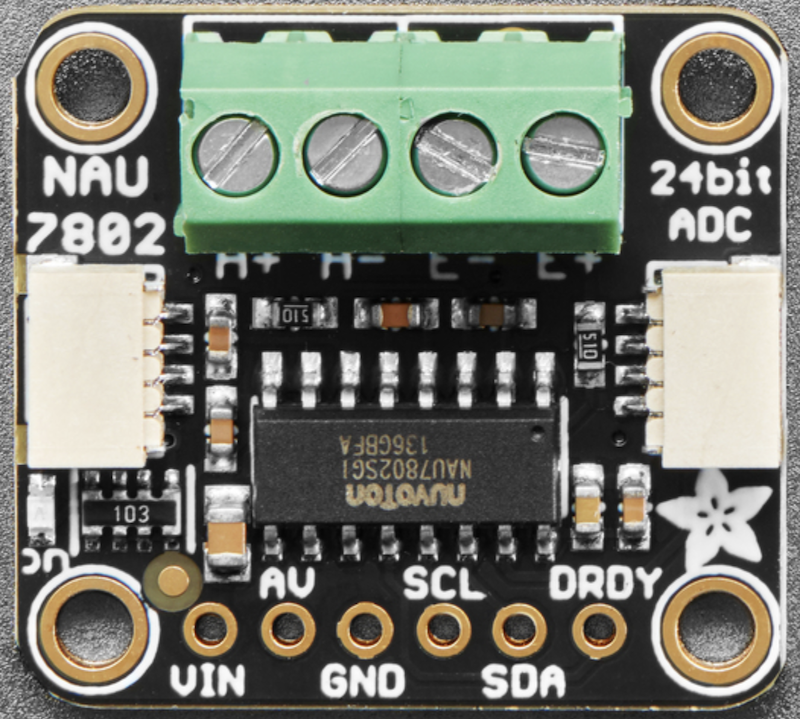

NAU7802 24-bit ADC
=========================

.. seo::
    :description: Instructions for setting up NAU7802 ADC with ESPHome
    :image: nau7802.jpg
    :keywords: NAU7802

The ``nau7802`` sensor platform allows you to use your NAU7802 ADC
(`datasheet <https://www.nuvoton.com/resource-files/NAU7802%20Data%20Sheet%20V1.7.pdf>`__, `Adafruit`_) with ESPHome. This ADC is typically used with strain gauges to act as a weight sensor.

    NAU7802 on a breakout board. Image by `Adafruit`_

.. _Adafruit: https://www.adafruit.com/product/4538
.. _Sparkfun: https://www.sparkfun.com/products/15242

Connect power pins (``VCC``/``GND``) and I2C (``SDA``/``SCL``). If using external reference voltage connect (``AV``/``AVDD``). Interrupt (``INT``/``DRDY``) is not supported.

.. code-block:: yaml

    # Example configuration entry
    sensor:
      - platform: nau7802
        name: "NAU7802 Value"
        gain: 128
        ldo_voltage: "3.0V"
        update_interval: 60s

Configuration variables:
------------------------

- **gain** (*Optional*, enum): ADC gain.

    - ``1``
    - ``2``
    - ``4``
    - ``8``
    - ``16``
    - ``32``
    - ``64``
    - ``128`` *(default)*

- **ldo_voltage** (*Optional*, enum): Voltage used for reference, should be less than ``VCC``

    - ``2.4V``
    - ``2.7V``
    - ``3.0V`` *(default)*
    - ``3.3V``
    - ``3.6V``
    - ``3.9V``
    - ``4.2V``
    - ``4.5V``
    - ``External``, ``Ext`` Use this if are using the ``AV``/``AVDD`` Pin

- **samples_per_second** (*Optional*, enum): Sets the internal chip sample rate

    - ``10`` *(default)*
    - ``20``
    - ``40``
    - ``80``
    - ``320``

- **offset_calibration** (*Optional*, int): Pre calibrated offset value, range -8388608 to 8388607
- **gain_calibration** (*Optional*, float): Pre calibrated gain value, range 0 to 511.9999998807907

- **update_interval** (*Optional*, :ref:`config-time`): The interval to check the sensor. Defaults to ``60s``.
- All other options from :ref:`Sensor <config-sensor>`.

Calibration
-----------
The NAU7802 includes 3 types of calibration, Internal offset, External Offset, and External Gain. Using the
Internal calibration should result in a consistent offset as it uses only reference voltage to calibrate.
External calibration uses the sensor reading in its current state. That means if the load is not consistent
when the action is executed then you will end up with varying results between calibrations and potential
loss of range on the ADC.

For high precision applications it is recommended to perform your calibration and store then store the
results in your config using ``offset_calibration`` and ``gain_calibration`` fields for final usage.
You can retrieve the calibrated values when the component dumps its config or when you execute the
action to calibrate.

Converting Units
----------------

The NAU7802 does not translate its ADC values to weights directly and can be used with varying types of gauges,
therefore you have to convert the measurement to units yourself.
To calibrate the sensor:

.. The rest of this section is copied from the HX711 doc as the procedure is essentially the same

1. Place a zero load or a known mass on the sensor, for example ``0kg``
2. Wait for the data to arrive in the logs and write down the value. For example ``120``.
3. Place another (different) known mass on the sensor, for example ``1kg``
4. Again wait for the data to arrive and note the value, for example ``810``.

Once you've done those steps, you can use the ``calibrate_linear`` filter to map the incoming value
to the calibrated one:

.. code-block:: yaml

    # Example configuration entry
    sensor:
      - platform: nau7802
        # ... Other NAU7802 options
        filters:
          - calibrate_linear:
              - 120 -> 0
              - 810 -> 1
        unit_of_measurement: kg

Replace the masses and values ``120.0``, ``810.0``, etc with your values.

See Also
--------

- :ref:`sensor-filters`
- :doc:`adc`
- :apiref:`nau7802/nau7802.h`
- `Adafruit NAU7802 Library <https://github.com/adafruit/Adafruit_NAU7802>`__
  `NAU7802 Datasheet <https://www.nuvoton.com/resource-files/NAU7802%20Data%20Sheet%20V1.7.pdf>`__
- :ghedit:`Edit`
