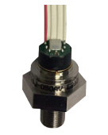

NPI-19 Pressure Sensor
===========================================

.. seo::
    :description: Instructions for setting up NPI-19 pressure sensors with ESPHome
    :image: npi19.jpg
    :keywords: NPI-19 NPI19

The ``npi19`` sensor platform allows you to use your NPI-19 (`datasheet <https://www.amphenol-sensors.com/hubfs/AAS-920-699F-NovaSensor-NPI-19-I2C-061322-web.pdf>`__,
`product page <https://www.amphenol-sensors.com/en/novasensor/pressure-sensors/3358-npi-19-i2c>`__) pressure sensors with ESPHome.

    NPI-19 Pressure Sensor.

Configuration
-------------
:ref:`I²C <i2c>` bus is required to be set up in your configuration for this sensor to work.

.. code-block:: yaml

    # Example configuration entry
    sensor:
      - platform: npi19
        raw_pressure:
          name: "Raw Pressure"
        temperature:
          name: Temperature

Configuration variables
-----------------------

- **raw_pressure** (*Optional*): The information for the pressure sensor. See :ref:`npi19-converting`.

 - All other options from :ref:`Sensor <config-sensor>`.

- **temperature** (*Optional*): The information for the temperature sensor. Readings in degrees celsius (°C).

 - All other options from :ref:`Sensor <config-sensor>`.

- **i2c_id** (*Optional*, :ref:`config-id`): Manually specify the ID of the :ref:`I²C Component <i2c>`. Defaults to the default I²C bus.

- **address** (*Optional*, int): Manually specify the I²C address of the sensor.
  All known sensors currently configured to ``0x28``. Defaults to ``0x28``.

.. _npi19-converting:

Converting units
-----------------

The NPI-19 pressure sensor is not calibrated to units, you have to convert the measurement to units yourself.

Estimated
*********

On page 1 of the `product application note <https://www.amphenol-sensors.com/hubfs/I2C%20NPI-19%20product%20application%20Note.pdf>`__
the value ``1638`` maps to approximately ``10%`` of the maximum value of the sensor (e.g. ``0.5`` psi for a ``5`` psi sensor);
the value ``14746`` maps to approximately ``90%`` of the maximum value of the sensor (e.g. ``4.5`` psi for a ``5``  psi sensor).
Use ``calibrate_linear`` filter to map these sensor values:

.. code-block:: yaml

    # Extract of configuration
    filters:
      - calibrate_linear:
        - 1638 -> 0.5
        - 14746 -> 4.5

Calibrated
**********
1. Expose the sensor to a low known pressure, for example ``5`` psi.
2. Observe the value of the raw pressure sensor, for example ``1500``.
3. Expose the sensor to a high pressure, for example ``90`` psi.
4. Observe the value of the raw pressure sensor, for example ``14500``.
5. Use ``calibrate_linear`` filter to map the incoming value to the calibrated one:

.. code-block:: yaml

    # Extract of configuration
    filters:
      - calibrate_linear:
        - 1500 -> 5.0
        - 14500 -> 90.0

Notes
-----

The NPI-19 I²C has a temperature output, however the manufacturer does
not specify its accuracy on the published datasheet. They indicate
that the sensor should not be used as a calibrated temperature
reading; it’s only intended for curve fitting data during
compensation.

See Also
--------

- :ref:`sensor-filters`
- `NPI-19 Product Page <https://www.amphenol-sensors.com/en/novasensor/pressure-sensors/3358-npi-19-i2c>`__
- `NPI-19 Datasheet <https://www.amphenol-sensors.com/hubfs/AAS-920-699F-NovaSensor-NPI-19-I2C-061322-web.pdf>`__
- `NPI-19 Product Application Note <https://www.amphenol-sensors.com/hubfs/I2C%20NPI-19%20product%20application%20Note.pdf>`__
- :ghedit:`Edit`
