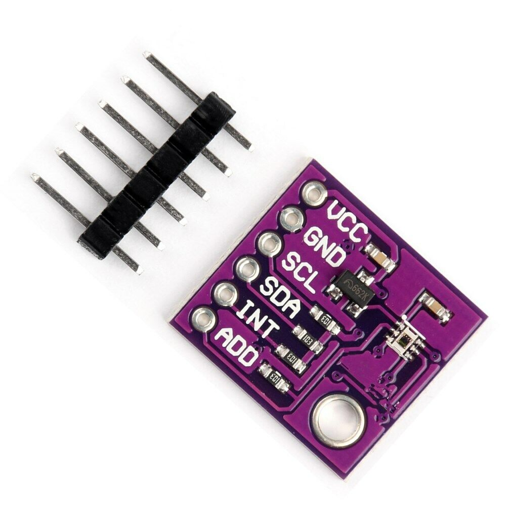

.. _OPT3001:

OPT3001 Ambient Light Sensor
===========================

.. seo::
    :description: Instructions for setting up OPT3001 ambient light sensors in ESPHome.
    :image: opt3001.jpg
    :keywords: OPT3001

The ``opt3001`` sensor platform allows you to use your OPT3001
(`datasheet <https://www.ti.com/lit/ds/symlink/opt3001.pdf>`__)
ambient light sensor with ESPHome. The :ref:`I²C bus <i2c>` is required to be set up in
your configuration for this sensor to work.

    OPT3001 Ambient Light Sensor.

.. code-block:: yaml

    # Example configuration entry
    sensor:
      - platform: opt3001
        name: "OPT3001 Illuminance"
        address: 0x44
        update_interval: 60s

Configuration variables:
------------------------

- **name** (**Required**, string): The name for the sensor.
- **address** (*Optional*, int): Manually specify the I²C address of the sensor.
  Defaults to ``0x44`` (address if address pin is pulled low). If the address pin is pulled high,
  the address is ``0x45``. If the address pin is connected to SDA, the address is ``0x46``. If the
  address pin is connected to SCL, the address is ``0x47``.
- **update_interval** (*Optional*, :ref:`config-time`): The interval to check the
  sensor. Defaults to ``60s``.
- **id** (*Optional*, :ref:`config-id`): Manually specify the ID used for code
  generation.
- All other options from :ref:`Sensor <config-sensor>`.

See Also
--------

- :ref:`sensor-filters`
- :doc:`bh1750`
- :doc:`tsl2561`
- :doc:`tsl2591`
- :apiref:`opt3001/opt3001.h`
- :ghedit:`Edit`
