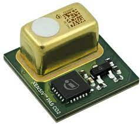

SCD4X CO₂, Temperature and Relative Humidity Sensor
===================================================

.. seo::
    :description: Instructions for setting up the Infineon XENSIV™ PAS CO2 sensor.
    :image: pas-co2.jpg

The ``pas-co2`` sensor platform  allows you to use your Infineon XENSIV™ PAS CO2 sensor
(`datasheet <https://www.infineon.com/dgdl/Infineon-EVAL_PASCO2_SENSOR-DataSheet-v01_00-EN.pdf?fileId=5546d462758f5bd10175934ec4215c6a>`__) sensors with ESPHome.
The :ref:`I²C Bus <i2c>` is required to be set up in your configuration for this sensor to work.

.. code-block:: yaml

    # Example configuration entry
    sensor:
      - platform: pas_co2
        co2:
          name: "Office CO2"

Configuration variables:
------------------------

- **co2** (*Optional*): The information for the CO₂ sensor.

  - **name** (**Required**, string): The name for the CO₂eq sensor.
  - **id** (*Optional*, :ref:`config-id`): Set the ID of this sensor for use in lambdas.
  - All other options from :ref:`Sensor <config-sensor>`.

- **automatic_self_calibration** (*Optional*, boolean): Whether to enable
  automatic self calibration (ASC). Defaults to ``true``.

- **ambient_pressure_compensation** (*Optional*, int): Enable compensation
  of measured CO₂ values based on given ambient pressure in hPa.

- **ambient_pressure_compensation_source** (*Optional*, id): Use to pressure sensor to provide the data for pressure compensation
  of measured CO₂ values based on given ambient pressure in mBar.

- **update_interval** (*Optional*, :ref:`config-time`): The interval to check the sensor. Defaults to ``60s``.
  The sensors internal measurement rate is aligned with ``update_interval`` 

Actions:
--------

.. _perform_forced_calibration_action:

``_perform_forced_calibration_action`` Action
---------------------------------------------

This :ref:`action <config-action>` triggers a forced calibration. 

Forced compensation provides a means to speed up the offset compensation process. Before forced compensation is enabled, the device must be physically exposed to the reference CO2 concentration. The device
will use the 3 next measurements to calculate the compensation offset. The user must ensure constant exposure to the reference CO2 concentration during that time. 
The sensor is operated at 1 measurement per 10 seconds while implementing the forced compensation scheme. When the 3 measurement sequences are completed, the device automatically reconfigures itself with the newly computed offset applied to the
subsequent CO2 concentration measurement results and the previous measurement rateis retored

.. code-block:: yaml
    on_...:
      then:
        pas_co2._perform_forced_calibration_action

See Also
--------
- `Registermap description of XENSIV™ PAS CO2 sensor <https://www.infineon.com/cms/en/product/sensor/co2-sensors/pasco2v01/#!?fileId=5546d4627600a6bc017604238d967785>`__
- :ref:`sensor-filters`
- :apiref:`pas-co2/pas-co2.h`
- :ghedit:`Edit`
