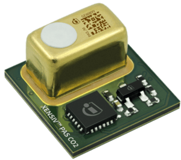

XENSIV™ PAS CO₂ sensor - disruptive CO2 sensor based on photoacoustic spectroscopy (PAS)
========================================================================================

.. seo::
    :description: Instructions for setting up XENSIV™ PAS CO₂ Sensor
    :image: pas_co2.png

The ``pas_co2`` sensor platform  allows you to use your Infineon XENSIV™ PAS CO₂
(`datasheet <https://www.infineon.com/dgdl/Infineon-PASCO2V01-DataSheet-v01_01-EN.pdf?fileId=8ac78c8c80027ecd01809278f1af1ba2>`__) sensors with ESPHome.
The :ref:`I²C Bus <i2c>` is required to be set up in your configuration for this sensor to work.

.. code-block:: yaml

    # Example configuration entry
    sensor:
      - platform: pas_co2
        co2:
          name: "Living room CO2"

Configuration variables:
------------------------

- **co2** (*Optional*): The information for the CO₂ sensor.

  - **name** (**Required**, string): The name for the CO₂eq sensor.
  - **id** (*Optional*, :ref:`config-id`): Set the ID of this sensor for use in lambdas.
  - All other options from :ref:`Sensor <config-sensor>`.

- **ambient_pressure_compensation** (*Optional*, int): Enable compensation
  of measured CO₂ values based on given ambient pressure in mBar.

- **ambient_pressure_compensation_source** (*Optional*, :ref:`config-id`): Set an external pressure sensor ID used for ambient pressure compensation.
  The pressure sensor must report pressure in hPa. the correction is applied before updating the state of the co2 sensor.

- **address** (*Optional*, int): Manually specify the I²C address of the sensor.
  Defaults to ``0x28``.

- **update_interval** (*Optional*, :ref:`config-time`): The interval to check the
  sensor. Defaults to ``60s``.

Automation
-----------------

Ambient pressure compensation compensation can be changed from :ref:`lambdas <config-lambda>`

``set_ambient_pressure_compensation(  <pressure in bar)``

Example
*******

Note: that the pressure from bme280 is in hPa and must be converted to bar.

.. code-block:: yaml

    sensor:
      - platform: pas_co2
        id: pas_co2_sensor
        i2c_id: bus_a
        co2:
            name: co2
            id: co2

        - platform: bme280
          pressure:
            name: "BME280-Pressure"
            id: bme280_pressure
            oversampling: 1x
          on_value:
            then:
                - lambda: "id(pas_co2_sensor)->set_ambient_pressure_compensation(x / 1000.0);"

See Also
--------

- :ref:`sensor-filters`
- :apiref:`pas_co2/pas_co2.h`
- :ghedit:`Edit`
