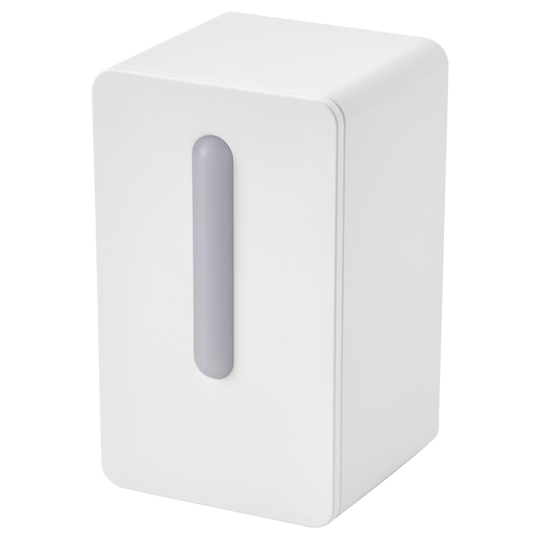

PM1006 Particulate Matter Sensor
================================

.. seo::
    :description: Instructions for setting up PM1006 Particulate matter sensors, such as in the IKEA VINDRIKTNING
    :image: pm1006.jpg
    :keywords: pm1006, IKEA VINDRIKTNING

The ``pm1006`` sensor platform allows you to use Cubic PM1006 particulate matter sensors (`datasheet <http://www.jdscompany.co.kr/download.asp?gubun=07&filename=PM1006_LED_PARTICLE_SENSOR_MODULE_SPECIFICATIONS.pdf>`__)
with ESPHome.

    IKEA VINDRIKTNING Particulate Matter Sensor with PM1006 inside

As the communication with the PM1006 is done using UART, you need to have an :ref:`UART bus <uart>` in your configuration with the ``rx_pin`` connected to the TX pin of the
PM1006.
This component is currently RX-only, as the IKEA VINDRIKTNING already sends commands to the PM1006.
Additionally, you need to set the baud rate to 9600.

.. code-block:: yaml

    # Example configuration entry
    uart:
      rx_pin: D2
      baud_rate: 9600

    sensor:
      - platform: pm1006
        pm_2_5:
          name: "Particulate Matter 2.5µm Concentration"

Unlike some other sensors, there is no configurable update interval, as this is a 'passive' implementation that picks up whatever the VINDRIKTNING MCU has requested from the sensor.

The implementation was inspired by https://github.com/Hypfer/esp8266-vindriktning-particle-sensor; you can also see the pinout there.
However, we recommend mounting your ESP below the fan (which blows out the front) so you do not obstruct the airflow.
`This discussion thread on the HA forum <https://community.home-assistant.io/t/ikea-vindriktning-air-quality-sensor/324599>`__ has several examples of how people have connected their ESP device to the IKEA sensor.

Configuration variables:
------------------------

- **pm_2_5** (*Optional*): Use the concentration of particulates of size less than 2.5µm in µg per cubic meter.
  All options from :ref:`Sensor <config-sensor>`.

- **uart_id** (*Optional*, :ref:`config-id`): Manually specify the ID of the :ref:`UART Component <uart>` if you want
  to use multiple UART buses.

See Also
--------

- :doc:`/components/sensor/pmsx003`
- :ref:`sensor-filters`
- :apiref:`pm1006/pm1006.h`
- :ghedit:`Edit`
