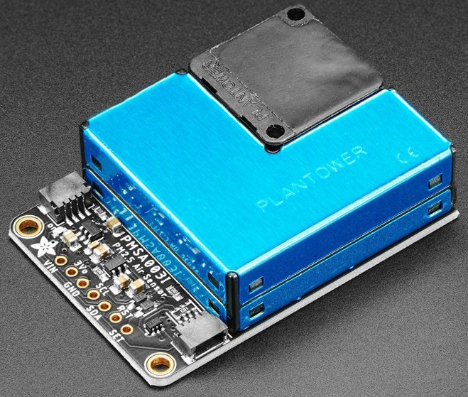

PMSA003I Particulate Matter Sensor
==================================================

.. seo::
    :description: Instructions for setting up PMSX003 Particulate matter sensors
    :image: pmsa003i.jpg

The ``pmsa003i`` sensor platform  allows you to use your Plantower PMSA003I
particulate matter sensor
(`datasheet <https://cdn-shop.adafruit.com/product-files/4632/4505_PMSA003I_series_data_manual_English_V2.6.pdf>`__,
`Adafruit`_) with ESPHome.

The :ref:`I²C Bus <i2c>` is required to be set up in your configuration for this sensor to work.

.. _Adafruit: https://www.adafruit.com/product/4632

.. code-block:: yaml

    # Example configuration entry
    sensor:
      - platform: pmsa003i
        pm_1_0:
          name: "PM1.0"
        pm_2_5:
          name: "PM2.5"
        pm_10_0:
          name: "PM10.0"
        pmc_0_3:
          name: "PMC >0.3µm"
        pmc_0_5:
          name: "PMC >0.5µm"
        pmc_1_0:
          name: "PMC >1µm"
        pmc_2_5:
          name: "PMC >2.5µm"
        pmc_5_0:
          name: "PMC >5µm"
        pmc_10_0:
          name: "PMC >10µm"

Configuration variables:
------------------------

- **pm_1_0** (*Optional*): Mass of particles with a diameter of 1 micrometres or less (μg/m^3).
  All options from :ref:`Sensor <config-sensor>`.
- **pm_2_5** (*Optional*): Mass of particles with a diameter of 2.5 micrometres or less (μg/m^3).
  All options from :ref:`Sensor <config-sensor>`.
- **pm_10_0** (*Optional*): Mass of particles with a diameter of 10 micrometres or less (μg/m^3).
  All options from :ref:`Sensor <config-sensor>`.
- **pmc_0_3** (*Optional*): Count of particles with diameter > 0.3 um in 0.1 L of air (#/0.1L).
  All options from :ref:`Sensor <config-sensor>`.
- **pmc_0_5** (*Optional*): Count of particles with diameter > 0.5 um in 0.1 L of air (#/0.1L).
  All options from :ref:`Sensor <config-sensor>`.
- **pmc_1_0** (*Optional*): Count of particles with diameter > 1 um in 0.1 L of air (#/0.1L).
  All options from :ref:`Sensor <config-sensor>`.
- **pmc_2_5** (*Optional*): Count of particles with diameter > 2.5 um in 0.1 L of air (#/0.1L).
  All options from :ref:`Sensor <config-sensor>`.
- **pmc_5_0** (*Optional*): Count of particles with diameter > 5 um in 0.1 L of air (#/0.1L).
  All options from :ref:`Sensor <config-sensor>`.
- **pmc_10_0** (*Optional*): Count of particles with diameter > 10 um in 0.1 L of air (#/0.1L).
  All options from :ref:`Sensor <config-sensor>`.
- **standard_units** (*Optional*, boolean): ``True`` to use standard units or ``False`` to use  environmental units. Defaults to ``True``.
- **address** (*Optional*, int): Manually specify the I²C address of the sensor.
  Defaults to ``0x12``.
- **update_interval** (*Optional*, :ref:`config-time`): The interval to check the
  sensor. Defaults to ``60s``.

.. note::

    Standard vs environmental units from https://publiclab.org/questions/samr/04-07-2019/how-to-interpret-pms5003-sensor-values#c23772

      "Standard" refers to the concentration "corrected" to the "standard atmosphere" which in the US is DEFINED as "having a temperature of 288.15 K at the sea level 0 km geo-potential height and 1013.25 hPa" details here

      On the other hand, the "ambient conditions" are just as the air is "now" (whatever temperature and pressure there is) Now what does that mean ...

      Air being a gas, it is compressible which means that it changes its volume when the pressure changes so when you report concentrations as mass per volume of air it is relevant at what pressure that volume is calculated. For example, if you have a bunch of particles rising in the air in a bubble (no loss of particles, no addition, they're just riding a bubble up in the air) then, as they rise, the pressure drops so what was 1cc at the ground it is now 2cc so the concentration is now half without anything actually changing other than the ambient pressure. So, it is common to report concentrations (of anything) as "x mg per standard m3" and because we scientist don't like to write much (current example excluded) you'll usually see the "standard" being dropped because it is "implicit".

See Also
--------

- :doc:`/components/sensor/pmsx003`
- :doc:`/components/sensor/sds011`
- :ref:`sensor-filters`
- :apiref:`pmsa003i/pmsa003i.h`
- :ghedit:`Edit`
