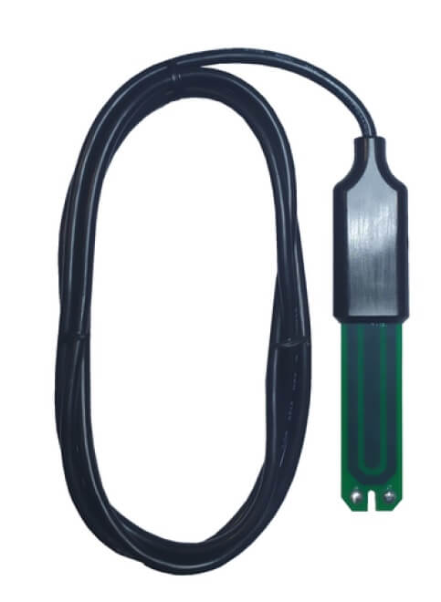

PMWCS3 Capacitive Soil Moisture and Temperature Sensor
======================================================

.. seo::
    :description: Instructions for setting up PMWCS3 capacitive soil moisture sensor in ESPHome.
    :image: pmwcs3.jpg
    :keywords: PMWCS3

The ``pmwcs3`` sensor platform allows you to use your PMWCS3
(`informations <https://tinovi.com/wp-content/uploads/2020/01/PM-WCS-3-I2C.pdf>`__)
capacitive soil moisture and temperature sensor with ESPHome. The :ref:`I²C bus <i2c>` is required to be set up in
your configuration for this sensor to work. Wiring scheme: red is 3.3V, black & shield is GND, green is SDA and white is SCL.
2.2kOhm resistors are advised to pullup both SDA & SDA lines.

    PMWCS3 Capacitive Soil Moisture and Temperature Sensor.

.. code-block:: yaml

    # Example configuration entry
    sensor:
      - platform: pmwcs3
        e25:
          name: "pmwcs3 e25"
        ec:
          name: "pmwcs3 ec"
        temperature:
          name: "pmwcs3 temperature"
        vwc:
          name: "pmwcs3 vwc"
 
Configuration variables:
------------------------

- **e25** (*Optional*): Electrical Conductivity, reference at 25°C in dS/m. 
  All options from :ref:`Sensor <config-sensor>`.
- **ec** (*Optional*): Electrical Conductivity in mS/m. 
  All options from :ref:`Sensor <config-sensor>`.
- **temperature** (*Optional*): Soil temperature in °C.
  All options from :ref:`Sensor <config-sensor>`.
- **vwc** (*Optional*): Volumetric Water Content in cm3cm−3.
  All options from :ref:`Sensor <config-sensor>`.
- **address** (*Optional*, int): Manually specify the I²C address of the sensor.
  Defaults to ``0x63``.
- **update_interval** (*Optional*, :ref:`config-time`): The interval to check the
  sensor. Defaults to ``60s``.

.. _sensor-PMWCS3AirCalibrationAction:

``pmwcs3.air_calibration`` Action
-----------------------------------

The pmwcs3 probe can to be calibrated in dry/air conditions. 
The air calibration is a 30s procedure.

.. code-block:: yaml

    # Example configuration entry
    sensor:
      - platform: pmwcs3
        id: pmwcs3_id
        # ...

    # in some trigger
    on_...:
      - sensor.pmwcs3_id.air_calibration:
          id: pmwcs3_id

Configuration option:

- **id** (**Required**, :ref:`config-id`): The ID of the pmwcs3 sensor.

.. _sensor-PMWCS3WaterCalibrationAction:

``pmwcs3.water_calibration`` Action
-----------------------------------

The pmwcs3 probe can to be also calibrated in water saturated conditions. Install the probe into a glass of water. 
The water calibration is also a 30s procedure.

.. code-block:: yaml

    # Example configuration entry
    sensor:
      - platform: pmwcs3
        id: pmwcs3_id
        # ...

    # in some trigger
    on_...:
      - sensor.pmwcs3_id.water_calibration:
          id: pmwcs3_id

Configuration option:

- **id** (**Required**, :ref:`config-id`): The ID of the pmwcs3 sensor.

.. _sensor-PMWCS3NewI2cAddressAction:

``pmwcs3.new_i2c_address`` Action
---------------------------------

A new I2C address can be set (for multi-probes cases for example)

.. code-block:: yaml

    # Example configuration entry
    sensor:
      - platform: pmwcs3
        id: pmwcs3_id
        # ...

    # in some trigger
    on_...:
      - sensor.pmwcs3_id.new_i2c_address:
          id: pmwcs3_id
          address: 0x65

Configuration options:

- **id** (**Required**, :ref:`config-id`): The ID of the pmwcs3 sensor.
- **address** (**Required**, int): New I2C address.

See Also
--------

- :ref:`sensor-filters`
- :apiref:`pmwcs3/pmwcs3.h`
- `Temperature Compensation for Conductivity <https://www.aqion.de/site/112>`__
- `PMWCS3 Library <https://github.com/tinovi/i2cArduino>`__ by `@tinovi <https://github.com/tinovi>`__
- :ghedit:`Edit`
