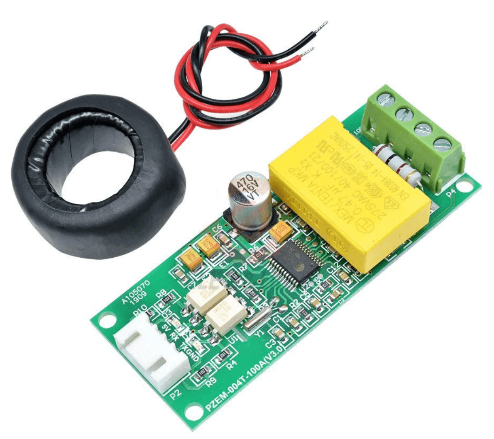

Peacefair PZEM-004T V3 Energy Monitor
=====================================

.. seo::
    :description: Instructions for setting up PZEM-004T power monitors.
    :image: pzem-ac.jpg
    :keywords: PZEM-004T V3

.. note::

    This page is incomplete and could use some work. If you want to contribute, please read the
    :doc:`contributing guide </guides/contributing>`. This page is missing:

      - Images/screenshots/example configs of this device being used in action.

The ``pzemac`` sensor platform allows you to use PZEM-004T V3 energy monitors
(`website <https://innovatorsguru.com/pzem-004t-v3/>`__,
`datasheet <https://innovatorsguru.com/wp-content/uploads/2019/06/PZEM-004T-V3.0-Datasheet-User-Manual.pdf>`__)
with ESPHome.

The sensor can be connected in various configurations - please see the `manufacturer's website <https://innovatorsguru.com/pzem-004t-v3/>`__
for more information.

.. warning::

    Please note that metering chip inside of PZEM module is powered from AC side and it has to be on during startup of ESPHome device, othervise measure results won't be visible. 

    PZEM-004T Version 3.

.. warning::

    This page refers to version V3 of the PZEM004T.
    For using the older V1 variant of this sensor please see :doc:`pzem004t <pzem004t>`.

The communication with this component is done via a :ref:`UART <uart>` using :ref:`Modbus <modbus>`.
You must therefore have a ``uart:`` entry in your configuration with both the TX and RX pins set
to some pins on your board and the baud rate set to 9600.

.. code-block:: yaml

    # Example configuration entry
    uart:
      rx_pin: D1
      tx_pin: D2
      baud_rate: 9600

    modbus:

    sensor:
      - platform: pzemac
        current:
          name: "PZEM-004T V3 Current"
        voltage:
          name: "PZEM-004T V3 Voltage"
        energy:
          name: "PZEM-004T V3 Energy"
        power:
          name: "PZEM-004T V3 Power"
        frequency:
          name: "PZEM-004T V3 Frequency"
        power_factor:
          name: "PZEM-004T V3 Power Factor"
        update_interval: 60s

Configuration variables:
------------------------

- **current** (*Optional*): Use the current value of the sensor in amperes. All options from
  :ref:`Sensor <config-sensor>`.
- **energy** (*Optional*): Use the (active) energy value of the sensor in watt*hours. All options from
  :ref:`Sensor <config-sensor>`.
- **power** (*Optional*): Use the (active) power value of the sensor in watts. All options from
  :ref:`Sensor <config-sensor>`.
- **voltage** (*Optional*): Use the voltage value of the sensor in volts.
  All options from :ref:`Sensor <config-sensor>`.
- **frequency** (*Optional*): Use the frequency value of the sensor in hertz.
  All options from :ref:`Sensor <config-sensor>`.
- **power_factor** (*Optional*): Use the power factor value of the sensor.
  All options from :ref:`Sensor <config-sensor>`.
- **update_interval** (*Optional*, :ref:`config-time`): The interval to check the
  sensor. Defaults to ``60s``.
- **address** (*Optional*, int): The address of the sensor if multiple sensors are attached to
  the same UART bus. You will need to set the address of each device manually. Defaults to ``1``.
- **modbus_id** (*Optional*, :ref:`config-id`): Manually specify the ID of the Modbus hub.

.. _pzemac-reset_energy_action:

``pzemac.reset_energy`` Action
******************************

This action resets the total energy value of the pzemac device with the given ID when executed.

.. code-block:: yaml

    on_...:
      then:
        - pzemac.reset_energy: pzemac_1

Changing the address of a PZEM-004T:
------------------------------------

You can use the following configuration to change the address of a sensor.
You must set the ``address`` of the ``modbus_controller`` to the current address, and ``new_address`` of the ``on_boot`` lambda to the new one.

.. warning::

    This should be used only once! After changing the address, this code should be removed from the ESP before using the actual sensor code.

.. code-block:: yaml

    esphome:
      ...
      on_boot:
        ## configure controller settings at setup
        ## make sure priority is lower than setup_priority of modbus_controller
        priority: -100
        then:
          - lambda: |-
              auto new_address = 0x03;

              if(new_address < 0x01 || new_address > 0xF7) // sanity check
              {
                ESP_LOGE("ModbusLambda", "Address needs to be between 0x01 and 0xF7");
                return;
              }

              esphome::modbus_controller::ModbusController *controller = id(pzem);
              auto set_addr_cmd = esphome::modbus_controller::ModbusCommandItem::create_write_single_command(
                controller, 0x0002, new_address);

              delay(200) ;
              controller->queue_command(set_addr_cmd);
              ESP_LOGI("ModbusLambda", "PZEM Addr set");

    modbus:
      send_wait_time: 200ms
      id: mod_bus_pzem

    modbus_controller:
      - id: pzem
        # The current device address.
        address: 0x1
        # The special address 0xF8 is a broadcast address accepted by any pzem device,
        # so if you use this address, make sure there is only one pzem device connected
        # to the uart bus. 
        # address: 0xF8
        modbus_id: mod_bus_pzem
        command_throttle: 0ms
        setup_priority: -10
        update_interval: 30s

See Also
--------

- :ref:`sensor-filters`
- :doc:`pzem004t`
- :doc:`pzemdc`
- :apiref:`pzemac/pzemac.h`
- :ghedit:`Edit`
