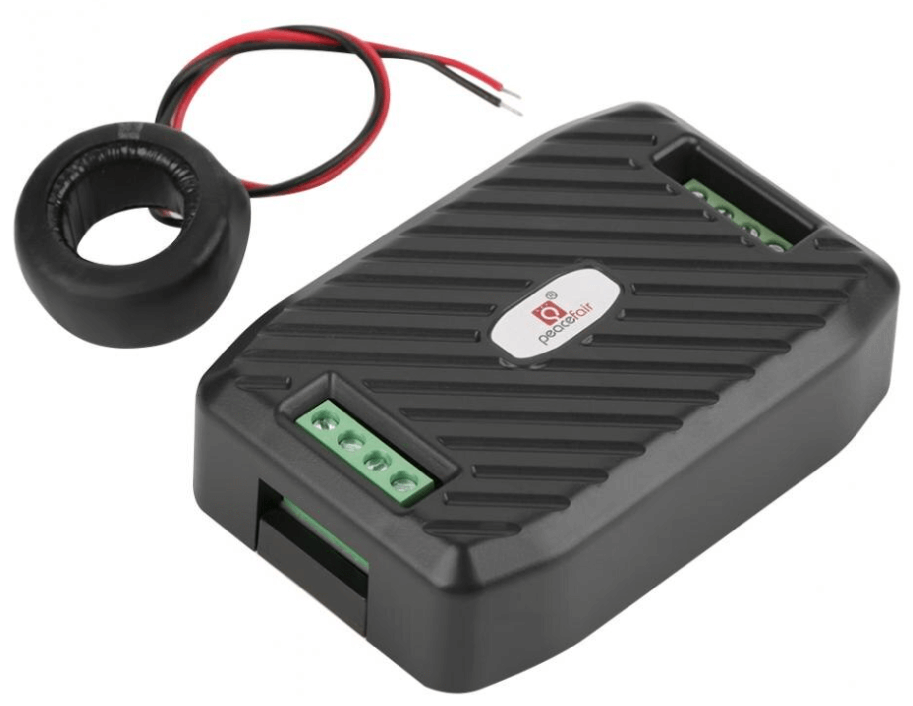

Peacefair PZEM-00X DC Energy Monitor
====================================

.. seo::
    :description: Instructions for setting up DC PZEM power monitors.
    :image: pzem-dc.jpg

.. note::

    This page is incomplete and could use some work. If you want to contribute, please read the
    :doc:`contributing guide </guides/contributing>`. This page is missing:

      - Images/screenshots/example configs of this device being used in action.

The ``pzemdc`` sensor platform allows you to use various DC Peacefair PZEM energy monitors
with ESPHome. The supported models are: PZEM-003, PZEM-014, PZEM-016 and PZEM-017.

The communication with this integration is done over a :ref:`UART bus <uart>`.
You must therefore have a ``uart:`` entry in your configuration with both the TX and RX pins set
to some pins on your board and the baud rate set to 9600.

    PZEM-0xx Energy Monitor.

.. code-block:: yaml

    # Example configuration entry
    uart:
      tx_pin: D1
      rx_pin: D2
      baud_rate: 9600
      stop_bits: 2

    sensor:
      - platform: pzemdc
        current:
          name: "PZEM-003 Current"
        voltage:
          name: "PZEM-003 Voltage"
        power:
          name: "PZEM-003 Power"
        update_interval: 60s

Configuration variables:
------------------------

- **current** (*Optional*): Use the current value of the sensor in amperes. All options from
  :ref:`Sensor <config-sensor>`.
- **power** (*Optional*): Use the power value of the sensor in watts. All options from
  :ref:`Sensor <config-sensor>`.
- **voltage** (*Optional*): Use the voltage value of the sensor in volts.
  All options from :ref:`Sensor <config-sensor>`.
- **update_interval** (*Optional*, :ref:`config-time`): The interval to check the
  sensor. Defaults to ``60s``.
- **address** (*Optional*, int): The address of the sensor if multiple sensors are attached to
  the same UART bus. You will need to set the address of each device manually. Defaults to ``1``.

See Also
--------

- :ref:`sensor-filters`
- :doc:`pzem004t`
- :doc:`pzemac`
- :apiref:`pzemdc/pzemdc.h`
- :ghedit:`Edit`
