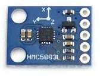

QMC5883L Magnetometer
=====================

.. seo::
    :description: Instructions for setting up QMC5883L IMU compass sensors.
    :image: qmc5883l.jpg
    :keywords: QMC5883L

The ``qmc5883l`` allows you to use your QMC5883L triple-axis magnetometers
(`datasheet <http://wiki.sunfounder.cc/images/7/72/QMC5883L-Datasheet-1.0.pdf>`__) with
ESPHome. This sensor is very simular to the :ref:`HMC5883L <hmc5883l>` sensor and is oftern found
as a knock off replacement. The QMC5883L sensor performs on par to the HMC5883L sensor,
though the configuration differs. The :ref:`I²C Bus <i2c>` is required to be set up in your
configuration for this sensor to work.

    QMC5883L Magnetometer.

.. code-block:: yaml

    # Example configuration entry
    sensor:
      - platform: qmc5883l
        address: 0x0D
        field_strength_x:
          name: "QMC5883L Field Strength X"
        field_strength_y:
          name: "QMC5883L Field Strength Y"
        field_strength_z:
          name: "QMC5883L Field Strength Z"
        heading:
          name: "QMC5883L Heading"
        temperature:
          name: "QMC5883L Temperature"
          filters:
            - offset: 34.0
        range: 200uT
        oversampling: 512x
        update_interval: 60s

Configuration variables:
------------------------

- **address** (*Optional*, int): Manually specify the  I²c address of the sensor. Defaults to ``0x1E``.
- **field_strength_x** (*Optional*): The field strength in microtesla along the X-Axis. All options from
  :ref:`Sensor <config-sensor>`.
- **field_strength_y** (*Optional*): The field strength in microtesla along the Y-Axis. All options from
  :ref:`Sensor <config-sensor>`.
- **field_strength_z** (*Optional*): The field strength in microtesla along the Z-Axis. All options from
  :ref:`Sensor <config-sensor>`.
- **heading** (*Optional*): The heading of the sensor in degrees. All options from
  :ref:`Sensor <config-sensor>`.
- **temperature** (*Optional*): The temperature of the sensor. Per the datasheet:
  "Temperature sensor gain is factory-calibrated, but its offset has not been compensated, only relative
  temperature value is accurate". Above example has an offset that you need to calibrate. All options from
  :ref:`Sensor <config-sensor>`.
- **range** (*Optional*): The range parameter for the sensor.
- **oversampling** (*Optional*): The oversampling parameter for the sensor.
- **update_interval** (*Optional*, :ref:`config-time`): The interval to check the sensor. Defaults to ``60s``.
- **id** (*Optional*, :ref:`config-id`): Manually specify the ID used for code generation.

Range Options
-------------

By default, the QMC5883L sensor measurement range is 200µT. You can, however,
configure this amount. Possible values:

-  ``200µT`` (default)
-  ``800µT``

Oversampling Options
--------------------

By default, the QMC5883L sensor measures each value 512 times when requesting a new value. You can, however,
configure this amount. The result is the sensor will take the adverage of the x samples. Possible sampling values:

-  ``512x`` (default)
-  ``256x``
-  ``128x``
-  ``64x``

See Also
--------

- :ref:`sensor-filters`
- :doc:`template`
- :apiref:`qmc5883l/qmc5883l.h`
- :ghedit:`Edit`
