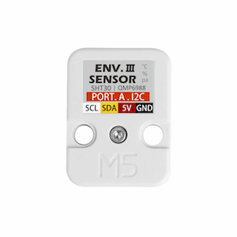

QMP6988 Temperature+Pressure Sensor
===================================

.. seo::
    :description: Instructions for setting up QMP6988 temperature and pressure sensors with ESPHome
    :keywords: QMP6988

The ``qmp6988`` sensor platform allows you to use your QMP6988
(`datasheet <https://m5stack.oss-cn-shenzhen.aliyuncs.com/resource/docs/datasheet/unit/enviii/QMP6988%20Datasheet.pdf>`__,
`M5Stack`_) temperature and pressure sensors with ESPHome. The :ref:`I²C <i2c>` is
required to be set up in your configuration for this sensor to work.

    QMP6988 Temperature and Pressure Sensor.

.. _M5Stack: https://docs.m5stack.com/en/unit/envIII

.. code-block:: yaml

    # Example configuration entry
    sensor:
      - platform: qmp6988
        temperature:
          name: "Living Room Temperature"
          oversampling: 16x
        pressure:
          name: "Living Room Pressure"
          oversampling: 16x
        address: 0x70
        update_interval: 60s
        iir_filter: 2x

Configuration variables:
------------------------

- **temperature** (*Optional*): The information for the temperature sensor

  - **name** (**Required**, string): The name for the temperature
    sensor.
  - **oversampling** (*Optional*): The oversampling parameter for the temperature sensor.
    See :ref:`Oversampling Options <qmp6988-oversampling>`.
  - **id** (*Optional*, :ref:`config-id`): Set the ID of this sensor for use in lambdas.
  - All other options from :ref:`Sensor <config-sensor>`.

- **pressure** (*Optional*): The information for the pressure sensor.

  - **name** (**Required**, string): The name for the pressure sensor.
  - **oversampling** (*Optional*): The oversampling parameter for the temperature sensor.
    See :ref:`Oversampling Options <qmp6988-oversampling>`.
  - **id** (*Optional*, :ref:`config-id`): Set the ID of this sensor for use in lambdas.
  - All other options from :ref:`Sensor <config-sensor>`.

- **address** (*Optional*, int): Manually specify the I²C address of
  the sensor. Defaults to ``0x70``. ``0x56`` is also configurable - see datasheet.
- **iir_filter** (*Optional*): Set up an Infinite Impulse Response filter to increase accuracy. One of
  ``OFF``, ``2x``, ``4x``, ``8x``, ``16x``, ``32x``. Defaults to ``OFF``.
- **update_interval** (*Optional*, :ref:`config-time`): The interval to check the
  sensor. Defaults to ``60s``.

.. _qmp6988-oversampling:

Oversampling Options
--------------------

By default, the QMP6988 sensor has been configured to measure each value 8 times when requesting a new value. You can, however,
configure this amount. Possible oversampling values:

-  ``NONE`` (value is skipped)
-  ``1x``
-  ``2x``
-  ``4x``
-  ``8x`` (default)
-  ``16x`` 
-  ``32x`` 
-  ``64x`` 

See Also
--------

- :ref:`sensor-filters`
- :apiref:`qmp6988/qmp6988.h`
- `QMP6988 Library <https://github.com/m5stack/UNIT_ENV>`__ by `M5Stack <https://m5stack.com>`__
- :ghedit:`Edit`
