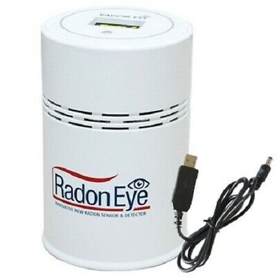

Radon Eye BLE Sensors
=====================

.. seo::
    :description: Instructions for setting up Radon Eye bluetooth-based sensors in ESPHome.
    :keywords: Radon, RadonEye, RD200, BLE, Bluetooth, Wave Plus, Wave Mini

The ``radon_eye_rd200`` sensor platforms lets you track the output of Radon Eye RD200 Bluetooth Low Energy device.

This component will track radon concentration.

Device Discovery
-----------------

RadonEye devices can be found using the ``radon_eye_ble`` ble scanner.

To find out your device's MAC address, add the following to your ESPHome configuration:

.. code-block:: yaml

    logger:
      level: DEBUG # Required for the tracker to show the device

    esp32_ble_tracker:
    radon_eye_ble:

The device will then listen for nearby devices, and display a message like this one:

.. code-block:: text

    [D][radon_eye_ble:017]:
    Found Radon Eye RD200 device Name: FR:R20:SN1234      (MAC: 01:02:03:04:05:06)

Once the device is found, remove the ``radon_eye_ble`` device tracker from your configuration and
take note of the device MAC address, and use it when configuring a sensor below.

Supported Devices
-----------------

Radon Eye RD200 Sensor
**********************

Radon Eye RD200 tracks radon concentration over short periods (5 min interval) and longer periods
(24h or month).

The ``radon_long_term`` sensor is populated with the longest available measurement. The RD200
provides a 24hr measurement and a 1 month measurement.

If the 1 month isn't available, it will use
the 24hr. If the 24hr isn't available either, it will not publish the value.

Configuration example:
**********************

.. code-block:: yaml

    esp32_ble_tracker:

    ble_client:
      - mac_address: 01:02:03:04:05:06
        id: radon_eye_ble_id

    sensor:
      - platform: radon_eye_rd200
        ble_client_id: radon_eye_ble_id
        update_interval: 5min # default
        radon:
          name: "Radon"
        radon_long_term:
          name: "Radon Long Term"

Here is an example to use pCi/L (to match the value on the device display):

.. code-block:: yaml

    esp32_ble_tracker:

    ble_client:
      - mac_address: 01:02:03:04:05:06
        id: radon_eye_ble_id

    sensor:
      - platform: radon_eye_rd200
        ble_client_id: radon_eye_ble_id
        update_interval: 5min # default
        radon:
          name: "Radon"
          unit_of_measurement: "pCi/L"
          accuracy_decimals: 2
          filters:
            - lambda: return x / 37;
        radon_long_term:
          name: "Radon Long Term"
          unit_of_measurement: "pCi/L"
          accuracy_decimals: 2
          filters:
            - lambda: return x / 37;

