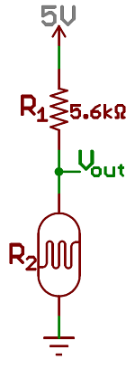

Resistance Sensor
=================

.. seo::
    :description: Instructions for setting up resistance sensors in ESPHome
    :image: omega.svg

The ``resistance`` platform is a helper sensor that allows you to convert readings
from a voltage sensor (such as the :doc:`ADC Sensor <adc>`) into resistance readings
in Ω (ohm).

In order to calculate the resistance, the circuit needs to be set up in a
`voltage divider circuit <https://learn.sparkfun.com/tutorials/voltage-dividers/all>`__.
This consists of three parts:

 - A voltage reference, usually this is connected to 3.3V (VCC). For example in the image
   below it is 5V (though on ESPs you should not use that voltage)
 - A reference resistor with constant resistance. For example below it is R₁ with a value
   of 5.6kOhm.
 - The variable resistor we wish the read the resistance of. Here R₂.

There are two kinds of configurations for this circuit: Either the variable resistor
is close to GND (DOWNSTREAM) or it is closer to VCC (UPSTREAM).

    Example voltage divider configuration of type "DOWNSTREAM" and a voltage
    reference of 5V.

.. code-block:: yaml

    # Example configuration entry
    sensor:
      - platform: resistance
        sensor: source_sensor
        configuration: DOWNSTREAM
        resistor: 5.6kOhm
        name: Resistance Sensor

    # Example source sensor:
      - platform: adc
        id: source_sensor
        pin: A0

Note:
------------------------
Some boards like NodeMCUv2 needs to multiply ADC reading by 3.3 to provide accurate result because they have built-in voltage divider on ADC pin (https://arduino.stackexchange.com/a/71952)

.. code-block:: yaml

    # Example source sensor:
      - platform: adc
        id: source_sensor
        pin: A0
        filters:
          - multiply: 3.3

Configuration variables:
------------------------

- **name** (**Required**, string): The name for the sensor.
- **sensor** (**Required**, :ref:`config-id`): The sensor to read the voltage values from
  to convert to resistance readings.
- **configuration** (**Required**, string): The type of circuit, one of ``DOWNSTREAM`` or
  ``UPSTREAM``.
- **resistor** (**Required**, float): The value of the resistor with a constant value.

- **reference_voltage** (*Optional*, float): The reference voltage. Defaults to ``3.3V``.
- **id** (*Optional*, :ref:`config-id`): Set the ID of this sensor for use in lambdas.
- All other options from :ref:`Sensor <config-sensor>`.

See Also
--------

- :doc:`adc`
- :doc:`ntc`
- :ref:`sensor-filters`
- :apiref:`resistance/resistance_sensor.h`
- :ghedit:`Edit`
