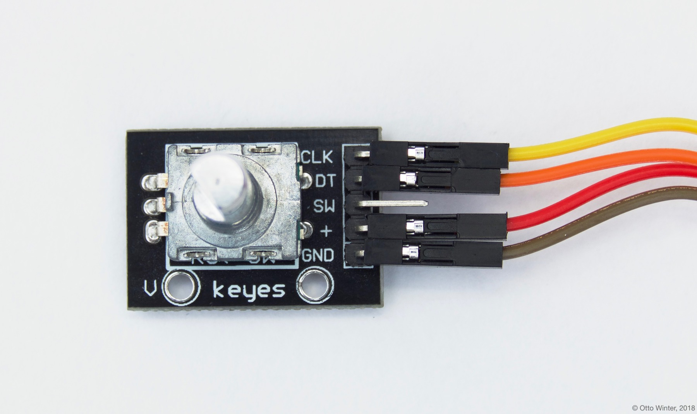

Rotary Encoder Sensor
=====================

.. seo::
    :description: Instructions for setting up rotary encoders.
    :image: rotary_encoder.jpg

The ``rotary_encoder`` sensor platform allows you to use any continuous-rotation
rotary encoders with ESPHome. These devices usually have two pins with which
they encode the rotation. Every time the knob of the rotary encoder is turned, the
signals of the two pins go HIGH and LOW in turn. See
`this Arduino article <https://playground.arduino.cc/Main/RotaryEncoders>`__ to gain
a better understanding of these sensors.

    Example of a continuous rotary encoder. Pin ``+`` is connected to ``3.3V``,
    ``GND`` is connected to ``GND``, and ``CLK`` & ``DT`` are A & B.

.. figure:: /components/sensor/images/rotary_encoder-ui.png
    :align: center
    :width: 75.0%

To use rotary encoders in ESPHome, first identify the two pins encoding th step value.
These are often called ``CLK`` and ``DT`` as in above image. Note if the values this sensor
outputs go in the wrong direction, you can just swap these two pins.

.. code-block:: yaml

    # Example configuration entry
    sensor:
      - platform: rotary_encoder
        name: "Rotary Encoder"
        pin_a: D1
        pin_b: D2

Configuration variables:
------------------------

- **pin_a** (**Required**, :ref:`Pin Schema <config-pin_schema>`):
  The first pin for determining the step value. Must not be a pin from an external I/O expander.
- **pin_b** (**Required**, :ref:`Pin Schema <config-pin_schema>`):
  The second pin for determining the step value. Must not be a pin from an external I/O expander.
- **name** (**Required**, string): The name of the rotary encoder sensor.
- **pin_reset** (*Optional*, :ref:`Pin Schema <config-pin_schema>`):
  An optional pin that resets the step value. This is useful with rotary encoders that have have a
  third pin. Defaults to no reset pin.
- **resolution** (*Optional*, string): The resolution of the sensor, this controls how many
  pulses are generated by one step:

    - 1 (default)
    - 2
    - 4

- **id** (*Optional*, :ref:`config-id`): Manually specify the ID used for code generation.
- **min_value** (*Optional*, int): The minimum value this rotary encoder will go to, turning
  the knob further will not decrease the number. Defaults to no minimum.
- **max_value** (*Optional*, int): The maximum value this rotary encoder will go to, turning
  the knob further will not increase the number. Defaults to no maximum.
- **on_clockwise** (*Optional*, :ref:`Automation <automation>`): Actions to be performed when
  the knob is turned clockwise. See :ref:`sensor-rotary_encoder-triggers`.
- **on_anticlockwise** (*Optional*, :ref:`Automation <automation>`): Actions to be performed when
  the knob is turned anticlockwise. See :ref:`sensor-rotary_encoder-triggers`.
- All other options from :ref:`Sensor <config-sensor>`.

.. _sensor-rotary_encoder-set_value_action:

``sensor.rotary_encoder.set_value`` Action
------------------------------------------

The internal state of the rotary encoder can be manually changed to any value with this action.
After executing this action, rotating the encoder further will increase/decrease the state relative
to the newly set internal value.

.. code-block:: yaml

    # Example configuration entry
    sensor:
      - platform: rotary_encoder
        id: my_rotary_encoder
        # ...

    # in some trigger
    on_...:
      - sensor.rotary_encoder.set_value:
          id: my_rotary_encoder
          value: 10

      # Templated
      - sensor.my_rotary_encoder.publish:
          id: my_rotary_encoder
          value: !lambda 'return -1;'

Configuration options:

- **id** (**Required**, :ref:`config-id`): The ID of the rotary encoder.
- **value** (**Required**, int, :ref:`templatable <config-templatable>`):
  The value to set the internal counter to.

.. _sensor-rotary_encoder-triggers:

``on_clockwise`` and ``on_anticlockwise`` Triggers
--------------------------------------------------

With these configuration options, you can run automations based on the direction
that the encoder has been turned, and not the value that it currently holds.
These triggers ignore the min and max values and will trigger on every step.

.. code-block:: yaml

    on_clockwise:
      - logger.log: "Turned Clockwise"
    on_anticlockwise:
      - logger.log: "Turned Anticlockwise"

See Also
--------

- :ref:`sensor-filters`
- :doc:`pulse_counter`
- :doc:`template`
- `Mechanical Input Library <https://github.com/jkDesignDE/MechInputs>`__ by `Jochen Krapf <https://github.com/JK-de>`__
- :apiref:`rotary_encoder/rotary_encoder.h`
- :ghedit:`Edit`
