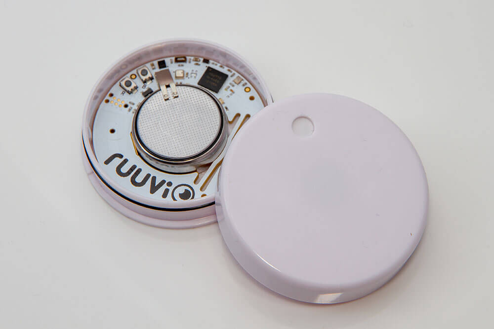

RuuviTag Open Source BLE Sensor
===============================

.. seo::
    :description: Instructions for setting up RuuviTag bluetooth-based sensors in ESPHome.
    :image: ruuvitag.jpg
    :keywords: Ruuvi, RuuviTag, BLE, Bluetooth

The ``ruuvitag`` sensor platform lets you track the output of RuuviTag
Bluetooth Low Energy devices using the :doc:`/components/esp32_ble_tracker`.
This component will track the temperature, humidity, acceleration and battery
voltage of a RuuviTag device with RAWv1 protocol every time the sensor sends
out a BLE broadcast. RAWv2 protocol is supported too. Then tx power,
movement count and measurement sequence number are also tracked.

    RuuviTagSensor over BLE.

.. figure:: images/ruuvitag-ui.jpg
    :align: center
    :width: 80.0%

.. code-block:: yaml

    # Example configuration entry
    esp32_ble_tracker:

    sensor:
    - platform: ruuvitag
      mac_address: FF:56:D3:2F:7D:E8
      humidity:
        name: "RuuviTag Humidity"
      temperature:
        name: "RuuviTag Temperature"
      pressure:
        name: "RuuviTag Pressure"
      acceleration:
        name: "RuuviTag Acceleration"
      acceleration_x:
        name: "RuuviTag Acceleration X"
      acceleration_y:
        name: "RuuviTag Acceleration Y"
      acceleration_z:
        name: "RuuviTag Acceleration Z"
      battery_voltage:
        name: "RuuviTag Battery Voltage"
      tx_power:
        name: "RuuviTag TX Power"
      movement_counter:
        name: "RuuviTag Movement Counter"
      measurement_sequence_number:
        name: "RuuviTag Measurement Sequence Number"

Configuration variables:
------------------------

- **mac_address** (**Required**, MAC Address): The MAC address of the RuuviTag
  device.
- **humidity** (*Optional*): The information for the humidity sensor

  - **name** (**Required**, string): The name for the humidity sensor.
  - **id** (*Optional*, :ref:`config-id`): Set the ID of this sensor for use
    in lambdas.
  - All other options from :ref:`Sensor <config-sensor>`.

- **temperature** (*Optional*): The information for the temperature sensor.

  - **name** (**Required**, string): The name for the temperature sensor.
  - **id** (*Optional*, :ref:`config-id`): Set the ID of this sensor for use
    in lambdas.
  - All other options from :ref:`Sensor <config-sensor>`.

- **pressure** (*Optional*): The information for the pressure sensor.

  - **name** (**Required**, string): The name for the pressure sensor.
  - **id** (*Optional*, :ref:`config-id`): Set the ID of this sensor for use
    in lambdas.
  - All other options from :ref:`Sensor <config-sensor>`.

- **acceleration** (*Optional*): The information for the acceleration
  sensor.

  - **name** (**Required**, string): The name for the acceleration sensor.
  - **id** (*Optional*, :ref:`config-id`): Set the ID of this sensor for use
    in lambdas.
  - All other options from :ref:`Sensor <config-sensor>`.

- **acceleration_x** (*Optional*): The information for the acceleration x
  sensor.

  - **name** (**Required**, string): The name for the acceleration x sensor.
  - **id** (*Optional*, :ref:`config-id`): Set the ID of this sensor for use
    in lambdas.
  - All other options from :ref:`Sensor <config-sensor>`.

- **acceleration_y** (*Optional*): The information for the acceleration y
  sensor.

  - **name** (**Required**, string): The name for the acceleration y sensor.
  - **id** (*Optional*, :ref:`config-id`): Set the ID of this sensor for use
    in lambdas.
  - All other options from :ref:`Sensor <config-sensor>`.

- **acceleration_z** (*Optional*): The information for the acceleration z
  sensor.

  - **name** (**Required**, string): The name for the acceleration z sensor.
  - **id** (*Optional*, :ref:`config-id`): Set the ID of this sensor for use
    in lambdas.
  - All other options from :ref:`Sensor <config-sensor>`.

- **battery_voltage** (*Optional*): The information for the battery voltage
  sensor.

  - **name** (**Required**, string): The name for the battery voltage sensor.
  - **id** (*Optional*, :ref:`config-id`): Set the ID of this sensor for use
    in lambdas.
  - All other options from :ref:`Sensor <config-sensor>`.

- **tx_power** (*Optional*): The information for the transmit power
  sensor

  - **name** (**Required**, string): The name for the transmit power sensor.
  - **id** (*Optional*, :ref:`config-id`): Set the ID of this sensor for use
    in lambdas.
  - All other options from :ref:`Sensor <config-sensor>`.
  - Only available if RAWv2 protocol is used.

- **movement_counter** (*Optional*): The information for the movement count
  sensor

  - **name** (**Required**, string): The name for the movement count sensor.
  - **id** (*Optional*, :ref:`config-id`): Set the ID of this sensor for use
    in lambdas.
  - All other options from :ref:`Sensor <config-sensor>`.
  - Only available if RAWv2 protocol is used.

- **measurement_sequence_number** (*Optional*): The information for the
  measurement sequence number sensor

  - **name** (**Required**, string): The name for the measurement sequence
    number sensor.
  - **id** (*Optional*, :ref:`config-id`): Set the ID of this sensor for use
    in lambdas.
  - All other options from :ref:`Sensor <config-sensor>`.
  - Only available if RAWv2 protocol is used.

Setting Up Devices
------------------

To set up RuuviTag devices you first need to find their MAC Address so that
ESPHome can identify them. So first, create a simple configuration without any
``ruuvitag`` entries but with ``ruuvi_ble`` enabled like so:

.. code-block:: yaml

    esp32_ble_tracker:

    ruuvi_ble:

After uploading the ESP32 will immediately try to scan for BLE devices.
When it detects these sensors, it will automatically parse the BLE message
print a message like this one:

.. code::

    Got ruuvi RuuviTag (FF:56:D3:2F:7D:E8): Humidity: 67.5%, Temperature: 22.97°C,
    Pressure: 977.09hPa, Acceleration X: 0.005G, Acceleration Y: 0.017G, Acceleration Z: 1.066G,
    Battery Voltage: 3.223V

Then just copy the address (``FF:56:D3:2F:7D:E8``) into a new
``sensor.ruuvitag`` platform entry like in the configuration example at the top.

.. note::

    The ESPHome Ruuvi BLE component listens passively to packets the RuuviTag device sends by itself.
    ESPHome therefore has no impact on the battery life of the device.

See Also
--------

- :doc:`/components/esp32_ble_tracker`
- :doc:`/components/sensor/index`
- :doc:`absolute_humidity`
- :apiref:`ruuvitag/ruuvitag.h`
- `Ruuvi <https://ruuvi.com>`__
- :ghedit:`Edit`
