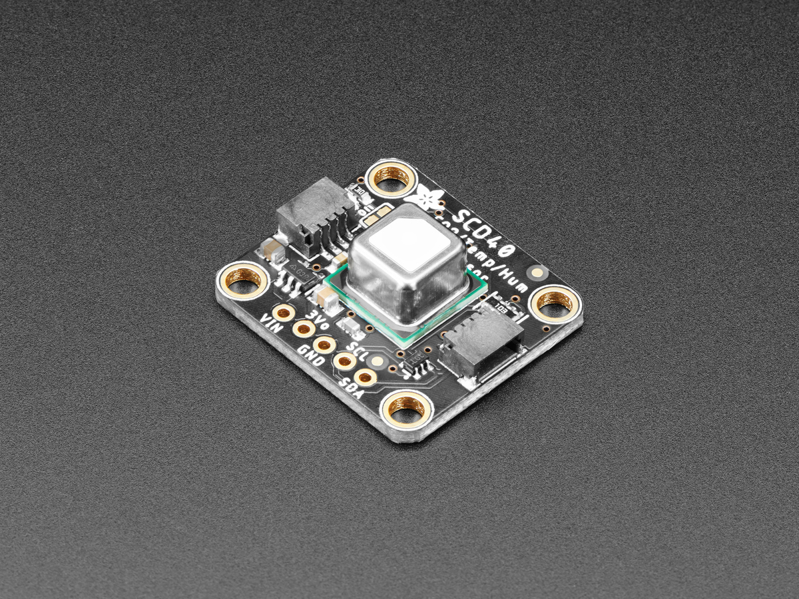

SCD4X CO₂, Temperature and Relative Humidity Sensor
===================================================

.. seo::
    :description: Instructions for setting up SCD4X CO₂ Temperature and Relative Humidity Sensor
    :image: scd4x.jpg

The ``scd4x`` sensor platform  allows you to use your Sensirion SCD4X CO₂
(`datasheet <https://sensirion.com/media/documents/C4B87CE6/627C2DCD/CD_DS_SCD40_SCD41_Datasheet_D1.pdf>`__) sensors with ESPHome.
The :ref:`I²C Bus <i2c>` is required to be set up in your configuration for this sensor to work.

.. code-block:: yaml

    # Example configuration entry
    sensor:
      - platform: scd4x
        co2:
          name: "Workshop CO2"
        temperature:
          name: "Workshop Temperature"
        humidity:
          name: "Workshop Humidity"

Configuration variables:
------------------------

- **co2** (*Optional*): The information for the CO₂ sensor.

  - **name** (**Required**, string): The name for the CO₂eq sensor.
  - **id** (*Optional*, :ref:`config-id`): Set the ID of this sensor for use in lambdas.
  - All other options from :ref:`Sensor <config-sensor>`.

- **temperature** (*Optional*): The information for the Temperature sensor.

  - **name** (**Required**, string): The name for the temperature sensor.
  - **id** (*Optional*, :ref:`config-id`): Set the ID of this sensor for use in lambdas.
  - All other options from :ref:`Sensor <config-sensor>`.

- **humidity** (*Optional*): The information for the Humidity sensor.

  - **name** (**Required**, string): The name for the humidity sensor.
  - **id** (*Optional*, :ref:`config-id`): Set the ID of this sensor for use in lambdas.
  - All other options from :ref:`Sensor <config-sensor>`.

- **temperature_offset** (*Optional*, float):  The temperature offset can depend
  on various factors such as the SCD4x measurement mode, self-heating of close
  components, the ambient temperature and air flow. This variable allows the
  compensation of those effects by setting a temperature offset. Defaults to
  ``4°C``.

- **automatic_self_calibration** (*Optional*, boolean): Whether to enable
  automatic self calibration (ASC). Defaults to ``true``.

- **ambient_pressure_compensation** (*Optional*, int): Enable compensation
  of measured CO₂ values based on given ambient pressure in mBar.

- **altitude_compensation** (*Optional*, int): Enable compensating
  deviations due to current altitude (in metres). Notice: setting
  *altitude_compensation* is ignored if *ambient_pressure_compensation*
  is set.

- **measurement_mode** (*Optional*): Set measurement mode for scd4x.

  - ``periodic``: The sensor takes a new measurement every 5 seconds. This is the default mode.
  - ``low_power_periodic``: The sensor takes a new measurement every 30 seconds. Make sure ``update_interval`` is at least 30 seconds.
  - ``single_shot``: A measurement is started in every update interval. A measurement takes 5 seconds. This mode is only available on scd41 and useful if low power consumption is required.
    The automatic self-calibration is optimized for single shot measurements performed every 5 minutes.
    To reduce noise levels, you can can perform several single shot measurements in a row and average the output values using a :ref:`sensor-filters`.
  - ``single_shot_rht_only``: A measurement is started in every update interval. A measurement takes 50 ms. Only humidity and temperature is measured. CO2 is reported as 0 ppm. This mode is only available on scd41 and useful if low power consumption is required.

- **ambient_pressure_compensation_source** (*Optional*, :ref:`config-id`): Set an external pressure sensor ID used for ambient pressure compensation.
  The pressure sensor must report pressure in hPa. the correction is applied before updating the state of the co2 sensor.

- **address** (*Optional*, int): Manually specify the I²C address of the sensor.
  Defaults to ``0x62``.

- **update_interval** (*Optional*, :ref:`config-time`): The interval to check the
  sensor. Defaults to ``60s``.

Actions:
--------

.. _perform_forced_calibration_action:

``perform_forced_calibration`` Action
---------------------------------------------

This :ref:`action <config-action>` manually calibrates the sensor to the provided value in ppm.
Operate the SCD4x in the operation mode later used in normal sensor operation (periodic measurement, low power periodic measurement or single shot) for > 3 minutes in an environment with homogenous and constant CO2 concentration before performing a forced recalibration.
As of April 2022 the average fresh air Co² concentration is 419 ppm.

.. code-block:: yaml

    on_...:
      then:
        - scd4x.perform_forced_calibration:
            value: 419   # outside average April 2022
            id: my_scd41

value can also be a template, for example to define a Home Assistant calibration service:

.. code-block:: yaml

    api:
      services:
        - service: calibrate_co2_value
          variables:
            co2_ppm: int
          then:
          - scd4x.perform_forced_calibration:
              value: !lambda 'return co2_ppm;'
              id: my_scd41

.. _factory_reset_action:

``factory_reset`` Action
--------------------------------

This :ref:`action <config-action>` triggers a factory reset of the sensor. Calibration settings are restored from factory settings.

.. code-block:: yaml

    on_...:
      then:
        - scd4x.factory_reset: my_scd41

Pressure compensation
---------------------

A static ambient pressure value can be set with `ambient_pressure_compensation` or `altitude_compensation`. It can also be changed dynamically with :ref:`lambdas <config-lambda>` using `set_ambient_pressure_compensation(<mBar>)`, or by pointing `ambient_pressure_compensation_source` to a local pressure sensor.

Example with a local sensor
***************************

Note: remember your pressure sensor needs to output in mBar

.. code-block:: yaml

    sensor:
      - platform: bme280
        pressure:
          name: "Ambient Pressure"
          id: bme_pressure

      - platform: scd4x
        measurement_mode: low_power_periodic
        ambient_pressure_compensation_source: bme_pressure
        temperature_offset: 0
        co2:
          name: "CO2 level"

Example with a remote sensor
****************************

This example creates a service `set_ambient_pressure` that can be called from Home Assistant:

.. code-block:: yaml

    api:
      services:
        - service: set_ambient_pressure
          variables:
            pressure_mbar: int
          then:
            - lambda: "id(my_scd41)->set_ambient_pressure_compensation(pressure_mbar);"

    sensor:
      - platform: scd4x
        id: my_scd41
        measurement_mode: low_power_periodic
        temperature_offset: 0
        co2:
          name: "CO2 level"

See Also
--------

- :ref:`sensor-filters`
- :doc:`absolute_humidity`
- :doc:`scd30`
- :apiref:`scd4x/scd4x.h`
- :ghedit:`Edit`
