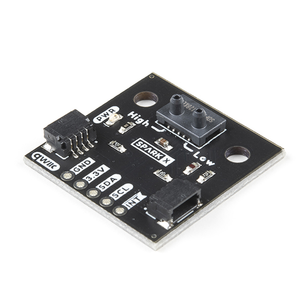

SDP3x / SDP800 Series Differential Pressure Sensor
===================================================

.. seo::
    :description: Instructions for setting up the SDP3x or SDP800 Series Differential Pressure sensor.
    :image: sdp31.jpg
    :keywords: SDP3x, SDP31, SDP32, SDP800 Series, SDP810, SDP810

The SDP3x Differential Pressure sensor allows you to use your SDP3x
(`datasheet <https://sensirion.com/media/documents/4D045D69/6375F34F/DP_DS_SDP3x_digital_D1.pdf>`__,
`sparkfun <https://www.sparkfun.com/products/17874>`__) or SDP800 Series (`datasheet <https://sensirion.com/media/documents/90500156/6167E43B/Sensirion_Differential_Pressure_Datasheet_SDP8xx_Digital.pdf>`__)
sensors with ESPHome.

    SDP31 Differential Pressure Sensor.
    (Credit: `Sparkfun <https://www.sparkfun.com/products/17874>`__, image cropped and compressed)

.. _Sparkfun: https://www.sparkfun.com/products/17874

To use the sensor, set up an :ref:`I²C Bus <i2c>` and connect the sensor to the specified pins.

.. code-block:: yaml

    # Example configuration entry
    - platform: sdp3x
      name: "HVAC Filter Pressure drop"
      id: filter_pressure

Configuration variables:
------------------------

- **name** (**Required**, string): The name for this sensor.
- **id** (*Optional*, :ref:`config-id`): Set the ID of this sensor for lambdas/multiple sensors.
- **address** (*Optional*, int): The I²C address of the sensor. Defaults to ``0x21``.
- **measurement_mode** (*Optional*): The measurement mode of the sensor. Valid options are ``differential_pressure`` and ``mass_flow``. Defaults to ``differential_pressure``.
- **update_interval** (*Optional*, :ref:`config-time`): The interval to check the sensor. Defaults to ``60s``.
- All other options from :ref:`Sensor <config-sensor>`.

See Also
--------

- :ref:`sensor-filters`
- :apiref:`sdp3x/sdp3x.h`
- :ghedit:`Edit`
