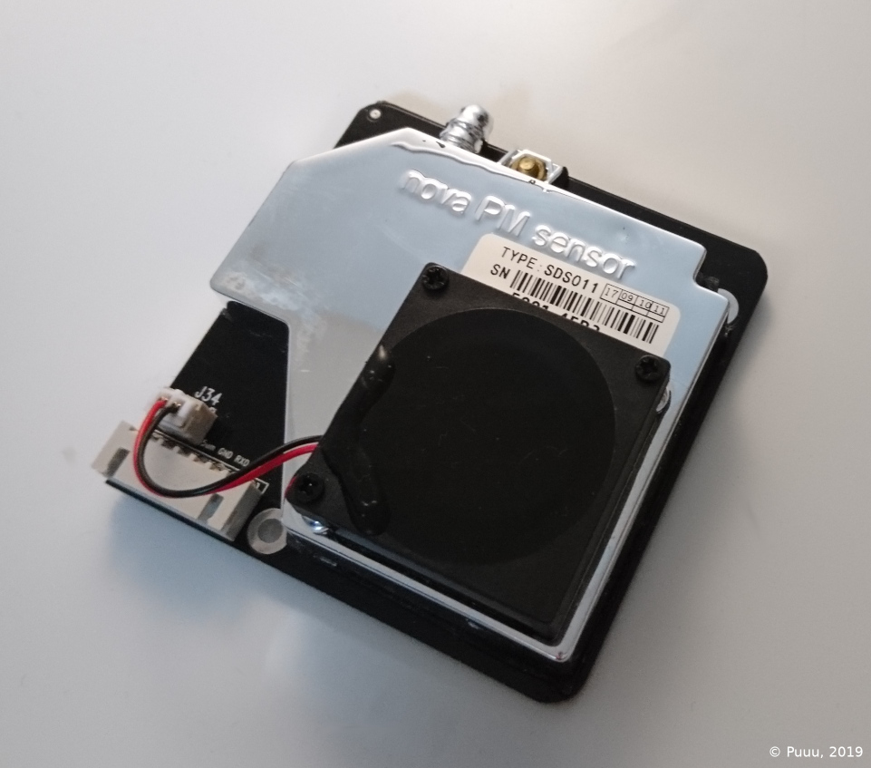

SDS011 Particulate Matter Sensor
================================

.. seo::
    :description: Instructions for setting up SDS011 Particulate matter sensors
    :image: sds011.jpg
    :keywords: sds011

The ``sds011`` sensor platform allows you to use SDS011 particulate matter sensors (`datasheet <https://nettigo.pl/attachments/398>`__)
with ESPHome.

    SDS011 Particulate Matter Sensor

As the communication with the SDS011 is done using UART, you need
to have an :ref:`UART bus <uart>` in your configuration with the ``rx_pin`` connected to the TX pin of the
SDS011 and optionally the ``tx_pin`` connected to the RX Pin of the SDS011 (it's switched because the
TX/RX labels are from the perspective of the individual device). Additionally, you need to set the baud rate to 9600.

.. code-block:: yaml

    # Example configuration entry
    uart:
      rx_pin: D0
      tx_pin: D1
      baud_rate: 9600

    sensor:
      - platform: sds011
        pm_2_5:
          name: "Particulate Matter <2.5µm Concentration"
        pm_10_0:
          name: "Particulate Matter <10.0µm Concentration"
        update_interval: 5min

With ``update_interval``, the working period of the SDS011 device will be changed. If ``update_interval`` is
equal to ``0min``, the SDS011 will be set to continuous measurement and will report new measurement values
approximately every second.

If ``update_interval`` is between 1-30 minutes, the SDS011 periodically turns on for 30s before each measurement.
For the remaining time the sensor is shut off. As a result, this mode can reduce power consumption and increases
the lifetime of the SDS011.

Note that ``update_interval`` may not be set to ``never``.

Configuration variables:
------------------------

- **pm_2_5** (*Optional*): Use the concentration of particulates of size less than 2.5µm in µg per cubic meter.
  All options from :ref:`Sensor <config-sensor>`.

- **pm_10_0** (*Optional*): Use the concentration of particulates of size less than 10.0µm in µg per cubic meter.
  All options from :ref:`Sensor <config-sensor>`.

- **update_interval** (*Optional*, :ref:`config-time`): The interval to check the sensor in minutes.
  This affects the working period of the SDS011 sensor. Defaults to ``0min``.

- **rx_only** (*Optional*, boolean): Whether the sensor is connected **only by RX pin** to the UART bus.
  Since the SDS011 can not be configured in RX-only mode, ``update_interval`` has no effect and the sensor must be
  configured separately. Defaults to ``false``.

- **uart_id** (*Optional*, :ref:`config-id`): Manually specify the ID of the :ref:`UART Component <uart>` if you want
  to use multiple UART buses.

.. note::

    The configuration variable ``update_interval`` reconfigure the SDS011 device. This setting is still effective
    after power off. This can affect the performance of other libraries. Factory default is continuous measurement.

See Also
--------

- :doc:`/components/sensor/pmsx003`
- :ref:`sensor-filters`
- `Laser Dust Sensor Control Protocol <https://nettigo.pl/attachments/415>`__
- :apiref:`sds011/sds011.h`
- :ghedit:`Edit`
