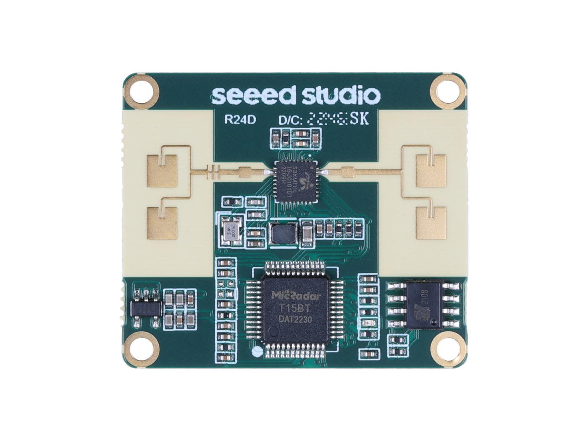
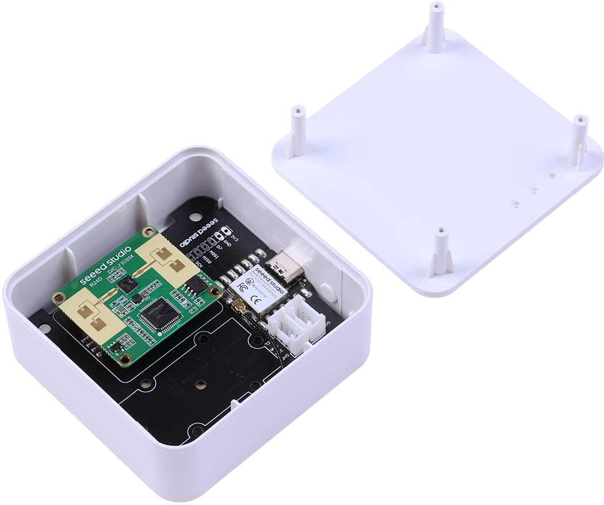
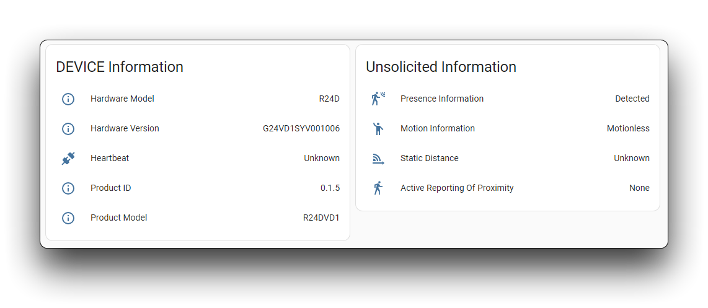

Seeed Studio MR24HPC1 mmWave (Kit)
=============

.. seo::
    :description: Instructions for setting up MR24HPC1 mmWave (Kit).
    :image: seeed-mr24hpc1.jpg

Component/Hub
-------------
.. _mr24hpc1-component:

The ``mr24hpc1`` sensor platform allows you to use Seeed Studio 24GHz mmWave Sensor - Human Static Presence Module Lite
(`Using Documents <https://wiki.seeedstudio.com/Radar_MR24HPC1/>`__) and Seeed Studio mmWave Human Detection Sensor Kit (`Using Documents <https://wiki.seeedstudio.com/mmwave_human_detection_kit/>`__) with ESPHome.

The :ref:`UART <uart>` is required to be set up in your configuration for this sensor to work, ``parity`` and ``stop_bits`` **must be** respectively ``NONE`` and ``1``. 
You can use the ESP32 software or hardware serial to use this MR24HPC1, its default baud rate is 115200.

    Seeed Studio 24GHz mmWave Sensor - Human Static Presence Module Lite

    
    Seeed Studio mmWave Human Detection Sensor Kit

.. code-block:: yaml

    # Example configuration entry
    mr24hpc1:

Configuration variables:
************************

- **id** (*Optional*, :ref:`config-id`): Manually specify the ID for this :doc:`seeed_mr24hpc1` component if you need multiple components.

Binary Sensor
-------------

The ``mr24hpc1`` binary sensor allows you to use your :doc:`seeed_mr24hpc1` to perform different measurements.

.. code-block:: yaml

    binary_sensor:
      - platform: mr24hpc1
        someoneexist:
          name: "Presence Information"

Configuration variables:
************************

- **someoneexist** (*Optional*): If true target detect either still or in movement. All options from :ref:`Binary Sensor <config-binary_sensor>`.

Sensor
------

The ``mr24hpc1`` sensor allows you to use your :doc:`seeed_mr24hpc1` to perform different measurements.

.. code-block:: yaml

    sensor:
      - platform: mr24hpc1
        custompresenceofdetection:
          name: "Static Distance"

Configuration variables:
************************

- **custompresenceofdetection** (*Optional*, float): Distance in meter of detected still target. All options from :ref:`Sensor <config-sensor>`.

Text Sensor
-----------

The ``mr24hpc1`` text sensor allows you to get information about your :doc:`seeed_mr24hpc1`.

.. code-block:: yaml

    text_sensor:
      - platform: mr24hpc1
        heartbeat:
          name: "Heartbeat"
        productmodel:
          name: "Product Model"
        productid:
          name: "Product ID"
        hardwaremodel:
          name: "Hardware Model"
        hardwareversion:
          name: "Hardware Version"
        keepaway:
          name: "Active Reporting Of Proximity"
        motionstatus:
          name: "Motion Information"

Configuration variables:
************************

- **heartbeat** (*Optional*): Sensor operating status indicator. All options from :ref:`Text Sensor <config-text_sensor>`.
- **productmodel** (*Optional*): The product model. All options from :ref:`Text Sensor <config-text_sensor>`.
- **productid** (*Optional*): The product ID. All options from :ref:`Text Sensor <config-text_sensor>`.`
- **hardwaremodel** (*Optional*) The hardware model. All options from :ref:`Text Sensor <config-text_sensor>`.`
- **hardwareversion** (*Optional*) The hardware version. All options from :ref:`Text Sensor <config-text_sensor>`.`
- **keepaway** (*Optional*) Indicator for detecting objects approaching or moving away. All options from :ref:`Text Sensor <config-text_sensor>`.`
- **motionstatus** (*Optional*) An indicator that detects the movement or stationarity of an object. All options from :ref:`Text Sensor <config-text_sensor>`.`

Home Assistant Card
*******************

For a more intuitive view of the sensor data, you can use the customised card below.

.. code-block:: yaml

    - type: horizontal-stack
      cards:
        - type: entities
          entities:
            - entity: sensor.DEVICE_hardware_model
              name: Hardware Model
            - entity: sensor.DEVICE_hardware_version
              name: Hardware Version
            - entity: sensor.DEVICE_heartbeat
              name: Heartbeat
            - entity: sensor.DEVICE_product_id
              name: Product ID
            - entity: sensor.DEVICE_product_model
              name: Product Model
          title: DEVICE Information
    - type: vertical-stack
      cards:
        - type: entities
          entities:
            - entity: binary_sensor.DEVICE_presence_information
              name: Presence Information
            - entity: sensor.DEVICE_motion_information
              name: Motion Information
            - entity: sensor.DEVICE_static_distance
              name: Static Distance
            - entity: sensor.DEVICE_active_reporting_of_proximity
              name: Active Reporting Of Proximity
          title: Unsolicited Information

Then replace all instances of ``DEVICE`` with your device name

The result:

See Also
--------

- `Official Using Documents for Seeed Studio 24GHz mmWave Sensor - Human Static Presence Module Lite <https://wiki.seeedstudio.com/Radar_MR24HPC1/->`_
- `Official Using Documents for Seeed Studio mmWave Human Detection Sensor Kit  <https://wiki.seeedstudio.com/mmwave_human_detection_kit/->`_
- `Source of inspiration for implementation <https://github.com/limengdu/mmwave-kit-external-components/>`_
- :apiref:`seeed_mr24hpc1/mr24hpc1.h`
- :ghedit:`Edit`
