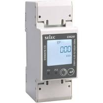

Selec Energy Monitor
==========================

.. seo::
    :description: Instructions for setting up Selec power monitors.
    :image: selec_meter_em2m.jpg
    :keywords: EM2M

The ``selec_meter`` sensor platform allows you to use Selec Modbus energy monitors
(`website <https://www.selec.com/product-details/energy-meter-direct-operated-em2m>`__)
with ESPHome.

    Selec EM2M Energy Monitor.

The communication with this component is done via a :ref:`UART <uart>` using :ref:`Modbus <modbus>`.
You must therefore have a ``uart:`` entry in your configuration with both the TX and RX pins set
to some pins on your board and the baud rate set to 9600.

.. code-block:: yaml

    # Example configuration entry
    uart:
      rx_pin: D1
      tx_pin: D2
      baud_rate: 9600
      stop_bits: 1

    sensor:
      - platform: selec_meter
        total_active_energy:
          name: "SelecEM2M Total Active Energy"
        import_active_energy:
          name: "SelecEM2M Import Active Energy"
        export_active_energy:
          name: "SelecEM2M Export Active Energy"
        total_reactive_energy:
          name: "SelecEM2M Total Reactive Energy"
        import_reactive_energy:
          name: "SelecEM2M Import Reactive Energy"
        export_reactive_energy:
          name: "SelecEM2M Export Reactive Energy"
        apparent_energy:
          name: "SelecEM2M Apparent Energy"
        active_power:
          name: "SelecEM2M Active Power"
        reactive_power:
          name: "SelecEM2M Reactive Power"
        apparent_power:
          name: "SelecEM2M Apparent Power"
        voltage:
          name: "SelecEM2M Voltage"
        current:
          name: "SelecEM2M Current"
        power_factor:
          name: "SelecEM2M Power Factor"
        frequency:
          name: "SelecEM2M Frequency"
        maximum_demand_active_power:
          name: "SelecEM2M Maximum Demand Active Power"
        maximum_demand_reactive_power:
          name: "SelecEM2M Maximum Demand Reactive Power"
        maximum_demand_apparent_power:
          name: "SelecEM2M Maximum Demand Apparent Power"

Configuration variables:
------------------------

- **total_active_energy** (*Optional*): Use the total active energy value of the sensor in kilo watt
  hours. All options from :ref:`Sensor <config-sensor>`.
- **import_active_energy** (*Optional*): Use the import active energy value of the sensor in kilo watt
  hours. All options from :ref:`Sensor <config-sensor>`.
- **export_active_energy** (*Optional*): Use the export active energy value of the sensor in kilo watt
  hours. All options from :ref:`Sensor <config-sensor>`.
- **total_reactive_energy** (*Optional*): Use the total reactive energy value of the sensor in
  kilo volt amps reactive hours. All options from :ref:`Sensor <config-sensor>`.
- **import_reactive_energy** (*Optional*): Use the import reactive energy value of the sensor in
  kilo volt amps reactive hours. All options from :ref:`Sensor <config-sensor>`.
- **export_reactive_energy** (*Optional*): Use the export reactive energy value of the sensor in
  kilo volt amps reactive hours. All options from :ref:`Sensor <config-sensor>`.
- **apparent_energy** (*Optional*): Use the apparent energy value of the sensor in
  kilo volt amps hours. All options from :ref:`Sensor <config-sensor>`.
- **active_power** (*Optional*): Use the (active) power value of the sensor in watts. All options
  from :ref:`Sensor <config-sensor>`.
- **reactive_power** (*Optional*): Use the reactive power value of the sensor in VAR. All
  options from :ref:`Sensor <config-sensor>`.
- **apparent_power** (*Optional*): Use the apparent power value of the sensor in VA. All
  options from :ref:`Sensor <config-sensor>`.
- **voltage** (*Optional*): Use the voltage value of the sensor in volts.
  All options from :ref:`Sensor <config-sensor>`.
- **current** (*Optional*): Use the current value of the sensor in amperes. All options from
  :ref:`Sensor <config-sensor>`.
- **power_factor** (*Optional*): Use the power factor value of the sensor.
  All options from :ref:`Sensor <config-sensor>`.
- **frequency** (*Optional*): Use the frequency value of the sensor in hertz.
  All options from :ref:`Sensor <config-sensor>`.
- **maximum_demand_active_power** (*Optional*): Use the maximum demand (active) power value of the sensor in watts. All options
  from :ref:`Sensor <config-sensor>`.
- **maximum_demand_reactive_power** (*Optional*): Use the maximum demand reactive power value of the sensor in VAR. All
  options from :ref:`Sensor <config-sensor>`.
- **maximum_demand_apparent_power** (*Optional*): Use the maximum demand apparent power value of the sensor in VA. All
  options from :ref:`Sensor <config-sensor>`.
- **update_interval** (*Optional*, :ref:`config-time`): The interval to check the
  sensor. Defaults to ``60s``.
- **address** (*Optional*, int): The address of the sensor if multiple sensors are attached to
  the same UART bus. You will need to set the address of each device manually. Defaults to ``1``.

See Also
--------

- :ref:`sensor-filters`
- :ghedit:`Edit`
