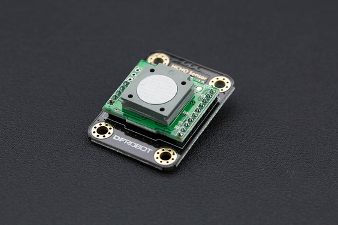

SEN0231 DFRobot Ozone Sensor
============================

.. seo::
    :description: Instructions for setting up SEN0231 DFRobot formaldehyde sensors
    :image: sen0231.jpg
    :keywords: sen0231

The ``sen0231`` sensor platform allows you to use your DFRobot
(`product wiki <https://wiki.dfrobot.com/Gravity__HCHO_Sensor_SKU__SEN0231>`__,
`DFRobot`_) formaldehyde sensors with ESPHome.
:ref:`uart` is required to be set up in your configuration for this sensor to work.
The Uart should be 9600 Baud, receiving only.

    DFRobot Formaldehyde Sensor (sen0231).

.. _DFRobot: https://www.dfrobot.com/product-1574.html

.. code-block:: yaml

    # Example configuration entry
    sensor:
      - platform: sen0231
        name: "Formaldehyde Sensor"
        uart_id: "id"
        update_interval: 60s

Configuration variables:
------------------------

- All options from :ref:`Sensor <config-sensor>`.

- **uart_id** (*Optional*, string): The ID of the uart device to use

- **update_interval** (*Optional*, :ref:`config-time`): The interval to check the
  sensor. Defaults to ``60s``.

See Also
--------

- :ref:`sensor-filters`
- :apiref:`sen0231/sen0231.h`
- `DFRobot SEN0231 Library <https://wiki.dfrobot.com/Gravity__HCHO_Sensor_SKU__SEN0231>`__ by `DFRobot <https://www.dfrobot.com/>`__
- :ghedit:`Edit`
