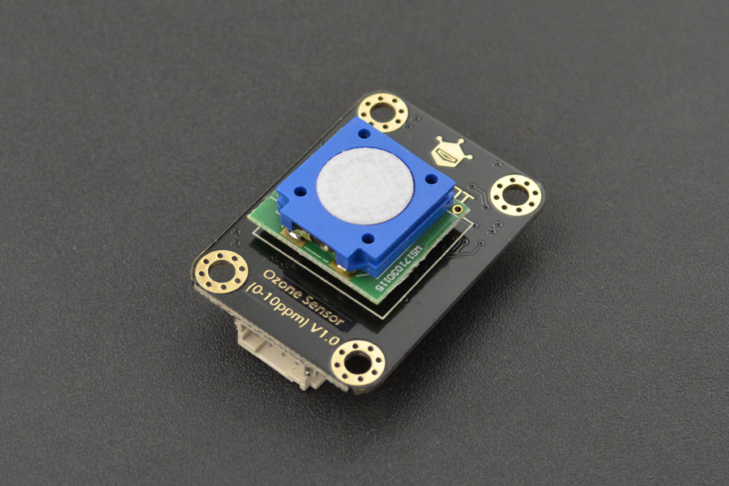

SEN0321 DFRobot Ozone Sensor
============================

.. seo::
    :description: Instructions for setting up SEN0321 DFRobot ozone sensors
    :image: sen0321.jpg
    :keywords: sen0321

The ``sen0321`` sensor platform allows you to use your DFRobot
(`product wiki <https://wiki.dfrobot.com/Gravity_IIC_Ozone_Sensor_(0-10ppm)%20SKU_SEN0321>`__,
`DFRobot`_) ozone sensors with ESPHome. The sensor is used in automatic mode where the sensor actively
updates its measurements every 2 seconds.
:ref:`I²C <i2c>` is required to be set up in your configuration for this sensor to work.

    DFRobot Ozone Sensor (sen0321).

.. _DFRobot: https://www.dfrobot.com/product-2005.html

.. code-block:: yaml

    # Example configuration entry
    sensor:
      - platform: sen0321
        name: "Ozone Sensor"
        address: 0x73
        update_interval: 60s

Configuration variables:
------------------------

- All options from :ref:`Sensor <config-sensor>`.

- **address** (*Optional*, int): Manually specify the I²C address of
  the sensor. Defaults to ``0x73``. Sensor can be configured to ``0x70``, ``0x71``, ``0x72``, or ``0x73`` using jumpers on the board.

- **update_interval** (*Optional*, :ref:`config-time`): The interval to check the
  sensor. Defaults to ``60s``.

See Also
--------

- :ref:`sensor-filters`
- :apiref:`sen0321/sen0321.h`
- `DFRobot SEN0321 Library <https://github.com/DFRobot/DFRobot_OzoneSensor/>`__ by `DFRobot <https://www.dfrobot.com/>`__
- :ghedit:`Edit`
