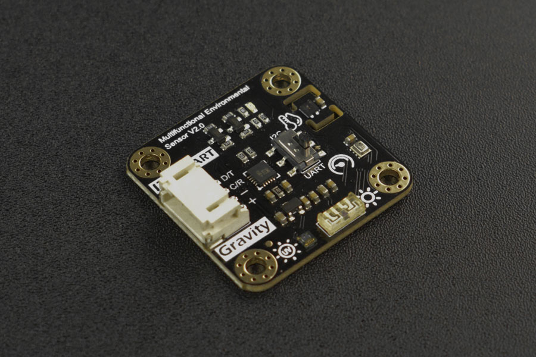
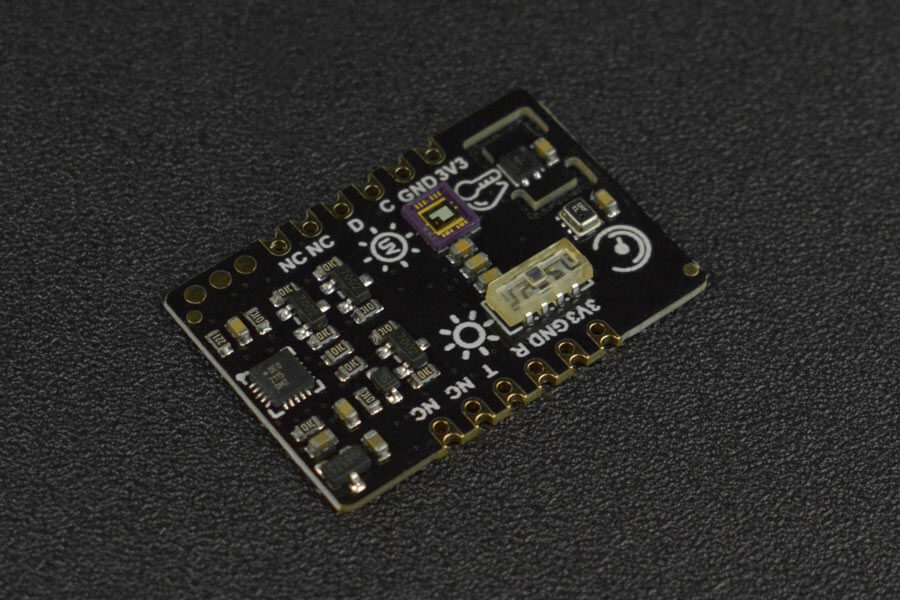

sen0501 and sen0500 Environmental Sensor
========================================

.. seo::
    :description: Instructions for setting up the sen0501 and sen0500 environmental sensor.
    :image: sen0501.jpg
    :keywords: sen0501, sen0500, DFRobot, Fermion, Gravity

The ``sen0501`` sensor platform allows you to use your DFRobot Gravity sen0501
(`product wiki <https://wiki.dfrobot.com/SKU_SEN0501_Gravity_Multifunctional_Environmental_Sensor>`__,
`DFRobot0501`_) or DFRobot Fermion sen0500 (`product wiki <https://wiki.dfrobot.com/SKU_SEN0500_Fermion_Multifunctional_Environmental_Sensor>`__,
`DFRobot0500`_) environmental sensor with ESPHome. :ref:`I²C <i2c>` is
required to be set up in your configuration for either of these sensors to work.

.. note::

    Both the sen0501 and the sen0500 have the capability of switching between I²C and UART protocols. 
    However, the ``sen0501`` sensor platform for ESPHome is only setup to deal with communication using I²C at the current time.
    Therefore, please ensure that the I²C protocol is selected on the respective board before proceeding.

    DFRobot Gravity sen0501 Environmental Sensor

    DFRobot Fermion sen0500 Environmental Sensor

.. _DFRobot0501: https://www.dfrobot.com/product-2528.html
.. _DFRobot0500: https://www.dfrobot.com/product-2522.html

.. code-block:: yaml

    # Example configuration entry
    sensor:
      - platform: sen0501
        temperature:
            name: "Temperature"
        humidity:
            name: "Humidity"
        uv_irradiance:
            name: "UV Irradiance"
        illuminance:
            name: "Ambient Light"
        pressure:
            name: "Atmospheric Pressure"
        elevation:
            name: "Elevation"

.. note::

    The sensor ``-platform:`` will always be ``sen0501``, regardless of whether you use the sen0501 or sen0500 board.

Configuration variables:
------------------------

- **temperature** (*Optional*): The temperature sensor.
  All options from :ref:`Sensor <config-sensor>`.
- **humidity** (*Optional*): The humidity sensor.
  All options from :ref:`Sensor <config-sensor>`.
- **uv_irradiance** (*Optional*): The UV irradiance sensor.
  All options from :ref:`Sensor <config-sensor>`.
- **illuminance** (*Optional*): The illuminance sensor.
  All options from :ref:`Sensor <config-sensor>`.
- **pressure** (*Optional*): The atmospheric rpessure sensor.
  All options from :ref:`Sensor <config-sensor>`.
- **elevation** (*Optional*): The elevation sensor.
  All options from :ref:`Sensor <config-sensor>`.

- **update_interval** (*Optional*, :ref:`config-time`): The interval to check the
  sensor. Defaults to ``60s``.

.. note::

    The default I²C address is set as ``0x22``. It appears there is no alternative provided for either the sen0501 or sen0500.

See Also
--------

- :ref:`sensor-filters`
- :apiref:`sen0501/sen0501.h`
- `DFRobot sen0501/sen0500 library <https://github.com/DFRobot/DFRobot_EnvironmentalSensor>`__ by `DFRobot <https://www.dfrobot.com/>`__
- :ghedit:`Edit`
