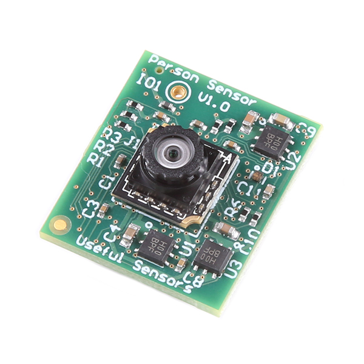

SEN21231 Person Sensor from Useful Sensors
==========================================

.. seo::
    :description: Instructions for setting up a SEN21231 Person Sensor from Useful Sensors with ESPHome.
    :image: description.svg

`Person Sensor (SEN21231) from Useful Sensors <https://usefulsensors.com/person-sensor>`__ has built in facial recognition that can detect how many people are facing the sensor and relative positions of the faces.

    Person Sensor

This sensor returns information over I2C interface. The I2C address is ``0x62``

.. code-block:: yaml

    # Example configuration entry
    sensor:
      - platform: sen21231
        id: person_sensor
        # sda and scl connected approriately
        # power connected to 3.3v

See Also
--------

- :doc:`/components/sensor/index`
- :apiref:`sen21231/sen21231.h`
- :ghedit:`Edit`
