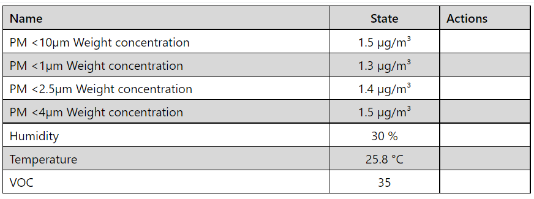
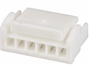

Sen5x Series Environmental sensor
=================================

.. seo::
    :description: Instructions for setting up Sen5x Series Environmental sensor for PM, RH/T, VOC, and NOx measurements.
    :image: sen54.jpg

The ``sen5x`` sensor platform allows you to use your Sensirion `SEN50 <https://sensirion.com/products/catalog/SEN50/>`__, `SEN54 <https://sensirion.com/products/catalog/SEN54/>`__ and `SEN55 <https://sensirion.com/products/catalog/SEN55/>`__ Environmental sensor (`datasheet <https://sensirion.com/media/documents/6791EFA0/62A1F68F/Sensirion_Datasheet_Environmental_Node_SEN5x.pdf>`__) sensors with ESPHome.
The :ref:`I²C Bus <i2c>` is required to be set up in your configuration for this sensor to work.
This sensor supports both UART and I²C communication. Only I²C communication is implemented in this component.

.. _Sensirion: https://sensirion.com/products/catalog/?filter_series=ceff880a-784d-4877-ae2c-79353c6a0428

.. code-block:: yaml

    # Example configuration entry
    sensor:
      - platform: sen5x
        id: sen54
        pm_1_0:
          name: " PM <1µm Weight concentration"
          id: pm_1_0
          accuracy_decimals: 1
        pm_2_5:
          name: " PM <2.5µm Weight concentration"
          id: pm_2_5
          accuracy_decimals: 1
        pm_4_0:
          name: " PM <4µm Weight concentration"
          id: pm_4_0
          accuracy_decimals: 1
        pm_10_0:
          name: " PM <10µm Weight concentration"
          id: pm_10_0
          accuracy_decimals: 1
        temperature:
          name: "Temperature"
          accuracy_decimals: 1
        humidity:
          name: "Humidity"
          accuracy_decimals: 0
        voc:
          name: "VOC"
          algorithm_tuning:
            index_offset: 100
            learning_time_offset_hours: 12
            learning_time_gain_hours: 12
            gating_max_duration_minutes: 180
            std_initial: 50
            gain_factor: 230
        temperature_compensation:
          offset: 0
          normalized_offset_slope: 0
          time_constant: 0
        acceleration_mode: low
        store_baseline: true
        address: 0x69
        update_interval: 10s

Configuration variables:
------------------------

- **pm_1_0** (*Optional*): The information for the **Weight Concentration** sensor for fine particles up to 1μm. Readings in µg/m³.

  - **name** (**Required**, string): The name for this sensor.
  - **id** (*Optional*, :ref:`config-id`): Set the ID of this sensor for use in automation and lambdas.
  - All other options from :ref:`Sensor <config-sensor>`.

- **pm_2_5** (*Optional*): The information for the **Weight Concentration** sensor for fine particles up to 2.5μm. Readings in µg/m³.

  - **name** (**Required**, string): The name for this sensor.
  - **id** (*Optional*, :ref:`config-id`): Set the ID of this sensor for use in automation and lambdas.
  - All other options from :ref:`Sensor <config-sensor>`.

- **pm_4_0** (*Optional*): The information for the **Weight Concentration** sensor for coarse particles up to 4μm. Readings in µg/m³.

  - **name** (**Required**, string): The name for this sensor.
  - **id** (*Optional*, :ref:`config-id`): Set the ID of this sensor for use in automation and lambdas.
  - All other options from :ref:`Sensor <config-sensor>`.

- **pm_10_0** (*Optional*): The information for the **Weight Concentration** sensor for coarse particles up to 10μm. Readings in µg/m³.

  - **name** (**Required**, string): The name for this sensor.
  - **id** (*Optional*, :ref:`config-id`): Set the ID of this sensor for use in automation and lambdas.
  - All other options from :ref:`Sensor <config-sensor>`.

- **auto_cleaning_interval** (*Optional*): Reads/Writes the interval in seconds of the periodic fan-cleaning.

- **temperature** (*Optional*): Temperature.Note only available with Sen54 or Sen55. The sensor will be ignored on unsupported models.

  - **name** (**Required**, string): The name of the sensor.
  - **id** (*Optional*, :ref:`config-id`): Manually specify the ID used for code generation.
  - All other options from :ref:`Sensor <config-sensor>`.

- **humidity** (*Optional*): Relative Humidity. Note only available with Sen54 or Sen55. The sensor will be ignored on unsupported models.

- **voc** (*Optional*): VOC Index. Note only available with Sen54 or Sen55. The sensor will be ignored on unsupported models.

  - **name** (**Required**, string): The name of the sensor.
  - **id** (*Optional*, :ref:`config-id`): Manually specify the ID used for code generation.

  - **algorithm_tuning** (*Optional*): The VOC algorithm can be customized by tuning 6 different parameters. For more details see `Engineering Guidelines for SEN5x <https://sensirion.com/media/documents/25AB572C/62B463AA/Sensirion_Engineering_Guidelines_SEN5x.pdf>`__

    - **index_offset** (*Optional*): VOC index representing typical (average) conditions. Allowed values are in range 1..250. The default value is 100.
    - **learning_time_offset_hours** (*Optional*): Time constant to estimate the VOC algorithm offset from the history in hours. Past events will be forgotten after about twice the  learning time. Allowed values are in range 1..1000. The default value is 12 hour
    - **learning_time_gain_hours** (*Optional*): Time constant to estimate the VOC algorithm gain from the history in hours. Past events will be forgotten after about twice the learning time. Allowed values are in range 1..1000. The default value is 12 hours.
    - **gating_max_duration_minutes** (*Optional*): Maximum duration of gating in minutes (freeze of estimator during high VOC index signal). Zero disables the gating. Allowed values are in range 0..3000. The default value is 180 minutes
    - **std_initial** (*Optional*): Initial estimate for standard deviation. Lower value boosts events during initial learning period, but may result in larger device-todevice variations. Allowed values are in range 10..5000. The default value is 50.
    - **gain_factor** (*Optional*): Gain factor to amplify or to attenuate the VOC index output. Allowed values are in range 1..1000. The default value is 230.

  - All other options from :ref:`Sensor <config-sensor>`.

- **nox** (*Optional*): NOx Index. Note: Only available with Sen55. The sensor will be ignored on unsupported models.

  - **name** (**Required**, string): The name of the sensor.
  - **id** (*Optional*, :ref:`config-id`): Manually specify the ID used for code generation.

  - **algorithm_tuning** (*Optional*): The NOx algorithm can be customized by tuning 5 different parameters.For more details see `Engineering Guidelines for SEN5x <https://sensirion.com/media/documents/25AB572C/62B463AA/Sensirion_Engineering_Guidelines_SEN5x.pdf>`__

    - **index_offset** (*Optional*): NOx index representing typical (average) conditions. Allowed values are in range 1..250. The default value is 100.
    - **learning_time_offset_hours** (*Optional*): Time constant to estimate the NOx algorithm offset from the history in hours. Past events will be forgotten after about twice the  learning time. Allowed values are in range 1..1000. The default value is 12 hour
    - **learning_time_gain_hours** (*Optional*): Time constant to estimate the NOx algorithm gain from the history in hours. Past events will be forgotten after about twice the learning time. Allowed values are in range 1..1000. The default value is 12 hours.
    - **gating_max_duration_minutes** (*Optional*): Maximum duration of gating in minutes (freeze of estimator during high NOx index signal). Zero disables the gating. Allowed values are in range 0..3000. The default value is 180 minutes
    - **std_initial** (*Optional*): The initial estimate for standard deviation parameter has no impact for NOx. This parameter is still in place for consistency reasons with the VOC tuning parameters command. This parameter must always be set to 50.
    - **gain_factor** (*Optional*): Gain factor to amplify or to attenuate the VOC index output. Allowed values are in range 1..1000. The default value is 230.

  - All other options from :ref:`Sensor <config-sensor>`.

- **store_baseline** (*Optional*, boolean): Stores and retrieves the baseline VOC and NOx information for quicker startups. Defaults to ``true``
- **temperature_compensation** (*Optional*): These parameters allow to compensate temperature effects of the design-in at customer side by applying a custom temperature offset to the ambient temperature.

  The compensated ambient temperature is calculated as follows:

      T_Ambient_Compensated = T_Ambient + (slope*T_Ambient) + offset

  Where slope and offset are the values set with this command, smoothed with the specified time constant. The time constant is how fast the slope and offset are applied. After the specified value in seconds, 63% of the new slope and offset are applied.
  More details about the tuning of these parameters are included in the application note `Temperature Acceleration and Compensation Instructions for SEN5x. <https://sensirion.com/media/documents/9B9DE2A7/61E957EB/Sensirion_Temperature_Acceleration_and_Compensation_Instructions_SEN.pdf>`__

  - **offset** (*Optional*): Temperature offset [°C]. Defaults to ``0``
  - **normalized_offset_slope** (*Optional*): Normalized temperature offset slope. Defaults to ``0``
  - **time_constant** (*Optional*): Time constant in seconds. Defaults to ``0``

- **acceleration_mode** (*Optional*): Allowed value are ``low``, ``medium`` and ``high``. (default is ``low``)

  By default, the RH/T acceleration algorithm is optimized for a sensor which is positioned in free air. If the sensor is integrated into another device, the ambient RH/T output values might not be optimal due to different thermal behavior.
  This parameter can be used to adapt the RH/T acceleration behavior for the actual use-case, leading in an improvement of the ambient RH/T output accuracy. There is a limited set of different modes available.
  Medium and high accelerations are particularly indicated for air quality monitors which are subjected to large temperature changes. Low acceleration is advised for stationary devices not subject to large variations in temperature

- **address** (*Optional*, int): Manually specify the I²C address of the sensor.
  Defaults to ``0x69``.

.. note::

    The sensor needs about a minute "warm-up". The VOC and NOx gas index algorithm needs a number of samples before the values stabilize.

Wiring:
-------

The sensor has a JST GHR-06V-S 6 pin type connector, with a 1.25mm pitch. The cable needs this connector:

To force the sensor into I²C mode, the SEL pin (Interface Select pin no.5) must be shorted to ground (pin no.2). Pin 6 is not used.

For better stability, the SDA and SCL lines require suitable pull-up resistors.

Automatic Cleaning:
-------------------

When the module is in Measurement-Mode an automatic fan-cleaning procedure will be triggered periodically following a defined cleaning interval. This will accelerate the fan to maximum speed for 10 seconds to blow out the accumulated dust inside the fan.

- Measurement values are not updated while the fan-cleaning is running.
- The cleaning interval is set to 604’800 seconds (i.e., 168 hours or 1 week).
- The interval can be configured using the Set Automatic Cleaning Interval command.
- Set the interval to 0 to disable the automatic cleaning.
- A sensor reset, resets the cleaning interval to its default value
- If the sensor is switched off, the time counter is reset to 0. Make sure to trigger a cleaning cycle at least every week if the sensor is switched off and on periodically (e.g., once per day).
- The cleaning procedure can also be started manually with the ``start_autoclean_fan`` Action

The Sen5x sensor has an automatic fan-cleaning which will accelerate the built-in fan to maximum speed for 10 seconds in order to blow out the dust accumulated inside the fan.
The default automatic-cleaning interval is 168 hours (1 week) of uninterrupted use. Switching off the sensor resets this time counter.

.. _start_autoclean_fan_action:

``sen5x.start_fan_autoclean`` Action
------------------------------------

This :ref:`action <config-action>` manually starts fan-cleaning.

.. code-block:: yaml

    on_...:
      then:
        - sen5x.start_fan_autoclean: sen54

See Also
--------

- :ref:`sensor-filters`
- :doc:`absolute_humidity`
- :doc:`sds011`
- :doc:`pmsx003`
- :doc:`ccs811`
- :doc:`scd4x`
- :doc:`sps30`
- :doc:`sgp4x`
- :apiref:`sen5x/sen5x.h`
- :ghedit:`Edit`
