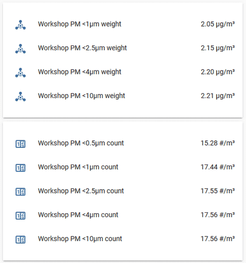

SPS30 Particulate Matter Sensor
===============================

.. seo::
    :description: Instructions for setting up Sen5x Series Environmental sensor for PM, RH/T, VOC, and NOx measurements

    :image: sen54.jpg

The ``sen5x`` sensor platform allows you to use your Sensirion SPS30
(`datasheet <https://www.sensirion.com/fileadmin/user_upload/customers/sensirion/Dokumente/9.6_Particulate_Matter/Datasheets/Sensirion_PM_Sensors_Datasheet_SPS30.pdf>`__) sensors with ESPHome.
The :ref:`I²C Bus <i2c>` is required to be set up in your configuration for this sensor to work.
This sensor supports both UART and I²C communication. However, at the moment only I²C communication is implemented.

.. _Sparkfun: https://www.sparkfun.com/products/15103

.. code-block:: yaml

    # Example configuration entry
    sensor:
      - platform: sen5x
        id: sen54
        temperature:
          name: "Temperature"
          accuracy_decimals: 1
        humidity:
          name: "Humidity"
          accuracy_decimals: 0
        pm_1_0:
          name: " PM <1µm Weight concentration"
          id: pm_1_0
          accuracy_decimals: 1
        pm_2_5:
          name: " PM <2.5µm Weight concentration"
          id: pm_2_5
          accuracy_decimals: 1
        pm_4_0:
          name: " PM <4µm Weight concentration"
          id: pm_4_0
          accuracy_decimals: 1
        pm_10_0:
          name: " PM <10µm Weight concentration"
          id: pm_10_0
          accuracy_decimals: 1
        voc:
          name: "VOC"
          algorithm_tuning:
            index_offset: 100
            learning_time_offset_hours: 12
            learning_time_gain_hours: 12
            gating_max_duration_minutes: 180
            std_initial: 50
            gain_factor: 230
        temperature_compensation:
          offset: 0
          normalized_offset_slope: 0
          time_constant: 0
        acceleration_mode: low
        store_baseline: true
        address: 0x69
        update_interval: 10s

Configuration variables:
------------------------

- **temperature** (*Optional*): Temperature.

  - **name** (**Required**, string): The name of the sensor.
  - **id** (*Optional*, :ref:`config-id`): Manually specify the ID used for code generation.
  - All other options from :ref:`Sensor <config-sensor>`.

- **humidity** (*Optional*): Relative Humidity.

- **pm_1_0** (*Optional*): The information for the **Weight Concentration** sensor for fine particles up to 1μm. Readings in µg/m³.

  - **name** (**Required**, string): The name for this sensor.
  - **id** (*Optional*, :ref:`config-id`): Set the ID of this sensor for use in automation and lambdas.
  - All other options from :ref:`Sensor <config-sensor>`.

- **pm_2_5** (*Optional*): The information for the **Weight Concentration** sensor for fine particles up to 2.5μm. Readings in µg/m³.

  - **name** (**Required**, string): The name for this sensor.
  - **id** (*Optional*, :ref:`config-id`): Set the ID of this sensor for use in automation and lambdas.
  - All other options from :ref:`Sensor <config-sensor>`.

- **pm_4_0** (*Optional*): The information for the **Weight Concentration** sensor for coarse particles up to 4μm. Readings in µg/m³.

  - **name** (**Required**, string): The name for this sensor.
  - **id** (*Optional*, :ref:`config-id`): Set the ID of this sensor for use in automation and lambdas.
  - All other options from :ref:`Sensor <config-sensor>`.

- **pm_10_0** (*Optional*): The information for the **Weight Concentration** sensor for coarse particles up to 10μm. Readings in µg/m³.

  - **name** (**Required**, string): The name for this sensor.
  - **id** (*Optional*, :ref:`config-id`): Set the ID of this sensor for use in automation and lambdas.
  - All other options from :ref:`Sensor <config-sensor>`.

- **store_baseline** (*Optional*, boolean): Stores and retrieves the baseline VOC and NOx information for quicker startups. Defaults to ``true``

- **address** (*Optional*, int): Manually specify the I²C address of the sensor.
  Defaults to ``0x69``.
- **update_interval** (*Optional*, :ref:`config-time`): The interval to check the
  sensor. Defaults to ``60s``.

Wiring:
-------

The sensor has a 6 pin JST ZHR type connector, with a 1.5mm pitch. (`Matching connector housing <https://octopart.com/zhr-5-jst-279203>`__, `datasheet <http://www.farnell.com/datasheets/1393424.pdf>`__)
To force the sensor into I²C mode, the SEL pin (Interface Select pin no.5) should be shorted to ground (pin no.4). Pin 6 is not used

.. figure:: images/sen5x-wiring.png
    :align: center
    :width: 50.0%

For better stability, the SDA and SCL lines require suitable pull-up resistors.

Automatic Cleaning:
-------------------

The Sen5x sensor has an automatic fan-cleaning which will accelerate the built-in fan to maximum speed for 10 seconds in order to blow out the dust accumulated inside the fan.
The default automatic-cleaning interval is 168 hours (1 week) of uninterrupted use. Switching off the sensor resets this time counter.

See Also
--------

- :ref:`sensor-filters`
- :doc:`sds011`
- :doc:`pmsx003`
- :doc:`ccs811`
- :doc:`sgp30`
- :apiref:`sen5x/sen5x.h`
- :ghedit:`Edit`
