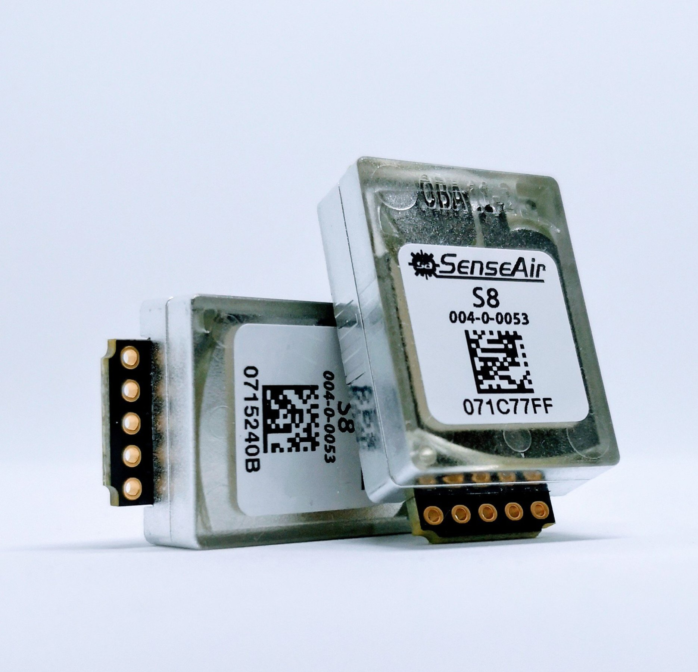
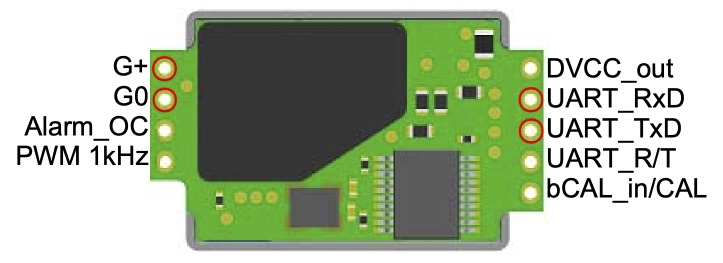

SenseAir CO_2 Sensor
====================

.. seo::
    :description: Instructions for setting up SenseAir S8 CO2 sensor
    :image: senseair_s8.jpg
    :keywords: senseair_s8

The ``senseair`` sensor platform allows you to use SenseAir CO_2 sensor
(`website`_) with ESPHome.

    SenseAir S8 CO_2 Sensor.

.. _website: https://senseair.com/products/size-counts/s8-residential/

As the communication with the SenseAir is done using UART, you need
to have an :ref:`UART bus <uart>` in your configuration with the ``rx_pin`` connected to the TX pin of the
sensor and the ``tx_pin`` connected to the RX Pin (it's switched because the
TX/RX labels are from the perspective of the SenseAir sensor). Additionally, you need to set the baud rate to 9600.

.. code-block:: yaml

    # Example configuration entry
    uart:
      rx_pin: D0
      tx_pin: D1
      baud_rate: 9600

    sensor:
      - platform: senseair
        co2:
          name: "SenseAir CO2 Value"
        update_interval: 60s

Configuration variables:
------------------------

- **co2** (**Required**): The CO_2 data from the sensor in parts per million (ppm).

  - **name** (**Required**, string): The name for the CO_2 sensor.
  - **id** (*Optional*, :ref:`config-id`): Set the ID of this sensor for use in lambdas.
  - All other options from :ref:`Sensor <config-sensor>`.

- **update_interval** (*Optional*, :ref:`config-time`): The interval to check the
  sensor. Defaults to ``60s``.

- **uart_id** (*Optional*, :ref:`config-id`): Manually specify the ID of the :ref:`UART Component <uart>` if you want
  to use multiple UART buses.

- **id** (*Optional*, :ref:`config-id`): Manually specify the ID used for actions.

    Pins on the SenseAir S8. Only the ones marked with a red circle need to be connected.

.. note::

    ``G+`` should be connected to power supply (supported voltage is 4.5 V to 5.25 V), ``G0`` to ``GND`` pin

.. _senseair-background_calibration_action:

``senseair.background_calibration`` Action
------------------------------------------

This :ref:`action <config-action>` initiates a background calibration on the sensor with the given ID: the current
CO2 level will be used as a reference for the 400ppm threshold. Ensure that the sensor is in a stable environment with
fresh ambient air, preferably near a window that has already been opened for a sufficient time.

.. code-block:: yaml

    on_...:
      then:
        - senseair.background_calibration: my_senseair_id

.. _senseair-background_calibration_result_action:

``senseair.background_calibration_result`` Action
-------------------------------------------------

This :ref:`action <config-action>` requests the result of the background calibration procedure from the sensor
with the given ID. The value will be printed in ESPHome logs.

Wait at least one sensor lamp cycle after having triggered the background calibration before requesting its result.

.. code-block:: yaml

    on_...:
      then:
        - senseair.background_calibration_result: my_senseair_id

.. _senseair-abc_get_period_action:

``senseair.abc_get_period`` Action
----------------------------------

This :ref:`action <config-action>` requests the currently configured ABC interval from the sensor with the given ID.
The value will be printed in ESPHome logs.

.. code-block:: yaml

    on_...:
      then:
        - senseair.abc_get_period: my_senseair_id

.. _senseair-abc_enable_action:

``senseair.abc_enable`` Action
------------------------------

This :ref:`action <config-action>` enables Automatic Baseline Calibration on the sensor with the given ID.
ABC will be activated with the default interval of 180 hours.

.. code-block:: yaml

    on_...:
      then:
        - senseair.abc_enable: my_senseair_id

.. _senseair-abc_disable_action:

``senseair.abc_disable`` Action
-------------------------------

This :ref:`action <config-action>` disables Automatic Baseline Calibration on the sensor with the given ID.

.. code-block:: yaml

    on_...:
      then:
        - senseair.abc_disable: my_senseair_id

See Also
--------

- :ref:`sensor-filters`
- :apiref:`senseair/senseair.h`
- :ghedit:`Edit`
