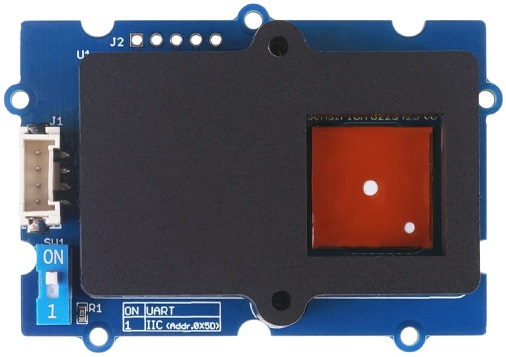

SFA30 Formaldehyde Sensor
=========================

.. seo::
    :description: Instructions for setting up SFA30 Formaldehyde Sensor
    :image: sfa30.jpg

The ``sfa30`` sensor platform  allows you to use your Sensirion SFA30 Formaldehyde
(`datasheet <https://sensirion.com/media/documents/DEB1C6D6/63D92360/Sensirion_formaldehyde_sensors_datasheet_SFA30.pdf>`__) sensors with ESPHome.
The :ref:`I²C Bus <i2c>` is required to be set up in your configuration for this sensor to work.
This sensor supports both UART and I²C communication. However, at the moment only I²C communication is implemented.

.. code-block:: yaml

    # Example configuration entry
    sensor:
      - platform: sfa30
        formaldehyde:
          name: "Formaldehyde"
        temperature:
          name: "Temperature"
        humidity:
          name: "Humidity"

Configuration variables:
------------------------

- **formaldehyde** (*Optional*): The information for the Formaldehyde sensor.
  All options from :ref:`Sensor <config-sensor>`.

- **temperature** (*Optional*): The information for the Temperature sensor.
  All options from :ref:`Sensor <config-sensor>`.

- **humidity** (*Optional*): The information for the Humidity sensor.
  All options from :ref:`Sensor <config-sensor>`.

- **address** (*Optional*, int): Manually specify the I²C address of the sensor.
  Defaults to ``0x5D``.

- **update_interval** (*Optional*, :ref:`config-time`): The interval to check the
  sensor. Defaults to ``60s``.

See Also
--------

- :ref:`sensor-filters`
- :doc:`absolute_humidity`
- :apiref:`sfa30/sfa30.h`
- :ghedit:`Edit`
